**Understanding Digital Tokens: Market Overviews & Proposed Guidelines
for Policymakers & Practitioners**

Prepared by: Token Alliance

An Industry Initiative of the Chamber of Digital Commerce

**Chamber of Digital Commerce **

The Chamber of Digital Commerce is the world’s largest trade association
representing the blockchain industry. Our mission is to promote the
acceptance and use of digital assets and blockchain technology. Through
education, advocacy, and working closely with policymakers, regulatory
agencies, and industry, our goal is to develop a pro-growth legal
environment that fosters innovation, jobs, and investment.

**Token Alliance **

The Token Alliance is an industry-led initiative of the Chamber of
Digital Commerce, developed to be a key resource for the emerging
industry surrounding the generation and distribution of tokens using
blockchain technology. Comprised of over 350 global industry
participants, the Alliance includes blockchain and token experts,
technologists, economists, former regulators, and practitioners from
over 20 law firms. The Token Alliance develops community-driven
guidelines for the responsible development of tokens.

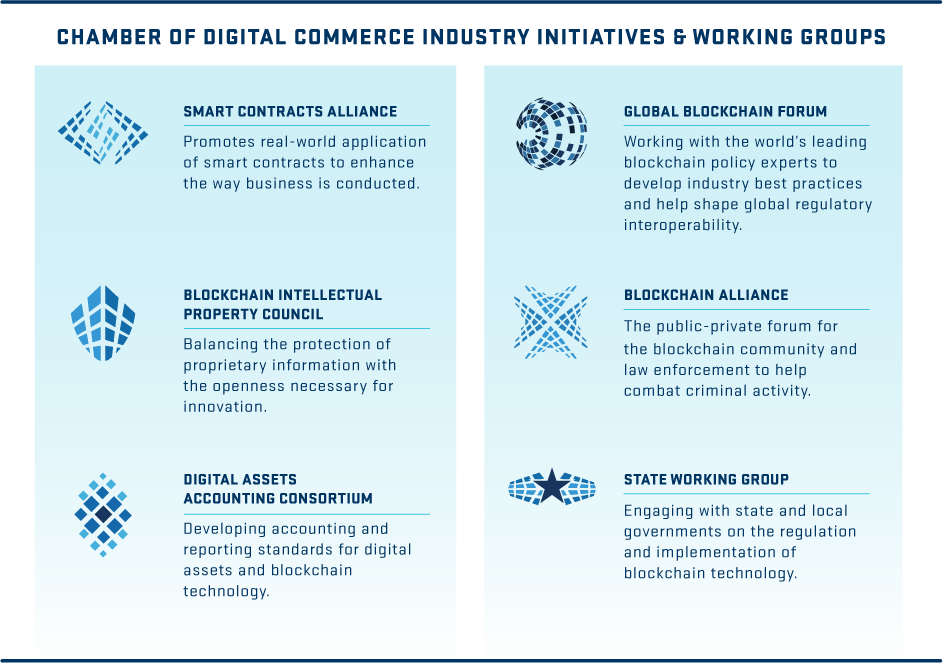

**Table of Contents**

1.  Acknowledgements
    
    1.  Co-Chairs
    
    2.  Leadership Committee
    
    3.  Expert Contributors
    
    4.  Member Participants

2.  Foreword – *by Paul Atkins and James Newsome *

3.  Introduction – The Case for Digital Tokens

4.  Part 1: Regulatory Overview of Digital Token Markets
    
    5.  United States
    
    6.  Canada
    
    7.  United Kingdom
    
    8.  Australia
    
    9.  Gibraltar

5.  Part 2: Token Principles and Guidelines
    
    10. Token Sponsors
    
    11. Token Trading Platforms

6.  Part 3: Token Economic Landscape

7.  Looking Ahead

**ACKNOWLEDGEMENTS**

**Token Alliance Co-Chairs **

Paul Atkins

Chief Executive Officer, Patomak Global Partners

Non-Executive Chairman, BATS Global Markets, Inc. (2012-2015)

Commissioner, U.S. Securities and Exchange Commission (2002 – 2009)

James Newsome, Ph.D

Founding Partner, Delta Strategy Group

President & CEO, New York Mercantile Exchange (2004-2008)

Chairman, U.S. Commodity Futures Trading Commission (2001–2004)

Commissioner, U.S. Commodity Futures Trading Commission (1998-2001)

**Token Alliance Leadership Committee**

The Chamber of Digital Commerce would like to recognize the following
individuals for their thought leadership, oversight of, and support to
the Token Alliance in the production of this report.

Kevin Batteh, Partner, Delta Strategy Group

Perianne Boring, Founder and President, Chamber of Digital Commerce

Joe Cutler, Partner, Perkins Coie LLP

Robert Greene, Strategic Advisor, Patomak Global Partners

Dax Hansen, Partner, Perkins Coie LLP

Chris Housser, Co-Founder, Polymath

Jonathan Johnson, President, Medici Ventures

Amy Davine Kim, Chief Policy Officer, Chamber of Digital Commerce

Kari Larsen, Counsel, Reed Smith LLP

Brian Lio, Chief Executive Officer, Smith + Crown

Rumi Morales, Partner, Outlier Ventures

Matthew Roszak, Chairman and Co-Founder, Bloq

Bill Shihara, Chief Executive Officer, Bittrex

Tom Sporkin, Partner, BuckleySandler LLP; Strategic Advisor to the Token
Alliance

Colleen Sullivan, CEO, CMT Digital

Joshua Stein, Chief Executive Officer, Harbor

**Expert Contributors **

The Chamber of Digital Commerce would also like to thank the following
individuals and organizations for their valuable contributions to the
Token Alliance in the production of this report.

Thomas Ahmadifar, Associate, Perkins Coie LLP

Steve Bunnell, Chief Legal Officer, Bittrex

Matt Chwierut, Research Director, Smith + Crown

Lewis Cohen, Lawyer, DLx Law LLP

Michael Didiuk, Partner, Perkins Coie LLP

Frederick Fedynyshyn, Senior Counsel, Perkins Coie LLP

Dror Futter, Partner, Rimon Law, P.C.

Gregory Grove, Principal, Much Shelist, P.C.

Kate Guimbellot, Executive Director, TravelCoin Foundation

Sharon Haverlah, IT Research and Innovation Technology Leader, USAA

Ramon Lafee, Chief Executive Officer, G Coin

Stephen Keen, Senior Counsel, Perkins Coie LLP

Kiran Nagaraj, Managing Director, KPMG USA

Jay Natarajan, Senior Global Solutions Architect, Microsoft

Lindsay Nelson, Research, Smith + Crown

Kwon Park, Director of Business Development, Bittrex

Scott Parsons, Managing Principal, Delta Strategy Group

Kiran Raj, Chief Strategy Officer, Bittrex

Andre Reina, Product Manager, Elliptic

Eric Sibbitt, Partner, O'Melveny & Myers LLP

James Sisneros, Founder and CEO, Zaahah

James Smith, Chief Executive Officer, Elliptic

J. Gray Sasser, Attorney at Law, Frost Brown Todd LLC

Steven Sprague, CEO and Co-Founder, Rivetz

Quan Trinh, Co-Founder, Secure Identity Ledger Corporation

Sardorbek Umarov, Co-Founder, BookLocal

Jason Weinstein, Partner, Steptoe

Les Wilkinson, Chief Development Officer, Hashed Health

**Global Subject Matter Experts**

The Chamber of Digital Commerce would like to express its gratitude to
the following firms and individuals for authoring the country specific
sections contained in this report.

United States:

Paul Atkins, Chief Executive Officer, Patomak Global Partners

Robert Greene, Strategic Advisor, Patomak Global Partners

Amy Davine Kim, Chief Policy Officer, Chamber of Digital Commerce

Matthew Comstock, Partner, Murphy & McGonigle, P.C.

Lisa Zarlenga, Partner, Steptoe

Chelsea Parker, Blockchain Industry Analyst, Steptoe

John Cobb, Associate, Steptoe

Michael Fletcher, Partner, RSM

Kari Larsen, Counsel, Reed Smith LLP

Michael Selig, Associate, Perkins Coie LLP

Canada:

Ross McKee, Partner, Blakes

Stefania Zilinskas, Associate, Blakes

Paritosh Gambhir, Partner, KPMG

United Kingdom:

Claude Brown, Partner, Reed Smith LLP

Tim Dolan, Partner, Reed Smith LLP

Karen Butler, Senior Associate, Reed Smith LLP

Australia:

Ronald Tucker, Founder and President of the Board, Australian Digital
Commerce Association

Nick Giurietto, CEO and Managing Director, Australian Digital Commerce
Association

Ivan Oshry, Head of Corporate, Kemp Strang

Michael Zheng, Senior Associate, Maddocks

Alex Cook, Lecturer, University of Western Australia Law School

Gibraltar:

Joey Garcia, Partner, ISOLAS LLP

Jonathan Garcia, Partner, ISOLAS LLP

**Token Alliance Participants **

The Chamber of Digital Commerce would like to thank the following
companies and individuals for their support of and participation in the
Token Alliance.

Accenture

AlphaPoint

Ant Financial

Aperture

Argon Group

Australian Digital Commerce Association

B3i

Bittrex

Bitwage

Black Square Capital

Blakes

Block Collider

BlockIDE

Blockmason

BlockMedx

Bloq

BNP Paribas

BNY Mellon

Bonner and Partners

BPM Accounting

Bright Matter Advisory

Buckley Sandler LLP

Capitol Alliance Group

Circle

Cisco

Citizens Reserve

Civic Technologies

CME Group

CMT Digital

Cognizant

Coin Circle

CoinList

Colorado Blockchain Capital

Crowe

Crowell and Moring LLP

Debevoise & Plimpton LLP

Deloitte

Delta Strategy Group

Dentons LLP

Digital Currency Group

DLA Piper

DLx Law LLP

doc.ai

DocuSign

Dragonchain

DTCC

Element Group

Elliptic

ERC dEX

eToro

Exchange Union

Factom

Fairfax County Economic Development Authority

Fidelity Labs

Frost Brown Todd LLC

Fundopolis

G Coin

Gem

Genaro Network

Global Blockchain Technologies Corporation

Go Coin

Golem

Grupo Cimcorp

Harbor

HashChain

Hashed Health

HCM Capital, Foxconn Technology Group

Hogan Lovells LLP

Hub Culture Services Ltd

IBM

IHS Markit

Incremint

Input Strategic Partners

Intuit

Irell and Manella LLP

Joshpe Mooney Paltzik LLP

KPMG

LBRY

Locke Lord LLP

Loyyal

Lykke

MadHive

MakerDAO

Medici Ventures

Mercury Protocol

Messari

Microsoft

Milligan Partners

MPEG LA

Much Shelist PC

Multicoin Capital

Murphy and McGonigle PC

Nasdaq

Nelson Mullins Riley and Scarborough LLP

Netki

New Alchemy

Nexus

Norton Rose Fulbright LLP

NuID

NYIAX

O’Melveny & Myers LLP

OTCXN

Outlier Ventures

Parsons and Whittemore

Patomak Global Partners

PeerStream

Perkins Coie LLP

Pillar Project

PokitDok

Polsinelli PC

Polymath

Qtum

R3

Reed Smith LLP

Rimon Law PC

Ripple

Rivetz

RKL LLP

RockTree Capital

RSM

SALT Lending

Secure Identity Ledger Corporation

Seed CX

Seward and Kissel LLP

Shulman Rogers Gandal Pordy and Ecker, PA

Slice Technologies

Smith + Crown

Smitz Laboratories

Softthink Solutions

SpaceChain

Spera

Strategic Coin

Stronghold

Symbiont

Tally Capital

The Depository Trust and Clearing Corporation

TMX

TravelCoin Foundation

tZERO

USAA

Vardavas and Concannon, PA

Vertex

Votem

Wanchain

Wipfli, LLP

Wyrick Robbins Yates and Ponton LLP

Zaahah

Zen Blockchain Foundation

**Foreword**

*By Co-Chairs Paul Atkins and James Newsome*

The last 24 months have seen incredible development in the blockchain
industry. We saw two of the world’s largest exchanges introduce bitcoin
futures contracts, market capitalization for digital tokens\[1\] grew
over 3000 percent,\[2\] and over a dozen central banks and many major
financial institutions around the world announced their interest in
blockchain-based technologies. The transformative possibilities of
blockchain technology and the tremendous positive impact that it could
have for our economy were front and center in the news and headlines.
2017 also brought along another phenomenon – the rise of so-called
“initial coin offerings.” Digital token projects and distributions of
the past year have revealed some of the strengths and weaknesses of the
industry.

**Why Tokens?**

When Bitcoin, the first-ever blockchain network, was released
pseudonymously, the author(s) published the code open source – anyone
could review the code, improve upon it, and innovate with it. This was a
boon to society – anyone could review the code, improve upon it, and
innovate with it. Over the past nine years, technologists from all over
the world, inspired by this revolutionary development, have created new
digital tokens – all with their own native functionalities and features.

For example, while bitcoin was created as a “Peer-to-Peer Electronic
Cash System,” ether, the second largest distributed token by market cap
(estimated at $72 billion as of May 7, 2018), was created to be a
“decentralized platform that runs smart contracts,” with Ether
functioning as the “fuel . . . for operating the distributed application
platform.”

Many token projects and token generation events have relied upon ether
to facilitate the development of blockchain-enabled platforms or
applications. Depending on its attributes and functions, a token can be
classified in various ways: as a security/equity, a currency/medium of
exchange, a commodity, or a means of access to a network that provides
utility to its users. A digital token can also be a hybrid that includes
several of these characteristics, and some have suggested that a token
may start representing one (or more characteristics) and then shift to
encompass others.

**The Token Policy Debate: Activity Underway in Washington **

The biggest policy debate currently underway in the blockchain industry
is when is a token considered to be a “*security*” and, perhaps more
importantly, when is it *not*?

In many circumstances, digital tokens are not securities. Indeed, the
two largest digital tokens – bitcoin and ether – are not securities, but
rather, are commodities. However, if the token and/or the method of
token distribution meets certain criteria, such as offering an expected
rate of return or potential for growth in value in some circumstances
(what securities lawyers call meeting the *Howey* Test, derived from a
U.S. Supreme Court case dating back to 1946), then it can be deemed a
security. A security issuer must follow prescribed procedures
promulgated by the U.S. Securities and Exchange Commission (“SEC”) for
issuance and distribution of securities (or qualify for an exemption or
exclusion from such rules) or risk enforcement action by the government
and potential private legal action.

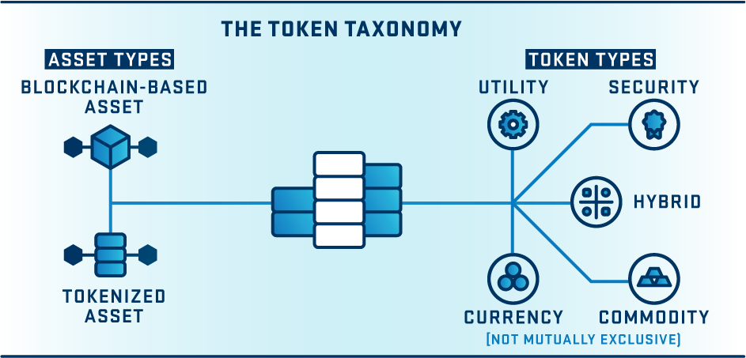

Unfortunately, several entities purported to create and distribute
“utility tokens,” but were charged by the SEC, either by using
the *Howey *Test as having issued unregistered securities, or for
fraud. The resulting settlements, statements by SEC officials, and
subpoenas have created regulatory uncertainty, because the *Howey* Test
is a case-by-case examination of facts and circumstances*.* An overly
expansive interpretation and application of the *Howey* Test could
threaten the utility of blockchain technology and could stifle
innovation. Regulatory certainty is needed to enable innovative
blockchain-based networks to flourish and fuel prosperity.

On the other hand, ensuring that safe, accessible markets exist is also
critical to enabling distributed token networks to grow and succeed.
Government has an essential role to play in supporting confidence in the
rule of law and investor protection against malfeasance. Private
infrastructure, such as Token Trading Platforms,\[3\] facilitate these
markets, and in doing so, bear consumer protection and market stability
responsibilities. Yet Trading Platforms also confront major challenges
related to perceptions of regulators regarding the legal status of
tokens traded on their platforms.

**The Token Alliance: Creating Guidance for Token Generation Events**

We believe that it is the industry’s responsibility actively to engage
firms, individuals, and businesses involved in the generation,
distribution, and trading of digital tokens to ensure that (1) they have
a comprehensive understanding of the regulatory environment, and that
(2) token project teams and Token Trading Platforms understand and
appropriately react to this environment. To meet this need, we have
formed the **Token Alliance**, an initiative of more than 350 blockchain
and token experts from around the globe. These experts are in active
discussions to create guidelines for token distributions and Token
Trading Platforms. These principles are designed to help market
participants understand the parameters around their activity and to act
in a fair and responsible manner toward potential purchasers.

These principles will also help guide policymakers as they attempt to
steer this industry. Understanding the wide variety of token types is
critical to ensuring that regulators act with carefully guided steps.
The wrong regulatory approach could create an environment of regulatory
arbitrage, or even worse, unintentionally decrease the attractiveness of
a jurisdiction regarding innovation and jobs creation.

The guidelines in this report are reactive to the current regulatory
state of affairs. Ideally, agencies will simplify, stabilize, and
improve regulatory environments so that entrepreneurs using blockchain
networks can spend less time worrying about uncertain compliance
obligations and regulatory interpretations, and more time developing
tokenized networks that improve peoples’ lives. We invite all those
dedicated to supporting and growing this thriving ecosystem to join our
efforts.

**INTRODUCTION – The Case for Digital Tokens**

For the purposes of this report, digital tokens (or “tokens”) are
defined as transferable units generated within a distributed network
that tracks ownership of the units through the application of blockchain
technology. The oversight and regulation of digital tokens has become a
crowded space. Many regulators have reviewed and continue to analyze
their jurisdiction in this rapidly growing market. The intensity has
increased to such a point that lawyers and advisors are poring over
responses made at Congressional hearings, speeches by government
officials, and enforcement actions to “read the tea leaves.” In such a
volatile regulatory regime (not to mention economic market), reasonable
guidelines are imperative.

**This report is the first installment of guidelines for one type of
token in particular – digital tokens that are not securities or CFTC
regulated instruments (defined below).** This type of token is under
threat of extinction by regulation; thus, a methodical, reasonable, and
thoughtful discussion of appropriate oversight is critical. Two topics
in particular—digital token distributions and secondary markets—have
garnered more attention than the rest, particularly from media, but also
from many aspiring application developers and entrepreneurs. Some
commentators have referred to these issuances as “Initial Coin
Offerings,” but that term is too limited in scope and attaches certain
connotations that do not aptly apply to all digital token distributions.

Oftentimes, digital tokens are generated or distributed by a “Token
Sponsor” (or “Sponsor”), which, within the context of this report, means
any clearly defined individual or group that generates or distributes a
digital token that is not intended to be an investment contract or CFTC
Regulated Instrument.

In the last 12 months, token issuances proliferated as a rush of capital
and a wellspring of new ideas flowed into the blockchain ecosystem.
In 2017 alone, more than 550 token generation events raised over $7.3
billion.  Many digital tokens are distributed to serve a fundamental
purpose—as an integral part of a service offering. These tokens are
sometimes referred to as “utility” tokens, although that term has also
been used, sometimes inappropriately, by entities whose tokens do not
serve a purpose other than to raise funds.

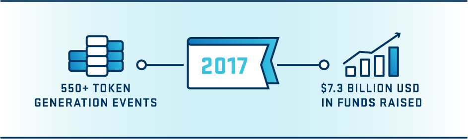

A token’s underlying purpose and how it is generated and distributed is
instrumental to the regulators’ analysis regarding its categorization –
such as a security or commodity. Some tokens may also serve as a virtual
currency, others may represent or track physical assets in the real
world, some may explicitly represent a security, and others may have a
utility function. These functionalities are not necessarily mutually
exclusive, and a token’s legal treatment may depend on the manner in
which the token was marketed. Further, there are different types of
token generation events, including the public release of code associated
with the token, direct distributions by a Token Sponsor, “air
drops”—whereby digital tokens are freely given to identified
parties, and mining events—whereby tokens are distributed to specific
individuals that maintain the integrity of the platform by validating
new blocks of data, to name a few. The nature of a digital token’s
features and its generation event will greatly impact the legal
landscape by which it is governed.

Within this matrix, regulators have begun to weigh in and claim
jurisdiction over certain types of activities surrounding digital
tokens. In the United States, the Securities and Exchange Commission
(“SEC”) and state regulators view many digital tokens to be securities
– triggering application of registration and offering rules of the U.S.
securities laws. The Commodity Futures Trading Commission (“CFTC”), on
the other hand, has deemed virtual currencies (a subset of digital
tokens) to be commodities. Participants in the underlying spot markets
for virtual currencies are thus subject to CFTC anti-fraud and
anti-manipulation powers, and the CFTC’s regulatory powers over digital
token markets are increased when accompanying futures markets exist. The
Financial Crimes Enforcement Network (“FinCEN”) may regulate Token
Sponsors as money transmitters, depending on the facts and circumstances
surrounding the flow of funds (or the value of funds).\[4\] Other
regulators may also seek to intervene in this debate and exercise their
jurisdiction.

**The guidelines presented in this report seek to address ONLY the sale
and trading of commodity tokens that do not constitute securities.**
While developers can issue token-based securities in compliance with
U.S. securities laws, this report does not address that topic.
**Significantly, the topics addressed in this document remain in flux,
as regulators and Congress continue to study and react to this
fast-growing industry.**

Industry and government need to work together to create a regulatory
landscape that enables participants in digital token markets to more
clearly determine when a token is a commodity and when it is a security.
Legal predictability advances market efficiency by removing unnecessary
expense and hindrances, facilitating development of new projects that
will benefit consumers. Legal clarity will also help government to weed
out the bad actors that have taken advantage of the dearth of regulatory
guidance, consumers’ general excitement surrounding blockchain-based
technologies, and a crowded but growing marketplace for new tokens.
“Regulation by enforcement” is not an acceptable approach in such an
environment.

 

Further complicating the matter, a number of governments and central
banks are considering and weighing the benefits of issuing their own
virtual currency tokens. In one instance, the U.S. government has
already determined how another country’s virtual currency issuance is
viewed under U.S. sanctions laws. The potential proliferation of central
bank-issued digital currencies is yet another example of why industry
and government policy makers need to think critically about the rules
that are created to govern tokens, including their issuance and trading,
so as not to be over-inclusive in one category or another.

The Token Alliance seeks to address these issues and it is
well-positioned to do so. Comprised of industry thought leaders,
professionals, technologists, and innovators from across technology,
legal, and advisory firms, the Token Alliance seeks to develop
community-driven guidelines for the responsible issuance of tokens. 
This industry-led initiative is primarily developed to be a key resource
for the emerging industry with respect to blockchain token issuances.

**This report is offered specifically to provide leadership on a
specific subset of the pressing issues facing the token issuance space –
tokens that are not regulated as securities.** It is organized as a
three-part narrative that covers: (i) a regulatory overview, addressing
the legal landscape impacting token issuances and trading in the United
States, Canada, the United Kingdom, Australia, and Gibraltar; (ii)
proposed guidelines that address, with regard to digital tokens that are
NOT securities, Token Sponsors and Token Trading Platforms; and (iii) a
report providing key economic metrics concerning token issuances.

The practices discussed in this report have evolved concurrently with
the evolution of digital token technology, and many nascent practices
were enhanced and refined in response to input from regulators.
Therefore, it is necessarily the case that many digital tokens were not
distributed or traded in conformity with the principles and guidelines
discussed in this report. **This makes it critically important that
earlier generations or distributions of digital tokens by Token Sponsors
not be retroactively analyzed by applying the principles and guidelines
set forth in this report, as past Token Sponsors did not have the
benefit of the experience, regulatory guidance, and interpretations
underlying this report.**

A few words of caution.

 

**THE REPORT DOES NOT CONSTITUTE LEGAL ADVICE**

  - **Specifically, nothing in this report should be construed as advice
    regarding the law of the United States, Canada, England and Wales,
    or Australia. **

  - **This report’s analysis of the criteria under which it is
    determined that tokens constitute securities or commodities do not
    constitute a restatement of law. **

  - **This report, including its suggested guidelines, merely express
    the general views of the Token Alliance, and compliance with such
    guidelines cannot assure that the distribution or trading of tokens
    will fully comply with the laws discussed herein. **

  - **These views are being offered for discussion purposes only, and
    they have not been sanctioned by the SEC, the CFTC, or any other
    regulator. **

**CONSULT LEGAL COUNSEL BEFORE DISTRIBUTING OR HOSTING TRADES OF
TOKENS**

  - Token Sponsors and associated parties seeking to generate or
    distribute a blockchain-based token should seek independent legal
    counsel with expertise in this area before proceeding with their
    project, particularly given the fast-paced nature of this industry
    and the quickly evolving legal landscape.

<!-- end list -->

  - Counsel can help consider the facts and circumstances surrounding
    particular issues within the contours of then-current regulatory and
    enforcement activity.

  - This report does not attempt to address any individual case, and the
    thought leadership contained herein is not appropriate for use as a
    substitute for independent counsel.

  - **Further, the digital token market is rapidly shifting and
    therefore the cases and regulatory interpretations discussed in this
    report may be overtaken by future events**.

The Token Alliance will continue to study the issues surrounding
appropriate regulation for tokens and it will offer additional insights,
as appropriate, when new developments arise.

**PART 1: REGULATORY OVERVIEW**

This part includes three sections, each providing an overview of the
regulatory and legal landscape in a different jurisdiction. Section 1
focuses on the United States; Section 2 focuses on Canada; Section 3
focuses on the United Kingdom, Section 4 focuses on Australia, and
Section 5 focuses on Gibraltar.

**Section 1**:

**United States**

1.  **Introduction**

This section provides an overview of U.S. rules and regulations
applicable to digital tokens, primarily focusing on the distinct
regulatory frameworks for digital tokens that are commodities versus
those that are securities. In doing so, this section sets forth criteria
used by regulators to assess whether a digital token meets either
regulatory classification. It also provides a summary of various
regulatory considerations related to consumer protection, state money
transmission laws, and federal money laundering rules. Subsequent parts
present overviews of the regulatory environment in Canada, the United
Kingdom, Australia, and Gibraltar for digital tokens.

In the regulatory sense, digital tokens largely, though not exclusively,
fall into two broad categories: 1) commodities; and 2) tokenized
securities. Each category brings about important regulatory
considerations, although some digital tokens likely fall into neither
regulatory category.

U.S. Securities and Exchange Commission (“SEC”) Chairman Jay Clayton has
stated publicy that he does not view virtual currencies to be
securities\[5\] and SEC Director of Corporation Finance William Hinman
has stated publicly that bitcoin and ether are not
securities;,\[6\] however, to date, the SEC has not formally
determined that virtual currencies are not securities. Meanwhile, the
U.S. Commodity Futures Trading Commission (“CFTC”) has determined that
virtual currencies like bitcoin are commodities,\[7\] and at least one
court has upheld that view.\[8\] Tokenized securities, like other
securities, are subject to SEC jurisdiction, but are different than
other securities in that they may apply blockchain technology to raise
funds, track ownership, and deliver value to owners. “Utility tokens”
(also known as “app-coins”) – which, as SEC Commissioner Hester Peirce
recently remarked, can “function as a means of executing a transaction,
as a way to get access to a product or service or participate in a
community, or in any number of ways that have yet to be dreamed up”\[9\]
– may be commodities, or may be neither securities nor commodities.
Tokens that are neither securities nor commodities are presumably
regulated under the Federal Trade Commission’s (“FTC”) anti-fraud and
other consumer protection authorities, as well as other regulatory
regimes. Unfortunately, some distributions of tokenized securities have
characterized or claimed the offered assets as “utility tokens,” to
steer clear of securities-registration requirements. These tokens are
not “utility tokens.”

Broadly, state attorneys general and the FTC have the authority within
their jurisdictions to enforce a variety of anti-fraud and consumer
protection laws in markets for all types of digital tokens, while the
U.S. Treasury Department has a range of anti-money laundering and
sanctions enforcement powers. Additionally, markets for digital tokens
are subject to a number of tax law implications.

**II. Legal Classifications & Related Regulatory Considerations**

1.  **Virtual currencies and many app-coins – commodities, not
    securities**

The term “commodity,” as defined in the Commodity Exchange Act (“CEA”),
is very broad, and includes “all services, rights, and interests . . .
in which contracts for future delivery are presently or in the future
dealt in.”\[10\] Only onions and box office receipts are expressly
excluded from the definition. The CFTC, in prior enforcement actions,
has determined that “Bitcoin and other virtual currencies” are a type of
“commodity,”\[11\] and as mentioned above, a federal court has likewise
ruled that the term “‘commodity’ encompasses virtual currency both in
economic function and in the language of the statute.”\[12\] While no
statutory definition for the term virtual currency exists, in December
2017, the CFTC stated in a proposed regulatory interpretation that it
interprets the terms “virtual currency” and “digital currency” to
encompass:

  - any digital representation of value (a “digital asset”) that
    functions as a medium of exchange, and

  - any other digital unit of account that:
    
      - is used as a form of a currency (*i.e*., transferred from one
        party to another as a medium of exchange);
    
      - may be manifested through units, tokens, or coins, among other
        things; and
    
      - may be distributed by way of digital “smart contracts,” among
        other structures.\[13\]

On the other hand, bitcoin and other similarly designed digital tokens
do not appear to be securities, as that term has been interpreted under
the U.S. Supreme Court’s holding in *SEC v. W.J. Howey Co*.,\[14\]
subject to SEC regulation. Indeed, SEC Chairman Jay Clayton recently
noted that bitcoin “has been determined by most people to not be a
security.”\[15\] His colleague SEC Commissioner Hester Peirce similarly
remarked in May 2018 that she is not yet “willing to make a blanket
statement that everything other than bitcoin is a security,”\[16\] and
in April 2017, SEC’s Division of Corporate Finance Director Bill Hinman
noted that “it is certainly possible that there are tokens that would
not have the hallmarks of a security.”\[17\] Regarding the features of
non-security digital tokens, Mr. Hinman noted that such tokens would
include those for which the token holder is buying a token “for its
utility rather than investment, especially if it's a decentralized
network in which it’s used with no central actors.” The SEC’s recent
interpretations of the *Howey* Test with regards to digital tokens, and
regulatory considerations associated with tokenized securities, are
described in greater detail below.

Clearly, the range of digital tokens that are not deemed by U.S.
regulators to be securities may be quite broad. For example, Filecoin is
a so-called “utility token” according to CFTC Commissioner Brian
Quintenz.\[18\] Commissioner Quintenz recently drew a distinction
between virtual currencies and “utility tokens” in a speech before the
Chamber of Digital Commerce,\[19\] and in more recent remarks, noted
that a motivation for creating digital token markets “is to utilize the
transferability of tokens to create a secondary market for . . .
non-tangible things.”\[20\] He also expressed his belief that
“\[e\]mpowering a secondary market’s price discovery and valuation
functions for products that were previously untransferable – such as
extra storage space on a home computer – is a fascinating development.”

If the CFTC determines that a digital token is a “commodity,” then it
may exercise general anti-fraud and anti-manipulation authority over
“spot transactions” in that digital token. The CFTC defines spot
transactions as those involving the exchange of a commodity for payment
where immediate delivery and payment for the commodity is typically
expected to occur on or within a few days of the transaction date.\[21\]
In determining whether transfer of possession and control of the
commodity has been made to the buyer, the CFTC considers: (i) “how the
agreement, contract, or transaction is marketed, managed, and performed”
and (ii) the facts regarding “\[o\]wnership, possession, title, and
physical location,” as well as the “relationship\[s\] between the buyer,
seller, and possessor of the commodity . . . and the manner in which the
. . . sale is recorded and completed.”\[22\]

The CFTC’s general anti-fraud and anti-manipulation rule (“Rule 180.1”),
which was amended by the Dodd-Frank Wall Street Reform and Consumer
Protection Act of 2010 to expand CFTC authority over spot transactions,
prohibits persons “in connection with any . . . contract of sale of any
commodity in interstate commerce” from:

  - using or employing a manipulative device or scheme to defraud;

  - engaging in or attempting to engage in market manipulation or fraud;

  - making or attempting to make untrue or misleading statements of a
    material fact or omitting to state a material fact necessary in
    order to make statements made not untrue or misleading; and

  - delivering false or misleading or inaccurate reports concerning
    market information or conditions that affect or tend to affect the
    price of a commodity.\[23\]

In a recent virtual currency-related regulatory action, the CFTC stated
that Rule 180.1 grants it the “ability to bring enforcement actions for
fraud or manipulation in connection with . . . contracts of sale of any
commodity in interstate commerce.”\[24\] Previously, the CFTC has relied
upon Rule 180.1 to assert its jurisdiction over interstate trading in
spot markets for commodities such as silver.\[25\] In September 2017,
the CFTC cited Rule 180.1 in a complaint against a pooled fund operator
for fraudulently inducing persons to invest in his bitcoin trading
operation.\[26\] Commentators note that in in this complaint, the CFTC
“took a step beyond \[its\] traditional limit” of intervening in
commodity spot markets only when “manipulative trading in the spot
market affected the associated derivatives market.”\[27\] At the time of
the action, no bitcoin futures market existed.

More recently, a March 2018 court ruling regarding a January 2018 CFTC
complaint against market participants engaged in the non-leveraged
purchase and sale of virtual currencies on behalf of retail customers
found that the “CFTC may exercise its enforcement power over fraud
related to virtual currencies sold in interstate commerce.”\[28\]
Notably, litecoin, for which no futures market exists, was one of the
virtual currencies traded on behalf of investors by the defendants in
the complaint.

According to the CFTC, “a key component” of its “ability to effectively
regulate \[virtual currency\] markets” is this ability to “assert\[\]
legal authority over virtual currency derivatives in support of the
CFTC’s anti-fraud and manipulation efforts, including in underlying
spot markets.”\[29\] Thus the creation by the Chicago Mercantile
Exchange (“CME”) and Chicago Board Options Exchange (“CBOE”) of futures
markets for virtual currencies (limited to bitcoin futures to date) will
likely lead to heightened CFTC scrutiny over the underlying spot markets
for virtual currencies for which a corresponding, CFTC-regulated futures
market exists.

Numerous retail customer-oriented spot markets have emerged through
which market participants can convert virtual currency, fiat currency,
or other digital tokens into other virtual currency, fiat currency, or
other digital tokens. Entities that host these markets and that are
neither (a) registered with the SEC pursuant to the Exchange Act as a
“national securities exchange” or an “alternative trading system” nor
(b) registered with the CFTC pursuant to the CEA as a “registered
entity,” are referred to in this report as “Token Trading Platforms.” In
some cases, as the CFTC recently noted, “\[t\]hese platforms provide a
place to immediately exchange one commodity for another ‘on the spot.’”
There are a number of regulatory implications for these “centralized
platforms” if a non-security digital token (being converted on a Token
Trading Platform into another non-security digital token or into fiat
currency) is deemed to be a virtual currency and thus a commodity by the
CFTC. One important issue relates to “actual delivery” – a customer
using a Token Trading Platform must, according to the CFTC’s
interpretation of CEA rules, receive “actual delivery” of that virtual
currency within in 28 days of sale in order for the sales contract
offered by the Token Trading Platform to be excluded from the definition
of a futures contract, thus requiring it to be traded on a
CFTC-regulated entity.

The CFTC has characterized virtual currencies as intangible commodities
capable of actual delivery.\[30\] In an enforcement action involving
Bitfinex, a Token Trading Platform, the CFTC found that actual delivery
did not occur in that case because Bitfinex held customers’ bitcoin in
an omnibus settlement wallet in its own database rather than transferred
possession and control of the bitcoin to the customers.\[31\] The CFTC
interpreted “actual delivery” to mean the delivery to a consumer of the
purchased bitcoins’ “private key” – the “secret number . . . associated
with a deposit wallet that allows \[the bitcoin\] in that wallet to be
spent.”\[32\] That stance was challenged through a petition that noted:

> \[M\]aking control of private keys a prerequisite to having ownership
> and control of a cryptocurrency would be artificial and harmful to
> \[cryptocurrency\] markets because private keys have no innate legal
> significance with regard to the transfer, control, and possession of
> cryptocurrency on the blockchain … Rather, private keys are a modality
> to effectuate the parties’ contractual agreements . . . and the
> significance or lack of significance of private keys . . . is
> determined entirely by the transacting parties.\[33\]

In December 2017, the CFTC issued a proposed interpretation regarding
actual delivery of virtual currency, which notes that for actual
delivery to occur, (1) a customer must have the ability to (i) “take
possession and control” of the virtual currency, and (ii) “use it freely
in commerce … no later than 28 days from the date of the transaction,”
and (2) the offeror or counterparty must not retain “any interest in or
control over any of the \[virtual currency\].” Examples of actual
delivery provided by the CFTC note that “title may be reflected by
linking an individual purchaser with proof of ownership of the
particular wallet to wallets that contain the purchased virtual
currency.”\[34\] A March 2018 court ruling calls the CFTC’s stance in to
question, however, noting that “actual delivery “does not require that a
buyer take actual possession and control of the purchased commodities;
it requires instead that the possession and control of commodities that
exist in fact be transferred from the seller.”\[35\]

Because the CFTC has deemed “virtual currency” not to fall under the
definition of “currency,”\[36\] it is not subject to a 2-day actual
delivery requirement for retail foreign currency transactions. The
agency, however, has requested public comment on whether a shortened
actual delivery requirement would be appropriate for virtual currencies,
and whether Congress should act to shorten the actual delivery
requirement for these instruments.\[37\]

Regardless, in its Actual Delivery Proposed Interpretation, the CFTC
noted that “depending on their use,” tokens “may be commodities,
commodity options, derivatives, or otherwise fall within the
Commission’s virtual currency definition described in this
interpretation.”\[38\] Indeed, agreements for the future delivery of
digital tokens may qualify as derivatives contracts (futures or swaps)
for an underlying commodity if the agreement includes optionality and/or
does not provide for physical delivery. Such agreements can be thought
of as commonplace commodity market forward agreements that provide for
future delivery in instances where the commodity has not yet been
harvested or extracted for delivery. Such digital tokens would be
subject to a variety of futures and swaps regulations as “**CFTC
Regulated Instruments**”which, for purposes of this report, means any
arrangement involving a digital token that would be subject to
regulation by the CFTC as a future, swap, option or retail commodity
transaction – as opposed to spot market transactions.

The likelihood that any arrangement involving a digital token may
constitute a CFTC Regulated Instrument from the perspective of the CFTC
is higher if the arrangement involves optionality, does not provide for
immediate delivery of the token to the purchaser, the offer or sale of a
commodity on a margined or financed basis where actual delivery does not
occur within 28 days, or the exchange of one or more payments based on
the value of one or more rates for, or prices of, intangible or tangible
commodities.

2.  **Tokenized Securities**

The SEC and its staff have historically interpreted the definition of
“security” under the Securities Act of 1933 (the “1933 Act” or the
“Securities Act”) and the Securities Exchange Act of 1934 (the “1934
Act” or the “Securities Exchange Act”) broadly.\[39\] In addition to
enumerating specific types of securities, such as stock and bonds, the
1933 Act definition of security also includes an “investment contract,”
which is essentially a catchall for securities that are not otherwise
set out in Section 2(a)(1) of the 1933 Act. In the seminal 1946 case
*SEC v. Howey,* noted above, interpreting the scope of the term
“investment contract,” the Supreme Court held that the term
encompasses “a contract, transaction or scheme whereby a person invests
his money in a common enterprise and is led to expect profits solely
from the efforts of the promoter or a third party.”\[40\] Under the
*Howey* Test, an investment contract exists if there is: (1) an
investment of money; (2) in a common enterprise; (3) with a reasonable
expectation of profits; and (4) to be derived from the entrepreneurial
or managerial efforts of others.\[41\]

In July 2017, the SEC considered whether so-called “initial coin
offerings” (or “ICOs”) involve, or could involve, the issuance of
securities. It issued a Report of Investigation Pursuant to Section
21(a) of the Securities Exchange Act of 1934“in which it concluded,
based on an investigation by its Division of Enforcement, that the
digital tokens issued by the Decentralized Autonomous Organization (the
“DAO”) were securities (the “DAO Report”) within the meaning of the
1933 Act and 1934 Act.\[42\] As described in the DAO Report, the DAO, an
unincorporated association, issued tokens (the “DAO Tokens”) via a
website. Investors purchased DAO Tokens with the ether. The DAO intended
to use the funds it raised through the sale of DAO Tokens to fund
“projects.” DAO Token holders stood to share in the anticipated
earnings from these projects as a return on their investment. After the
initial issuance of the DAO Tokens, a secondary market for trading the
DAO Tokens developed.

In the DAO Report, the SEC analyzed whether the DAO Token was a
security. Because a digital token such as the DAO Token is not a
specifically-enumerated type of security under the 1933 Act, such as a
stock or a bond, the SEC considered whether the DAO Token was an
“investment contract.” To answer that question, the SEC applied the
*Howey* Test and concluded that the DAO Tokens qualified as investment
contracts and thus were securities for purposes of the Securities Act
and the Exchange Act.\[43\] Specifically, the SEC found that:

  - the purchase of DAO Tokens with ether was an “investment of money,”
    noting that “money” need not take the form of cash;

  - investors in DAO Tokens were investing in a common enterprise,
    *i.e.*, the DAO, which was created to pool resources and invest in a
    variety of projects;

  - investors reasonably expected to earn profits by sharing in the
    return on projects that the DAO would fund from the proceeds of the
    DAO Token sales; and

  - DAO Token holders’ profits were to be derived from the managerial
    efforts of others, namely the founders and other key personnel
    associated with the DAO who would direct investments in projects.

Accordingly, the SEC concluded that DAO Tokens were securities that were
issued without being registered under the Securities Act.

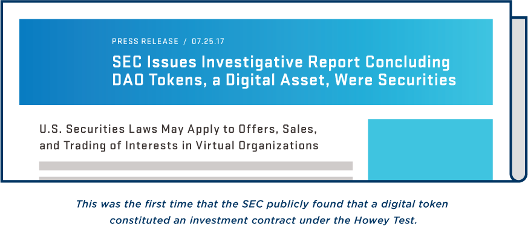

After publishing the DAO Report, the SEC brought a number of enforcement
actions related to so-called ICOs. Most of those actions, however, were
brought against persons who launched Ponzi schemes or other outright
frauds.\[44\] Yet in the December 2017 *Munchee* Order, the SEC took the
opportunity to expand upon the DAO Report.\[45\] *Munchee* involved the
creator of a restaurant review smartphone application, Munchee, that
wanted to raise capital through the sale of digital tokens to expand its
business. Munchee issued a whitepaper describing its proposed business
expansion and plan to raise $15 million by issuing so-called “MUN
tokens” in exchange for bitcoin and ether. Munchee characterized the
MUN tokens as “utility tokens” and promised they could be used in the
future to purchase goods and services in the ecosystem that Munchee
would create. Munchee also stated that as use of its app increased, the
value of MUN tokens would increase. Moreover, it promised to help
increase the value of MUN tokens by “burning” tokens in the future,
*i.e.*, taking tokens out of circulation, and by working to ensure that
the tokens would trade on a number of trading platforms.

The SEC’s Division of Enforcement contacted Munchee and communicated its
view that Munchee was engaged in an unregistered offering of securities
in violation of the federal securities laws. Munchee terminated its
offering, did not deliver any MUN tokens, and returned all proceeds it
received from investors. In its cease-and-desist order concluding that
MUN tokens were securities under the *Howey* Test, the SEC took the
position that “\[p\]urchasers reasonably would have viewed the MUN token
offering as an opportunity to profit . . . whether or not they ever used
the Munchee App or otherwise participated in the MUN ‘ecosystem.’”\[46\]
Specifically, the SEC referenced online and social media statements made
by Munchee in which, as the SEC notes, MUN token holders were told they
“could count on the ‘burning’ of MUN tokens to raise the value of
remaining MUN tokens.” The order also highlights that Munchee promised
to take action to increase the value of MUN tokens by expanding its
business and agreed to use its efforts to allow investors to take
advantage of the increased value of MUN tokens by helping to establish a
secondary market that would allow holders to sell their tokens. That
profit, moreover, would derive from the entrepreneurial efforts of
Munchee and its agents, who were working to build out Munchee. The SEC
also emphasized that characterizing a digital token as a “utility token”
was not in and of itself sufficient to take MUN tokens outside of the
definition of a security, even if the tokens had practical use. Rather,
the key was the economic reality underlying a token sale; yet the
*Munchee* Order made clear that MUN tokens had no utility at the time of
issuance outside of their potential to trade on the secondary market,
given that Munchee had not yet built out its ecosystem.

Since *Munchee*, the SEC has continued to urge caution with respect to
digital token distributions. Chairman Clayton remarked during a February
2018 U.S. Senate hearing that he views many new digital tokens to be
securities,\[47\] although more recently, he noted that it is
“absolutely not” the case that all digital tokens are
securities.\[48\] Yet, as Chairman Clayton explained during his February
testimony, and as noted in the DAO Report, whether a digital token
distribution involves a security is a facts-and-circumstances
determination.

Of course, as explained above, SEC officials appear to recognize that
some digital tokens are not securities.\[49\] Notably, the SEC not deem
ether to be a security in its DAO Report, and both the SEC and Chairman
Clayton seemingly draw a distinction between “coins” (such as virtual
currencies, which are commodities) and “virtual tokens.”\[50\] With
regard to the distinction between securitized tokens and other digital
tokens, Chairman Clayton remarked in December 2017:\[51\]

> A key question for all ICO market participants: “Is the coin or token
> a security?” As securities law practitioners know well, the answer
> depends on the facts. For example, a token that represents a
> participation interest in a book-of-the-month club may not implicate
> our securities laws and may well be an efficient way for the club’s
> operators to fund the future acquisition of books and facilitate the
> distribution of those books to token holders.

Furthermore, in April 2018, he stated that digital tokens can evolve
from being securities into non-securities, using the example of a
laundry token:\[52\]

> If I have a laundry token for washing my clothes, that's not a
> security. But if I have a set of 10 laundry tokens and the laundromats
> are to be developed and those are offered to me as something I can use
> for the future and I'm buying them because I can sell them to next
> year's incoming class, that's a security. . .. What we find in the
> regulatory world \[is that\] the use of a laundry token evolves over
> time, . . . \[and\] \[t\]he use can evolve toward or away from a
> security.

No formal SEC statement exists listing the criteria under which the SEC
would determine that a particular digital token is or is not a security.
As explained above, the SEC relies upon facts and circumstances using
the *Howey* Test and has provided insights into its digital
token-specific considerations in these matters through the DAO Report
and the *Munchee* enforcement action. If the SEC does determine that a
particular digital token is a security, then a panoply of federal
securities laws applies to the distribution and trading of that token,
as outlined below.

1.  **Registration of Offers and Sales**

Section 5 of the Securities Act prohibits the sale of securities to the
public unless a registration statement for such securities has been
filed with the SEC and is in effect, and the issuer has delivered a
prospectus to investors. The SEC’s DAO Report observes that the term
“issuer” is flexibly construed, and, therefore, that The DAO was an
issuer required to provide needed information material to the investors
in deciding whether to purchase the DAO Tokens.

Section 12(a)(1) of the Securities Act imposes liability on persons who
offer or sell securities in violation of Section 5.\[53\]

Under limited circumstances, offers to sell securities can be made prior
to the filing of a registration statement (pre-filing period). There is
no defined period as to when the pre-filing period commences; therefore,
token issuers should consider whether publishing of whitepapers on
websites could be construed as an offer to sell.

There are several potential exemptions from the registration
requirements, including:

  - Section 4 of the Securities Act permits sales of securities without
    registration with the SEC under specified circumstances:
    
      - Section 4(a)(2) Non-public offerings – Issuers must limit sales
        to so-called “sophisticated investors” who have sufficient
        knowledge and experience in finance and business to evaluate the
        risks and merits of investment, or who have the ability to bear
        the risk of loss associated with the investment.
    
      - Section 4(a)(5) –This paragraph permits non-public offers and
        sales made solely to accredited investors (a term discussed
        below), up to a maximum issuance of $5 million.
    
      - Section 4(a)(6) – This paragraph provides a crowdfunding
        exemption that permits the issuance of securities that does not
        $1 million in value. It also imposes maximum amounts that
        individual investors may invest in a given crowdfunding
        offering.
    
      - Section 4(a)(7) – This paragraph provides that sales of
        securities are permitted where, among other things, issuers have
        limited sales to accredited investors; have not engaged in
        general solicitation or general advertising, and make specified
        information available to prospective purchasers, including the
        issuer’s most recent balance sheet and profits and loss
        statement, as well as similar financial statements.

  - Rules 504 and 506 of Regulation D under the Securities Act\[54\] –
    Regulation D is intended to clarify the scope and requirements of
    certain of the securities offering exemptions under Section 4 of the
    Securities Act. The rules permit issuance of securities without SEC
    registration. Securities offerings under Rule 504 are open both to
    accredited and non-accredited investors,\[55\] but general
    solicitation of investors is prohibited. Offerings under Rule 506
    are limited to accredited investors, but general solicitation is
    permited for offerings conducted under paragraph (c) of Rule 506
    (intended to allow access to the capital markets for small companies
    unable to bear costs of normal registration. Sales are generally
    limited to accredited investors.)

  - Regulation A under the Securities Act – allows companies to raise
    money under two different tiers:
    
      - Tier 1 – eligible up to $20 million in a 12-month period;
        requires an offering circular to be filed with and qualified by
        the SEC as well as relevant state regulators; submission of
        unaudited financial statements; no ongoing reporting
        obligations.
    
      - Tier 2 – eligible up to $50 million in a 12-month period;
        requires an offering circular to be filed with and qualified by
        the SEC; submission of audited financial statements; and ongoing
        reporting obligations.

Issuers also need to be aware of potential state law securities
registration requirements.

2.  **Secondary Market Trading **

Investors can resell securities that they acquire in private and public
offerings in private transactions, on registered securities exchanges or
in over-the-counter (“OTC”) transactions. Each type of resale
transaction is subject to certain requirements and considerations. This
report focuses on secondary market transactions on exchanges and OTC
markets.

Both the exchanges and the securities that trade on them are subject to
requirements under the Exchange Act. Section 5 of the Exchange Act makes
it unlawful to effect any transaction in a security on an exchange
unless it is registered as a national securities exchange under Section
6 of the Exchange Act or exempted from such registration. A An exchange
is defined as “a marketplace or facilities for bringing together
purchasers and sellers of securities.”\[56\] In the DAO Report, the SEC
concluded that the platforms that permitted secondary market trading in
DAO Tokens were unregistered exchanges not exempt from registration and,
thus, their trading of DAO Tokens, which were securities, violated
Section 5 of the Exchange Act.

Securities that trade on an exchange are either listed to trade on that
exchange, or entitled to unlisted trading privileges on that exchange (a
security may obtain unlisted trading privileges on an exchange only if
it is listed on another exchange). Section 12 of the Exchange Act
prohibits a security from trading on a national securities exchange
unless there is in place an effective registration with respect to that
security for the exchange. Exchanges display quotations in securities in
accordance with applicable securities laws, regulations and rules, such
as Regulation NMS.\[57\]

Securities can also trade on an OTC basis, typically on alternative
trading systems (“ATS”). An ATS is a marketplace that provides for
secondary market trading of securities. Instead of registering as a
national securities exchange, however, an ATS registers as a
broker-dealer and files Form ATS with the SEC in accordance with the
requirements of Regulation ATS.\[58\] An ATS does not list securities.
Rather, an ATS typically displays quotations in securities that
broker-dealer subscribers to the ATS provide in compliance with Rule
15c2-11 under the Exchange Act. Rule 15c2-11 requires a broker-dealer
wishing to publish any quotation for a security in a “quotation medium”
(which includes an ATS) to gather specified information regarding the
issuer.\[59\] Securities issued in a private placement, however, are not
freely tradeable and, thus, cannot be subject to quoting on an ATS
unless and until they have met certain requirements, such as a six-month
or one-year restricted period, i.e., a period during which the security
may not be traded, as set out in Rule 144 under the Securities
Act.\[60\]

3.  **Anti-Fraud, Anti-Manipulation, and Related Rules**

Federal securities laws, rules, and regulations (*e.g.,* Rule 10b-5
under the Exchange Act) prohibit, directly or indirectly, fraud and
manipulation in connection with the purchase or sale of any security as
well as with security-based swap transactions. Such behavior includes:
(a) fraudulent or deceitful devices and schemes; and (b) material
misstatements or omissions.

Separately, Section 11(a) of the Securities Act imposes liability for
untrue statements of material facts in registration statements, or
omissions of material facts that are needed to make statements in
registration statements not misleading. Furthermore, Section 12(a)(2) of
the Securities Act allows for the rescission of securities purchases (or
a suit for damages) if the offer/sale was made using a prospectus or
oral communication containing material misstatements or omissions.

Additionally, there are a number of state laws, such as the Martin Act
of New York State, related to fraud and manipulation in securities
markets.

4.  **Other Issues**

If a derivatives market emerges for which the underlying asset is a
tokenized security, either the SEC or the CFTC would regulate the
derivatives. Options, swaps on single names or narrow indexes, or
futures on single names would be subject to the SEC’s jurisdiction.
Swaps on broad-based indices and futures on other than single names
would be subject to CFTC jurisdiction.

A person that “engages on behalf of an issuer of securities or on behalf
of itself in . . . transferring record ownership of securities by
bookkeeping entry without physical issuance of securities certificates”
would fall within the definition of “transfer agent” in the Exchange
Act.\[61\] Unless exempted, a transfer agent that makes use of the
jurisdictional means to perform that function with respect to a security
registered under Exchange Act Section 12\[62\] must register as such
with the SEC.\[63\] Therefore, a system that uses distributed ledger
technology to electronically transfer record ownership of securities as
or on behalf of an issuer may be subject to the registration
requirements of Section 17A of the Exchange Act.

3.  **When Digital Tokens are Neither Securities nor Commodities**

As suggested earlier, it is possible – and perhaps appropriate – for
some digital tokens to be viewed as neither a security nor a commodity
by regulators. In these instances, digital tokens can bear a closer
resemblance to participatory rights in channels of communication,
collaboration, and commerce, rather than as an intangible commodity or
security that is bought and sold.

For example, airline miles and other loyalty and rewards points programs
constitute neither securities nor commodities. Yet points in many such
programs can oftentimes be purchased for fiat currency and even
transferred for cash. Of course, these instruments are not generated
using blockchain technology, but nonetheless illustrate that in the U.S.
regulatory context it is plausible that cash conversion markets for
particular tokens could exist, even though tokens do not constitute
securities or commodities, but rather, participatory rights in a system
of communication or commerce.

Federal and state consumer protection laws and escheat laws apply to
gift cards, gift certificates, and similar kinds of property, and
presumably would apply to tokens that are neither securities nor
commodities. Indeed, the broader regulatory considerations set forth
below apply not just to tokens that are neither securities nor
commodities, but also to all other digital tokens, broadly defined.

**III. Broader Regulatory Considerations**

1.  **Consumer protection issues**

Regardless of the legal category (security versus commodity versus
neither) of a particular digital token, state attorneys general (“AG”)
would have jurisdiction to enforce their states’ consumer protection and
anti-fraud statutes as those laws relate to the purchase and sale of
tokens. AG offices would likely have jurisdiction to bring enforcement
actions if residents of their states were affected, or if bad actors
conducted business in their state. The FTC is also charged with
protecting consumers from unfair or deceptive acts and practices that
affect commerce.\[64\] The FTC has authority to conduct investigations,
issue subpoenas, and file enforcement actions in administrative
tribunals or in federal court. If securities laws do not apply, it is
likely that the FTC would have jurisdiction to bring antifraud claims
against bad actors.\[65\]

In 2014, the Consumer Financial Protection Bureau (“CFPB”) issued a
statement regarding virtual currency products and services, noting that
it will use complaints it receives from consumers regarding bitcoin and
other virtual currencies to “help enforce federal consumer financial
laws and, if appropriate, take consumer protection policy steps.”\[66\]
So far, the agency has yet to take any enforcement actions related to
virtual currencies or digital tokens. Notably, in 2016, the Bureau’s
final prepaid card rule was issued without referring to virtual currency
products within its “prepaid access” definition, and the agency stated
that the “application of Regulation E and this final rule to \[virtual
currency\] products and services” was “outside of the scope” of its
rulemaking. \[67\] It also noted that, “as part of its broader
administration and enforcement of the enumerated consumer financial
protection statutes and Title X of the Dodd-Frank Act, the Bureau
continues to analyze the nature of products or services tied to virtual
currencies.”\[68\]

2.  **State money transmission laws **

Trading Platforms that receive for transmission or transmit U.S. dollars
in exchange for virtual currency are regulated as money transmitters in
many U.S. states in which they operate or have customers. Money
transmitter regulatory regimes entail a variety of regulations aimed
primarily at protecting consumers, which often include regular
examinations, minimum net worth standards, disclosures of key employee
criminal convictions, descriptions of the organization’s structure, and
a copy of recent audited financial statements.\[69\] Some state
regulatory regimes may entail particularly stringent obligations and/or
may be geared particularly towards firms engaged in the purchase, sale,
generation, or distribution of convertible virtual currencies. For
example, the New York Department of Financial Services “BitLicense”
requirements are triggered when a company engages in a “virtual currency
business activity.” All holders of a BitLicense must maintain a written
anti-fraud policy as well as other enumerated policies. Further, federal
law makes it a crime to fail to obtain state money transmitter licenses
when required to do so.\[70\]

3.  **Anti-money laundering and sanctions regulations**

Anti-money laundering (“AML”) regulations and associated requirements
are significantly important to how digital tokens can be distributed and
purchased. The relevant AML rules relate to the Bank Secrecy Act
(“BSA”),\[71\] which requires financial institutions to comply with
recordkeeping and reporting requirements, and to develop and implement
AML compliance regimes. Similar requirements exist for asset management
firms and broker-dealers, including under FINRA Rule 3310. Money
transmitters must also register as money services businesses (“MSBs”)
with the U.S. Treasury Department’s Financial Crimes Enforcement Network
(“FinCEN”).

The sanctions programs maintained by the Office of Foreign Assets
Control (“OFAC”) also apply to digital token market participants.

Companies engaged in financial transactions are advised to maintain both
AML and OFAC compliance programs to ensure they do not run afoul of
these obligations and restrictions. To maintain compliance with both of
these regimes, companies must have some understanding of persons with
whom they interact.

1.  **Bank Secrecy Act & related regulatory requirements**

In 1970, the U.S. Congress passed the Currency and Foreign Transactions
Reporting Act, commonly known as the BSA, which established requirements
for recordkeeping and reporting by private individuals, banks, and other
financial institutions. The BSA was designed to help identify the
source, volume, movement of currency and other monetary instruments
transported or transmitted into or out of the United States or deposited
in financial institutions. The statute requires individuals, banks, and
other financial institutions to file reports with the U.S. Department of
the Treasury, properly identify persons conducting transactions, and
maintain appropriate records of financial transactions. These reports
and records enable law enforcement and regulatory agencies to pursue
investigations of criminal, tax, and regulatory violations, and provide
evidence useful in prosecuting money laundering and other financial
crimes.

Various statutes since then expanded on the authority of the BSA,
including the Money Laundering Control Act of 1986, the Annunzio-Wylie
Anti-Money Laundering Act of 1992, the Money Laundering Suppression Act
of 1994, and the Uniting and Strengthening America by Providing
Appropriate Tools Required to Intercept and Obstruct Terrorism Act of
2001 (“USA PATRIOT Act”).

Pursuant to guidance published on March 18, 2013 by the FinCEN, the
Treasury agency charged with administering and enforcing the BSA,
“administrators” and “exchangers” of convertible virtual currency are
treated as money transmitters under the BSA and are thus subject to its
AML requirements.\[72\]

Specifically, money transmitters – such as certain Trading Platforms –
must develop, implement, and maintain effective AML programs that
address the ever-changing strategies of money launderers and terrorists
who attempt to gain access to the U.S. financial system.

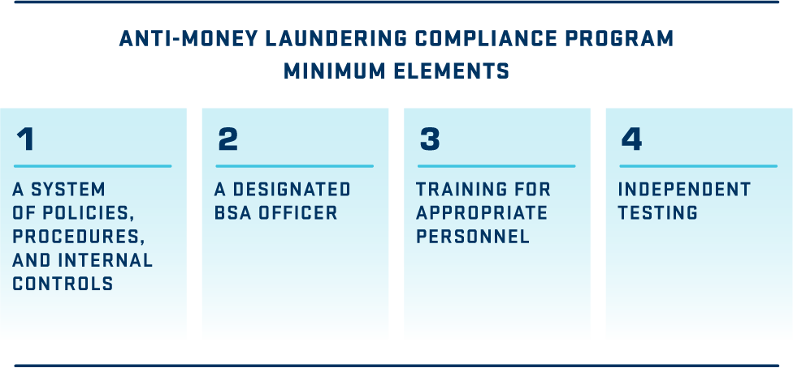

At a minimum, an AML compliance program must contain the following
elements:

1.  A system of policies, procedures, and internal controls to ensure
    compliance with the BSA;

2.  A designated BSA Officer who is responsible for ensuring the
    Company’s compliance with the BSA and Office of Foreign Assets
    Control (“OFAC”) requirements;

3.  Training for appropriate personnel; and

4.  Independent testing of the program.

The program must also address specific recordkeeping and reporting
obligations, such as filing suspicious activity reports (“SARs”) and
currency transaction reports (“CTRs”).

Similar requirements apply to broker-dealers\[73\], mutual funds\[74\],
and futures commission merchants and introducing commodity brokers
\[75\]. Broker-dealers also must comply with FINRA’s AML compliance
rule, FINRA Rule 3310.\[76\] Further, general prohibitions against
promoting or conducting a transaction knowing the proceeds facilitate
money laundering or other crimes, whether or not a company is a
“financial institution” under the BSA, apply to all persons.\[77\]

Appropriate procedures for KYC at customer onboarding and then
monitoring the customer’s ongoing transactions are essential to
determining whether suspicious activity is occurring.

It is also worth noting that various state regulatory regimes may entail
additional AML standards. For example, holders of New York’s
“BitLicense” must, among other thing:

  - Conduct AML risk assessments, and maintain and enforce an AML
    program very similar in structure to that required by FINRA Rule
    3310;

  - Verify customer identities at account opening and maintain
    transaction records that reflect the identity and physical addresses
    of customers and other parties to the transaction to the extent
    practicable;

  - File SARs as required under federal law, and make certain SAR-like
    filings to NY state if not required to make such filings to federal
    regulators; and

  - Maintain a written anti-fraud policy.

<!-- end list -->

2.  **Office of Foreign Assets Control Requirements**

The Office of Foreign Assets Control (“OFAC”) administers and enforces
both comprehensive and targeted economic and trade sanctions to further
U.S. foreign policy and national security goals against certain foreign
countries and regimes, nationals of certain of those countries,
designated terrorists, foreign terrorist organizations, international
narcotics traffickers, those engaged in activities related to the
proliferation of weapons of mass destruction, and other threats to the
national security, foreign policy, or the economy of the United States.
OFAC acts under Presidential national emergency powers, as well as
authority granted by specific legislation, to impose controls on
transactions and freeze assets under U.S. jurisdiction.

OFAC requirements apply to all “U.S. persons” or “Persons subject to
U.S. jurisdiction”, including U.S. incorporated companies and their
foreign branches, persons and companies located or physically in the
United States, and U.S. citizens and permanent resident aliens wherever
located. In certain sanctions programs, foreign subsidiaries owned or
controlled by U.S. companies must also comply.

The specific prohibitions vary depending on the program; however, OFAC
sanctions generally prohibit transactions or dealings with a person or
entity identified on the OFAC list of Specially Designated Nationals and
Blocked Persons (the “SDN List”) or the assets of a SDN, as well as
certain transactions and activities with countries or sectors subject to
economic sanctions. OFAC regulations maintain specific instructions on
what to do if such a transaction or dealing is attempted, including
“blocking” (freezing) of accounts or property, or prohibiting or
rejecting the transaction.

3.  **Executive Order 13827 and Venezuela-Related Sanctions**

On January 19, 2018, OFAC published FAQ 551 stating that U.S. persons
who engage in purchasing or otherwise dealing with the Venezuelan petro
(a state-sponsored virtual currency backed by oil) may violate U.S.
sanctions imposed against Venezuela because of rights attached to it to
receive commodities, such as oil, in a specified quantity at a later
date.\[78\] This right to receive commodities would violate Executive
Order 13808, issued on August, 24, 2017, which, among other things,
prohibits transactions, financing, and other dealings regarding “new
debt with a maturity of greater than 30 days, or new equity, of the
Government of Venezuela.”\[79\] 

On March 19, 2018, President Trump signed Executive Order 13827, Taking
Additional Steps to Address the Situation in Venezuela and memorializing
the policy position taken in FAQ 551. This Executive Order provides that
U.S. persons may not transact, deal, or provide financing related to any
digital currency, digital coin, or digital token that was issued by, or
on behalf of the Government of Venezuela on or after January 9,
2018.\[80\] Executive Order 13827 also covers the broad concepts of
“digital currency,” “digital coin,” and “digital token,” which are
undefined in the Order but are explained in OFAC FAQs 564-566.

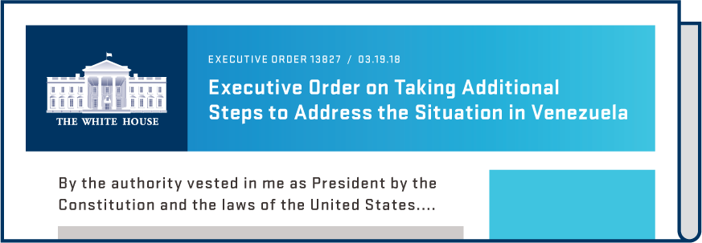

Following the issuance of Executive Order 13827, OFAC amended its list
of FAQs related to sanctions imposed against Venezuela to add FAQs
564-66. FAQ 564 clarifies that for the purposes of Executive Order
13827, Venezuela’s petro and petro-gold are considered to be a digital
currency, digital coin, or digital token issued by the Government of
Venezuela on or after January 9, 2018; thereby prohibiting transactions
by U.S. persons related to the petro and petro-gold.\[81\] FAQ 565
clarifies that Venezuela’s fiat currency, the bolivar fuerte, does not
constitute a digital currency, digital coin, or digital token. Finally,
FAQ 566 provides that OFAC would consider license applications related
to digital currencies, digital coins, or digital tokens issued by the
Government of Venezuela on a case-by-case basis, but generally, absent
OFAC’s authorization, U.S. persons may not “engag\[e\] in transactions
related to, provid\[e\] financing for, and otherwise deal” in
Venezuelan-issued digital currencies, digital coins, or digital tokens.

On March 19, 2018, OFAC amended its FAQs to clarify its policy position
on virtual currencies generally.\[82\] FAQ 559 defines “virtual
currency,” “digital currency,” “digital currency wallet,” and “digital
currency address.”\[83\]

FAQ 560 states that OFAC compliance obligations are the same for U.S.
persons whether transactions are denominated in a digital currency or a
traditional fiat currency. Further, OFAC specifically notes that the
compliance obligations extend to firms that are using digital currency
when facilitating or engaging in online commerce or processing
transactions, as well as trading platforms and others. In addition, the
FAQ states that technology companies, digital currency users, digital
currency trading platforms, digital currency administrators, and other
payment processors, among others, should develop tailored, risk-based
compliance programs that include sanctions list screening.

FAQ 561 explains that OFAC will use pre-existing government strategies
designed to combat illicit use of digital currencies in order to
sanction perpetrators. In addition, OFAC reserved the right to amend its
SDN list to include specific digital currency addresses that are
associated with blocked persons or entities that appear on the list.

FAQ 562 explains that OFAC may also add digital currency addresses
associated with blocked persons to the SDN list, and reminds companies
that any such digital currency must be blocked and to file a blocking
report with OFAC.

FAQ 563 states that the format in which a digital currency address is
included on the SDN list will include its corresponding digital
currency.

4.  **Federal Income Tax Treatment**

The federal income tax consequences of transactions involving digital
tokens is a developing area of law. The IRS has issued some guidance in
Notice 2014-21, which generally treats convertible virtual currencies as
property for U.S. tax purposes, rather than, for example, as foreign
currency. However, Notice 2014-21 does not cover all of the terrain, and
there are a number of areas of remaining uncertainty.

1.  **Treatment of Convertible Virtual Currencies Under Notice 2014-21**

In April 2014, the IRS issued Notice 2014-21, which explains, in
question and answer format, the application of existing general tax
principles to transactions using virtual currency.

The guidance in the Notice only applies to “convertible virtual
currency,” defined as “\[v\]irtual currency that has an equivalent value
in real currency, or that acts as a substitute for real currency.” The
Notice cited bitcoin as one example of a convertible virtual currency,
noting that it “can be digitally traded between users and can be
purchased for, or exchanged into, U.S. dollars, Euros, and other real or
virtual currencies.”

The Notice provides that, in general, the sale or exchange of
convertible virtual currency, or the use of convertible virtual currency
to pay for goods or services in a real-world economy transaction, has
tax consequences that may result in a tax liability. The Notice provides
that virtual currency is treated as property for tax purposes and that
“\[g\]eneral tax principles applicable to property transactions” apply
to transactions using virtual currency. The Notice provides that virtual
currency is not treated as currency that could generate foreign currency
gain or loss for tax purposes.

The Notice describes some of the tax consequences of mining virtual
currency. The Notice provides that when a taxpayer successfully mines
virtual currency, the fair market value of the virtual currency as of
the date of receipt is includible in gross income. The Notice further
provides that if a taxpayer’s mining of virtual currency constitutes a
trade or business, and the mining activity is not undertaken by the
taxpayer as an employee, the net earnings resulting from those
activities constitute self-employment income and are subject to the
self-employment tax.

The Notice also describes some of the tax consequences of exchanging
virtual currency for other property. If the fair market value of
property received in exchange for virtual currency exceeds the
taxpayer’s adjusted basis of the virtual currency, the taxpayer has
taxable gain. The taxpayer has a loss if the fair market value of the
property received is less than the adjusted basis of the virtual
currency. The Notice provides that the basis of virtual currency is
generally equal to the fair market value of the virtual currency in U.S.
dollars as of the date of receipt. The Notice also provides that if a
virtual currency is listed on an exchange and the exchange rate is
established by market supply and demand, the fair market value of the
virtual currency is determined by converting the virtual currency into
U.S. dollars (or into another real currency which in turn can be
converted into U.S. dollars) at the exchange rate, in a reasonable
manner that is consistently applied.

The character of the gain or loss generally depends on whether the
virtual currency is a capital asset in the hands of the taxpayer.
Virtual currency held for investment typically should be treated as a
capital asset. Virtual currency held mainly for sale to customers in a
trade or business typically should not be treated as a capital asset. In
general, gain on the sale or exchange of a capital asset is treated as
long-term capital gain (taxed at preferential rates) when the capital
asset has been held for longer than one year. When a capital asset has
been held for less than one year, gain generally is treated as
short-term capital gain (taxed at ordinary income rates). Gain on the
sale or exchange of a non-capital asset generally is treated as ordinary
income.

The Notice provides that payments made using virtual currency are
subject to information reporting to the same extent as any other payment
made in property. The fair market value of virtual currency paid as
wages is subject to federal income tax withholding, Federal Insurance
Contributions Act (“FICA”) tax, and Federal Unemployment Tax Act
(“FUTA”) tax and must be reported on Form W-2. Generally, a person
who in the course of a trade or business makes a payment of $600 or more
in a taxable year to an independent contractor for the performance of
services is required to report that payment to the IRS and to the payee
on Form 1099-MISC. A third party that contracts with a substantial
number of unrelated merchants to settle payments between the merchants
and their customers is a third-party settlement organization that is
required to report payments made to a merchant on a Form 1099-K.

Payments made using virtual currency are subject to backup withholding
to the same extent as other payments made in property. Therefore, payors
making reportable payments using virtual currency must solicit a
taxpayer identification number (“TIN”) from the payee. The payor must
backup withholding from the payment if a TIN is not obtained prior to
payment or if the payor receives notification from the IRS that backup
withholding is required.

2.  **Other Tax Issues Involving Virtual Currencies**

Notice 2014-21 does not provide guidance on certain issues relating to
the tax treatment of virtual currencies, including: (i) whether and how
virtual currency brokers or dealers must report transactions involving
virtual currency on Form 1099-B; (ii) whether holders of virtual
currency should report their holdings on FinCEN Form 114 (FBAR
reporting) or Form 8938 (FATCA reporting); (iii) the circumstances under
which two different kinds of virtual currency may be regarded as like
kind property for purposes of section 1031 of the Internal Revenue Code;
and (iv) the treatment of a “hard fork” in the blockchain of a virtual
currency or of an “airdrop” of virtual currency.

In general, a broker or dealer that effects the sale of certain
securities, commodities, options, regulated futures contracts,
securities futures contracts, or forward contracts by a customer in the
ordinary course of a trade or business must report information
concerning its customer’s name, address, and TIN, the property sold, the
gross proceeds of the sale, the sale date, and other information
required by Form 1099-B. In addition, with respect to certain “covered
securities,” the broker or dealer must report the adjusted basis of the
security sold and whether any gain or loss with respect to the security
sold is long-term or short-term. If reportable sales are not reported on
a Form 1099-B, then the broker or dealer generally is subject to backup
withholding. Treasury and the IRS have not produced guidance on whether
or how brokers or dealers should comply with Form 1099-B reporting with
respect to virtual currency.

In general, U.S. persons that have a financial interest in or signature
authority over foreign financial accounts that exceed specified value
thresholds must file a Report of Foreign Bank and Financial Accounts
(“FBAR”), Form 114, through the e-filing system of FinCEN. In
addition, under the Foreign Account Tax Compliance Act (“FATCA”),
certain taxpayers that have an interest in specified foreign financial
assets that exceed specified value thresholds must report those assets
on a Statement of Specified Foreign Financial Assets, Form 8938, filed
with their annual tax return. Treasury, the IRS, and FinCEN have not
produced any guidance on whether virtual currency accounts could be
subject to these reporting requirements.

Prior to 2018, under section 1031 gain or loss generally was not
recognized on the sale or exchange of property held for productive use
in a trade or business or for investment if such property was exchanged
solely for property of like kind which was to be held either for
productive use in a trade or business or for investment. Whether
intangible personal property was of a like kind to other intangible
personal property generally depended on the nature and character of the
rights involved and on the nature or character of any underlying
property. Treasury and the IRS have not issued guidance on the
circumstances under which two different kinds of virtual currency may be
regarded as like kind property for purposes of section 1031. The IRS has
historically taken a narrow view of the type of property that can
qualify as like-kind (for example, treating gold and silver bullion or
gold numismatic and gold bullion coins as not like-kind but treating
gold bullion for Canadian Maple Leaf gold coins or Mexican and Austrian
noncurrency bullion coins as like-kind). Nonetheless, it may be possible
to argue that two cryptocurrencies are similar enough to qualify as
like-kind (for example, two mined cryptocurrencies on the same
blockchain as opposed to a digital currency and a smart contract based
token). As a result of the 2017 tax reform legislation,\[84\] however,
section 1031 can only apply to exchanges of real property, so like-kind
exchanges of virtual currencies are no longer possible after 2017.

Treasury and the IRS have not issued any guidance concerning the
appropriate treatment of a virtual currency hard fork. A fork is
potentially analogous to a number of different kinds of transactions
that are treated differently for tax purposes. As a result, the timing
and character of any income that may be realized in connection with a
fork or subsequent sale of virtual currency that is created by a fork is
uncertain. In particular, it is not clear: (i) whether income is
recognized at the time of the fork, at the time that a taxpayer
exercises dominion and control over virtual currency created in the
fork, or only at the time that a taxpayer sells or disposes of virtual
currency; (ii) how dominion and control should be interpreted in the
context of virtual currency created in a fork; (iii) how the basis in
virtual currency created in a fork should be determined; and (iv) how
the holding period of virtual currency created in a fork should be
determined.

Treasury and the IRS have also not released guidance on the treatment of
so-called “airdrops” of virtual currency or tokens—where holders of one
digital token are given other digital tokens for free. The timing of
income recognition in an airdrop is unclear, and airdrops may present
valuation issues as well.

1.  **Tax Treatment of Token Distributions and SAFTs**

Treasury and the IRS have not issued any guidance concerning the tax
treatment of token distributions. In general, the facts and
circumstances of a particular token distribution, including the nature
of any rights associated with a token, must be analyzed to determine the
appropriate characterization of the tokens for tax purposes. Depending
on these facts, a token might properly be treated as convertible virtual
currency under Notice 2014-21, as debt or equity interests in an entity
established by the issuer, as equity in a de facto partnership among
holders of the tokens, as a prepayment for goods and services, or as
some other type of property. The tax consequences to issuers and holders
of a particular token will depend upon this characterization of the
token. In addition, token issuers may be subject to barter exchange
reporting rules if the tokens are properly characterized as “scrip”
through which clients of the issuer exchange property or services.

Some Token Sponsors pre-sell some amount of the digital tokens that the
sponsor intends to distribute through a Simple Agreement for Future
Tokens (“SAFT”). Under this model, the SAFT holder typically pays a
fixed amount (usually in fiat currency or in a virtual currency) for the
right to receive a determinable amount of tokens upon the occurrence of
a “launch event,” at which point the Token Sponsor distributes tokens.
SAFTs typically provide that the intended tax treatment of the SAFT is
as a forward contract. If this treatment is respected, then the issuance
of the SAFT generally should not be a taxable event, and taxation of the
purchase amount under the SAFT should be deferred until delivery of the
tokens to the SAFT holder.

However, the characterization of a SAFT as a forward contract may not
necessarily be respected by the IRS. For example, depending on the facts
and circumstances, the IRS may seek to recharacterize a SAFT as a debt
instrument or to distinguish a SAFT from a traditional prepaid forward
contract and tax the proceeds upon receipt. The efficacy of the SAFT
approach to token generation remains controversial, and is not a settled
regulatory matter.

**Section 2:**

**Canada**

# Introduction

Digital token units, often referred to as “coins” or “tokens”, issued as
part of an ICO or initial token offering (“ITO”) – terms for digital
token distributions that have been used by Canadian Securities
Administrators – can represent many different things, including a
portion of an asset, whether tangible or intangible; services or units
of services; or an ownership interest in a business. Whether Canadian
securities laws apply to ICOs and ITOs will likely depend on the use to
which the coin or token may be put and what rights it represents.

There may be a distinction between tokens that fall within the ambit of
securities regulation and those that fall outside of it. Proponents of
this view conceive of at least two distinct types of tokens. The concept
of a “utility token” involves a token or coin that represents services
or units of services, for example, using tokens to play a game at an
arcade. On the other hand, a “securities token” entitles the holder of
the token or coin to certain rights in the business’ assets, revenues or
profits. Since a securities token functions similar to a typical
security such as a share, Canadian securities laws are likely to apply.

While reference is made throughout this discussion to “securities
tokens,” it is important to note that any distinction between utility
tokens and securities tokens has not been explicitly accepted by
Canadian securities regulatory authorities. On August 24, 2017, Canadian
Securities Administrators (“CSA”) staff, with the exception of
Saskatchewan, published Staff Notice 46-307 – *Cryptocurrency
Offerings*\[85\] (“CSAN 46-307”), in response to requests from fintech
businesses for guidance on the applicability of Canadian securities laws
to “cryptocurrency offerings,” “cryptocurrency exchanges,” and
“cryptocurrency-focused investment funds.” CSAN 46-307 articulated a
general view that “in many instances” digital tokens associated with
ICOs/ITOs are securities.

On June 11, 2018, the CSA published [Staff Notice 46-308 *Securities Law
Implications for Offerings of
Tokens*](http://www.osc.gov.on.ca/documents/en/Securities-Category4/csa_20180611_46-308_implications-for-offerings-of-tokens.pdf)\[86\]
(“CSAN 46-308”), which provides additional guidance on the applicability
of securities law to offerings of blockchain-based tokens or coins.

The discussion that follows outlines certain of the Canadian securities
law considerations that may apply to the distribution or trading of a
digital token that qualifies as a “security” within the meaning of
Canadian securities laws.

# The Canadian Legal Framework

Securities legislation in Canada is principally governed by Canada’s ten
provincial and three territorial governments with the view of balancing
investor protection against efficient capital markets.\[87\] While each
province and territory has its own securities legislation, some
coordination among jurisdictions is achieved through the CSA as an
umbrella organization.\[88\] While the following discussion will focus
mainly on the securities laws of the Province of Ontario, the rules in
many areas of securities regulation have been standardized among the
provinces and territories and cooperative systems have been established
among the regulators through the CSA.

## The Definition of “Security” and its Application to Digital Tokens

The provincial securities Acts have expansive statutory definitions of
“security.”\[89\] The statutory definitions of “security” include as
one category, an “investment contract”, which is the category Canadian
courts and securities regulators generally use to assess whether a new
type of transaction involves a security.

The leading case in Canadian jurisprudence on the meaning of investment
contracts is *Pacific Coast Coin Exchange* v. *Ontario Securities
Commission*\[90\] (“Pacific Coast”), which was expressly cited as the
relevant case law in CSAN 46-307. The Supreme Court of Canada in Pacific
Coast considered and adopted certain U.S. jurisprudence on the meaning
of investment contracts, and in particular, the common law test set out
in *SEC* v. *W.J. Howey Co.*, 328 U.S. 293 (1946) and other U.S. cases.

The application of this Canadian case law to so-called “utility” tokens
has not been further elaborated upon directly by the Canadian courts.

In its application to “cryptocurrency offerings,” the CSA has stated
that it will conduct an evaluation of whether a “cryptocurrency” – a
term that it leaves undefined – qualifies as a “security” on a
case-by-case basis and that substance will be considered over form. In
CSAN 46-307, the CSA noted that the appropriate interpretive test was
the four-prong test: does the ICO/ITO involve (1) an investment of
money, (2) in a common enterprise, (3) with the expectation of profit,
(4) to come significantly from the efforts of others. The CSA further
stated in CSAN 46-307 that the case law requires an assessment of the
economic realities of a transaction and a purposive interpretation,
keeping in mind the objective of investor protection.\[91\]

The CSA did not provide any clear guidance in CSAN 46-307 on the
characteristics that would indicate that “securities may not be
involved.” Generally, however, it can be concluded that a token that
entitles the holder to share in the business profits of the entity
distributing the token will likely be considered a security.

The application of this Canadian case law to so-called “utility” tokens
has not been further elaborated upon directly by the CSA or Canadian
courts.

In CSAN 46-308, the CSA staff expressed the view that if management
“clearly and uniformly promotes the token in a manner that, taken as a
whole, promotes only its utility and not its investment value, the
implication that purchasers have an expectation of profit may be
reduced.”

If tokens are not fungible or interchangeable and each token has unique
characteristics, and any future market value of the token is primarily
based on market forces, the value of the token may be based on its
unique characteristics, and not on the efforts of others. There may not
be a common enterprise.

If tokens have a fixed value on the platform that does not automatically
increase over time, or change based on non-commercial factors, this may
reduce the purchaser’s expectation of profit.

If the token’s software, platform or services are not yet available or
are still in development, the CSA said this could indicate that the
purchaser is not purchasing the tokens for their immediate utility, but
because of an expectation of profit. “Although some purchasers may be
purchasing the token for the utility function, many purchasers may be
purchasing the token in order to sell it on a cryptoasset trading
platform or otherwise in the secondary market.” This is particularly
true where the existence of secondary trading is critical to the success
of the offering of tokens or is featured prominently in the marketing of
the offering. This could also indicate the existence of a common
enterprise because management’s efforts are still needed to develop or
deliver the software, online platform or application or goods and
services.

## CSA Sandbox Approvals

The CSA established a regulatory sandbox\[92\] in February 2017 (the
“CSA Sandbox”), a program whereby issuers seeking to offer innovative
products, services and applications, such as digital tokens, are invited
by the CSA to discuss their business model and applicable securities
laws, and possible exemptive relief, directly with the applicable
securities regulators on a coordinated and flexible basis. As CSA
Sandbox approvals are intended to allow the issuers to operate in a test
environment, the approvals are time-limited, so far to one or two years.

To date, only two limited exemptions relating to digital tokens have
been granted through the CSA Sandbox process.

The first limited exemption was for Montreal-based Impak Finance Inc.
(“Impak”), which received exemptive relief on August 16, 2017 from the
Québec Autorité des marchés financiers (“AMF”) and seven other Canadian
jurisdictions from the dealer registration requirement and the
prospectus requirement in respect of the resale of Impak Coins
(“MPK”).\[93\] The initial distribution of MPK was made in
accordance with the standard terms of an already existing statutory
offering memorandum prospectus exemption. This allowed Impak to carry
out the ICO. The issuance of MPK, a new digital currency based on the
Waves blockchain platform, was proposed in order to fund the development
of Impak’s online social network dedicated to the impact economy. The
MPK network did not exist at the time of the ICO. MPK were not delivered
to purchasers upon closing of the offering, rather, only once Impak
launches its digital wallet sometime in the future.

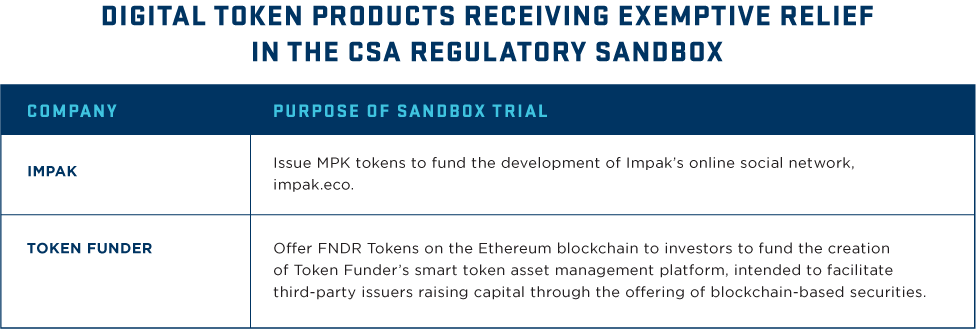

The Impak exemption order had a number of significant conditions. Impak
was required to conduct both know-your-client and suitability reviews
for each MPK purchaser. In this context KYC means more than simply
identity verification, and includes knowing clients’ overall investment
experience and objectives, in order to assess investment suitability for
the client. Impak was permitted to accomplish this through an online
interactive questionnaire. There was no prospectus relief granted for
any resale by a holder of MPK, except for a transfer by a participant to
a social impact merchant. MPK cannot be listed and traded on any
exchange unless it is done in accordance with Canadian securities laws
and first approved by the AMF. The exchange rate for MPK to the Canadian
dollar is established by an MPK governance body, and MPK may be redeemed
for Canadian dollars at that rate, although Impak does not guarantee the
purchase or conversion of MPK to participants. The exemption expires 24
months from the date of the decision.

The second limited exemption was for Toronto-based Token Funder Inc.
(“Token Funder”), which received exemptive relief on October 17, 2017
from the Ontario Securities Commission (“OSC”) and other Canadian
securities regulators from the dealer registration requirement to allow
it to sell its own digital tokens, called FNDR Tokens, to the
public.\[94\] The initial distribution of FNDR Tokens would be made in
accordance with the standard terms of an already existing statutory
offering memorandum prospectus exemption. Token Funder was seeking to
offer FNDR Tokens on the Ethereum blockchain to investors in order to
fund the creation of its smart token asset management platform, intended
to facilitate third-party issuers raising capital through the offering
of blockchain-based securities. FNDR Tokens were designed to share in
distributions from Token Funder arising from the operation of the
platform, in the discretion of the Board of Directors of Token Funder
and will have certain voting rights on the entities entitled to use the
platform. FNDR Tokens cannot be listed and traded on any exchange unless
done in accordance with Canadian securities laws and first approved by
the OSC. The exemption will expire 12 months from the date of the
decision.

Unlike the FNDR Tokens, MPK was unusual in that it was generally not
freely transferable by its terms, but was redeemable at a non-guaranteed
rate to be established. Given that the Impak network was still a work in
progress, the MPK tokens had no utility at the time of the ICO and were
treated by the issuer and the AMF as being investment contracts. The
FNDR Tokens are more clearly securities tokens due to their distribution
entitlements. From these two narrow examples, few clear factors on the
broader application of the law around investment contracts to tokens can
be
elucidated.

## Factors Relating to the Consideration of Whether a Token is a Security

While the following factors are relevant to the analysis of whether a
token does or does not qualify as a “security,” it is not clear whether
the securities regulatory authorities in Canada will consider any
particular factor or set of factors as determinative:

  - What is the token’s use or purpose?

  - Does the token represent access to a business’ platform, or does it
    represent an ownership stake in a business that could increase or
    decrease in value depending on the success of the business?

  - At the intended time of sale of the token, does the relevant
    platform still need to be developed or is there an existing,
    functioning ecosystem in which the token can be utilized?

  - Will the purchaser receive the token upon payment of the full price?

  - Is the token’s market value reflective of the general attractiveness
    of the business?

  - Is the token transferable, and is the anticipated value derived from
    future market demand?

  - Does the token expire after a certain period of time of not being in
    use?

  - Is the purchaser’s purpose for purchasing the token personal use or
    consumption, rather than merely investment purposes?

<!-- end list -->

2.  # Considerations Regarding “ICOs” of a “Security”
    
    4.  ## Issuing a Securities Token

### Prospectus Requirement or Exemption

If the purchaser of a securities token is located in a Canadian
jurisdiction, Canadian securities laws must be considered regardless of
the location of the issuer of the token. Canada’s prospectus requirement
creates a closed-system whereby any distribution of a security, even if
made by a private company, must either be qualified by a prospectus or
must qualify for a prescribed prospectus exemption.

To date, there has been no prospectus filed and approved to undertake an
ICO in Canada. Upon filing and receiving a receipt for a final
prospectus, the issuer would become a “reporting issuer” in Canada. A
reporting issuer is subject to all of the continuous and timely
disclosure requirements of Canadian securities laws, which are extensive
and include the requirement to prepare and disseminate quarterly and
audited annual financial statements.

As an alternative to a public prospectus, one of the most commonly used
prospectus exemptions is the “accredited investor” exemption.\[95\] This
exempts an issuer or selling security holder from the prospectus
requirement when distributing securities to certain institutional
investors or wealthy individuals (for example an individual whose
financial assets before taxes but net of liabilities of over $1 million,
or whose net income exceeds $200,000 in each of the two most recent
calendar years).\[96\] Individual accredited investors below certain
financial thresholds are required to receive and sign a prescribed risk
acknowledgment form.

Token Funder and Impak each relied on the “offering memorandum”
prospectus exemption\[97\] in respect of the initial distribution of
their securities tokens. While the details vary by Canadian
jurisdiction, the offering memorandum exemption allows an issuer to
distribute its securities to purchasers who are not accredited investors
or eligible investors (which are investors who meet a slightly less
stringent financial test than the accredited investor test), so long as
the issuer provides purchasers with a prescribed form of offering
memorandum (which is similar to a prospectus), the issuer obtains a
signed risk acknowledgment form from the purchaser and the purchaser’s
acquisition cost does not exceed a prescribed maximum amount. While the
prescribed maximum amount in many jurisdictions is ordinarily $10,000
for non-eligible investors, the OSC and the AMF in their exemptive
relief decisions in respect of Token Funder and Impak, imposed lower
$2,500 investment limits for investors who did not qualify as accredited
investors or eligible investors.

### Marketing restrictions

“Trading” of securities includes any act, advertisement, solicitation,
conduct or negotiation directly or indirectly in furtherance of a
distribution of securities, and thus triggers the prospectus
requirement.\[98\]

If the accredited investor exemption is to be relied upon, before a
marketing document, such as a term sheet or offering memorandum, is
provided to potential investors, their eligibility for the accredited
investor exemption must already have been assessed. In the case of
reliance on the offering memorandum exemption, an offering memorandum in
the prescribed form and in many cases, a risk acknowledgment form, must
be obtained from the purchaser prior to signing the agreement to
purchase the security.

In order to meet these requirements, issuers have used a “walled garden”
approach whereby potential investors may access the electronic marketing
materials on the issuer’s website only once their compliance with the
applicable exemption has been verified.

### Exempt distribution reporting

Certain prospectus exemptions, including the accredited investor and
offering memorandum exemptions, require the filing of exempt
distribution reports (and in some cases offering memoranda) with the CSA
within ten days after the distribution.\[99\] The names of any agents or
underwriters that assist with an offering of securities tokens and their
fees must also be recorded on the reports. As these exempt distribution
reports require detailed information about purchasers, issuers of
securities tokens must ensure their purchase procedures have the
capability of capturing and recording information in respect of each
purchase of securities, including the name, address and telephone number
of each investor in Canada, their particular sub-category of accredited
investor, if applicable, as well as the price and number of securities
purchased by each investor. Issuers based in the Canadian provinces of
Alberta, British Columbia or Québec have additional reporting
obligations, even for distributions made outside Canada.

### Resale restrictions

Securities tokens purchased in reliance upon a prospectus exemption are
subject to restrictions on resale pursuant to National Instrument 45-102
– *Resale of Securities* (“NI 45-102”). NI 45-102 generally prohibits
resale of a security purchased under the accredited investor exemption
unless either (i) the issuer of the security has been a reporting issuer
in a jurisdiction of Canada for the four months preceding the trade, or
(ii) the resale is made under another prospectus exemption, such as the
accredited investor exemption, which would entail continued resale
restrictions, or the security is of a foreign issuer and is resold
outside Canada under certain conditions.\[100\] Unless the issuer of a
securities token becomes a reporting issuer in Canada, the resale
restrictions continue indefinitely and do not expire, so the tokens
would never become freely tradeable in Canada.

## Trading or Advising in Securities Tokens 

Persons in the business of trading or advising in securities, or holding
themselves out as being in the business of trading or advising in
securities, must register as dealers or advisers with the relevant CSA
regulator and meet the requirements set out in National Instrument
31-103 – *Registration Requirements, Exemptions and Ongoing Registrant
Obligations.*\[101\] The determination of whether one is, or holds
oneself out to be, in the business of trading or advising in securities
is a factual determination commonly referred to as the “business
trigger” for registration.

Startup issuers that are raising capital to advance their operating
business plans would typically not be considered to be in the business
of trading in securities unless they engage an employee with primary
responsibility and/or compensation for capital raising activities.
However, it is notable that both Token Funder\[102\] and Impak\[103\]
sought and received temporary exemptions from the dealer registration
requirement upon conditions, including: conducting investment
know-your-client and suitability reviews of purchasers, not providing
investment advice to purchasers, and establishing policies and
procedures that establish a system of controls and supervision
sufficient to manage the risks of the business.

On September 6, 2017, Canada’s first “Cryptocurrency Fund,” a term used
by the CSA to refer to an investment fund that invests solely in
specified digital tokens, was established. The British Columbia
Securities Commission (“BCSC”) and the OSC granted to First Block
Capital Inc. (“First Block”) the first registration in Canada to an
investment fund manager (“IFM”) and exempt market dealer (“EMD”) solely
dedicated to digital token investments, in order to operate a bitcoin
investment fund.\[104\] First Block’s registration was granted subject
to a number of tight restrictions and requirements, including:\[105\]

  - Prior approval must be granted by the BCSC for any new
    Cryptocurrency Fund established by First Block;

  - A specific custodian (Xapo) was prescribed and changes to a
    Cryptocurrency Fund’s custodian or to the entity principally
    responsible for the execution of trades for such fund will also be
    subject to prior approval;

  - First Block must require its custodians and brokers to maintain
    compliance systems that provide reasonable assurance of compliance
    with regulatory requirements, and to manage business risks in
    accordance with prudent business practices;

  - Independent auditor reports reviewing the sufficiency of the
    Cryptocurrency Fund’s custodian’s security practices as well as
    regulatory compliance documents received by First Block from its
    custodians and brokers must be provided to the BCSC;

  - Annual audited financial statements must be available to
    securityholders for each Cryptocurrency Fund, and net asset value
    reports must be available on a monthly or more frequent basis for
    each Cryptocurrency Fund; and

  - Prior to making a trade in a digital token, First Block must make
    its own determination of a current and reasonable fair price for the
    digital token.

Subsequently, the Alberta Securities Commission (“ASC”), OSC and AMF
imposed similar restrictions on the registrations of Ross Smith Asset
Management ULC (“RSAM”),\[106\] 3iQ Corp.,\[107\] and Majestic Asset
Management LLC (“Majestic”),\[108\] respectively, each of which notified
the relevant regulator that it intended to establish, manage and
distribute securities of a fund that will invest solely in
“cryptocurrencies,” which, for the purposes of the decision documents,
the ASC, OSC, and AMF (as applicable) defined to mean bitcoin, ether,
litecoin (in the case of the 3iQ Corp. decision document) and “anything
commonly considered a cryptocurrency, digital or virtual currency, or
digital or virtual token.”\[109\] The decision documents note that an
investment fund that invests solely in one or more specified
“cryptocurrencies” is a novel business model in Canada and, as such,
additional reporting is required in order to monitor developments in the
area.

It was significant at the time that First Block was not also required to
register as a portfolio manager in order to manage investment activity
for the initial bitcoin trust, as this implied that the underlying
bitcoin was not considered by the BCSC and OSC to be a security.
However, RSAM, 3iQ Corp., Majestic and Rivemont Investments Inc.,
investment portfolio manager of the fund created by Majestic, are all
also registered as portfolio managers, implying that the issue is not
yet settled.

On December 5, 2017, the OSC issued a notice to all registered firms
(dealers, advisers or investment fund managers) saying that any firms
that plan to establish, manage, advise and/or trade in securities of
investment funds with portfolios of “\[b\]itcoin and/or other
cryptocurrencies, cryptocurrency assets and coins and token offerings”
are required to report changes in their business activities “to include
cryptocurrency products and/or services” by completing and filing a
prescribed form of notice of change of registration information.\[110\]
The OSC said that following reviews of the information provided, the OSC
may impose terms and conditions on the firm’s registration to ensure
adequate investor protection.\[111\]

## Creating a Market for Securities Tokens 

As part of CSAN 46-307*,* the CSA signaled its concern that platforms
facilitating trades in coins, tokens or cryptocurrencies that qualify as
securities may also be subject to Canadian securities law requirements
involving recognition or exemption from recognition as an exchange or as
a quotation and trade reporting system.\[112\] At this point in time, no
entity has obtained the recognition required, nor an exemption from such
recognition requirement, in order to allow Canadians to participate in
on-exchange trading of tokens that are securities.

The definition of “marketplace” in the Ontario *Securities Act* and
other relevant rules is broad and includes an exchange, a quotation and
trade reporting system, or any person or company that constitutes,
maintains or provides a market or facility for bringing together orders
for securities from multiple buyers and sellers using established,
non-discretionary methods under which orders interact with each other
and the buyers and sellers entering into the orders agree to the terms
of a trade.\[113\]

A person or company is considered to bring together orders for
securities if it (a) displays, or otherwise represents to marketplace
participants, trading interests entered on the system; or (b) receives
orders centrally for processing and execution. Merely routing orders to
marketplace or a dealer for execution is not considered to be providing
a market or facilities for bringing together buyers and sellers of
securities.\[114\]

Marketplaces will generally be found to be exchanges if the marketplace
provides a listing function, provides a guarantee of a two-sided market
for a security on a continuous or reasonably continuous basis, sets
requirements governing the conduct of marketplace participants or
disciplines marketplace participants, for example by levying fines or
taking enforcement action.\[115\] A marketplace that does not meet these
exchange indicia and is not a quotation and trade reporting system may
be characterized as an “alternative trading system” (“ATS”). An ATS
proposing to carry on business in Canada is required to become
registered as an investment dealer and provide detailed specified
information to the CSA.

3.  # Anti-money Laundering
    
    In 2014, the federal government proposed amendments to the Proceeds
    of Crime (Money Laundering) and Terrorist Financing Act (“PC
    Act”)115 that, once in force, will require entities
    engaged in the business of “dealing in virtual currencies” to
    register as money services businesses with the Financial
    Transactions and Reports Analysis Centre (“FINTRAC”). In June 2018
    the Department of Finance published proposed regulations defining
    what “virtual currency” means. In that regard virtual currency is
    defined as  (a) a digital currency that is not fiat currency and
    that can be readily exchanged for funds or for another virtual
    currency that can be really exchanged for funds; or (b) information
    that enables a person or entity to have access to a digital currency
    referred to in paragraph (a). The proposed regulations would limit
    AML/ATF obligations to virtual currencies that are exchangeable,
    also known as convertible. This would include both centralized
    virtual currencies which are administered by single authority and
    decentralized virtual currencies such as bitcoin, where authority is
    distributed across a network. The definition of virtual currency
    also includes information that provides access to the use of virtual
    currency, such as a private key in a cryptographic key pairing.
    There is a comment period in respect of  the proposed regulations
    until September 7, 2018, and accordingly the final language will not
    be finalized until after that time. The proposed amendments to the
    PC Act have already received Royal Assent but the in-force date is
    not known.

Once the proposed amendments are in force, entities that must register
as money services business will need to report certain transactions to
FINTRAC, verify the identities of customers and maintain records with
respect to transactions beyond a financial threshold and implement an
anti-money laundering and counter-terrorist financing compliance regime.
These requirements will apply to entities that have a place of business
in Canada as well as entities that do not, provided they direct their
services to persons or entities in Canada. As they are drafted, the
proposed amendments will not apply to entities or individuals that
simply use, and do not otherwise deal in, digital tokens.

Until the proposed amendments are in force, platforms that trade digital
tokens that are not securities are not directly addressed in the PC Act.
Such an entity may remit, transmit, or deal in digital tokens that are
not securities and because these tokens are not a recognized national
currency of a foreign country and are not considered “funds” within the
meaning of the PC Act, such activities alone do not yet bring the entity
within the scope of acting as a money services business under the PC
Act.

However, entities dealing in digital tokens that are not securities do
not operate in a legislative vacuum across Canada. If an entity operates
an automated teller machine or trading platform for digital tokens in
Québec, the AMF has taken the position that such entities are money
services businesses for the purposes of Québec legislation and must be
licensed as such.\[116\]

# Commodities and Derivatives

Although the Bank of Canada has said that “digital currencies” are
currently treated as commodities,\[117\] this has not been formally
accepted or adopted by the CSA or other regulators. Some OSC staff have
publicly complained that the Bank of Canada has not come out with a
position as to whether bitcoin, ether, or any other coin is
currency.\[118\]

In Canada, contracts for the sale of commodities, other than
exchange-traded commodity futures contracts, could still qualify as
investment contracts and thus be “securities” regulated by the
provincial and territorial securities laws.

The CSA noted in CSAN 46-307 that digital tokens may also constitute
derivatives and be subject to the derivatives laws adopted by the
Canadian securities regulatory authorities;\[119\] however, the
application of commodity trading laws and derivatives laws to digital
tokens in Canada remains to be determined.

# Enforcement Proceedings

Recent events suggest that caution must be exercised when considering
the launch of, or the investment in, digital token distributions.

On July 20, 2017, the AMF obtained prohibition orders against various
parties in connection with soliciting investments in PlexCoin, a digital
token.\[120\] The PlexCoin “purported” ICO proceeded regardless in
August. On December 8, 2017, the Québec Superior Court sentenced the
individual behind PlexCoin to jail and fines for contempt of the court
orders. On December 1, 2017, the U.S. Securities and Exchange Commission
filed charges against the parties behind PlexCoin, describing the
individual as “a recidivist Quebec securities law violator” and the ICO
as a “full-fledged cyber scam.”\[121\]

**  
**

**Section 3:**

**United Kingdom**

# Introduction

The regulation of digital tokens is a developing area as the current
United Kingdom (“U.K.”) financial services law was not developed with
the use of digital tokens in mind. Over time new legislation may well be
introduced (and interpretations of current legislation may change) to
take account of the expected increase in the use of digital tokens,
sharp and frequent price volatility of digital tokens and to safeguard
the economy against the use of digital tokens (such as virtual
currencies) for criminal purposes and intent. It also is important to
bear in mind that subtle differences in the legal structure and
commercial function of a digital asset can have significant regulatory
consequences. It is not a “one size fits all”
    regime.

2.  # Potential legal classification and related regulatory considerations
    
    1.  ## Overview

Broadly, there are several generic approaches to the regulation of
digital tokens in the U.K. One is to treat them as a commodity or other
form of physical property. Where this is the case, the marketing,
purchase and sale of the digital token will largely be unregulated from
a U.K. financial services law perspective, save if the contracts for the
trading of the digital tokens fall within the scope of the U.K. law
definitions of a derivative. Another is to treat them as a financial
instrument (principally a security) but also possibly a unit in a fund
(including a collective investment scheme, which is broadly defined and
capable of capturing arrangements involving digital tokens or an
alternative investment fund), the third approach is to treat them as
money or a currency (potentially e-money or entailing the provision of a
payment service).

In this regard, whether the digital token will be subject to regulation
will depend on whether it is designed as a medium of exchange or whether
it has more narrow functions such as solely enabling for the payment for
services provided within the particular digital token’s closed
infrastructure.

The regulatory categorisation of the digital token is important as it
will determine the extent to which (if at all) any U.K. authorisation,
prospectus, marketing restrictions, systems, controls, procedural,
conduct of business, anti-money laundering and anti-terrorist financing
requirements apply.

## U.K. Collective Investment Scheme Analysis

The term “Collective Investment Scheme” (“CIS”) is deliberately broad
and vague and so it is capable of capturing a wide range of arrangements
even if the parties to the arrangements do not intend to create or
establish a ‘fund’ or a collective investment.

Section 235 of the Financial Services and Markets Act 2000 (as amended
from time to time) (“FSMA”) defines a CIS as “any arrangements with
respect to property of any description . . . the purposes or effect of
which is to enable persons taking part in the arrangements . . . to
participate in or receive profits or income arising from the
acquisition, holding, management, or disposal of the property or sums
paid out of such profits or income.”\[122\]

Further elements of the definition are that the participants do not have
day-to-day control over the management of the property.\[123\]

In addition, the arrangements must have either of the following
characteristics:\[124\]

  - pooling of contributions and profits or income of the participants
    in the scheme (which would include the holders of the digital
    tokens); and

  - the property is managed as a whole on behalf of the operator of the
    scheme.

Typically, a CIS takes in money from investors and invests it in some
other type of property. It is that other property, plus any uninvested
contributions and undisbursed profits and income, which would normally
be regarded as the underlying property of the CIS.

In the context of digital tokens, arrangements are capable of being a
treated as a CIS in circumstances where participants pay cash to an
‘issuer’ in exchange for a certificate or token which gives the
participants/investors an entitlement to underlying property (e.g.,
gold, silver, wine, art, etc.) if the underlying property is managed by
a third party (the term managed could entail administrative functions
such as arranging for the property to be stored and/or insured) or if
the contributions or profits of the participants/investors are pooled.
Therefore arrangements relating to digital tokens need to be carefully
scrutinised to determine whether they are within the U.K. CIS regime
even if the intention is not to create a fund or collective investment.

Even if the arrangements fall within the basic definition of a CIS, they
will not be caught if an exemption in the Schedule to the FSMA
Collective Investment Scheme Order 2001 (the Order) applies. There are
exemptions for arrangements relating to debt instruments, joint venture
arrangements and those structured as bodies corporates.

The regulatory consequences of an arrangement relating to a digital
token being a CIS are twofold:

  - A CIS arrangement triggers authorisation requirements and compliance
    with certain rules for certain parties.

> For example, establishing, operating or winding up a CIS is a
> regulated activity under section 19 of FSMA and no exemption applies.
> This may be relevant to the person who is charged with establishing
> the arrangements, or arranging for the issuance of the certificates or
> tokens relating to digital tokens or arranging for the tokens to be
> stored and/or insured). Therefore, if this is done in the U.K., the
> operator will require authorisation from the U.K. Financial Conduct
> Authority (FCA). Other activities that may require authorisation, in
> relation to arrangements that amount to a CIS include managing
> investments, advising, dealing as principal or agent and arranging. It
> is an offence to carry on a regulated activity without authorisation
> under section 23 FSMA. Any contracts made by an unauthorised person
> (with participants/investors) in carrying on a regulated activity are
> unenforceable unless the court is satisfied that it is just and
> equitable to allow them to be enforced pursuant to section 28 of FSMA.

  - A CIS arrangement will have an impact on the ability to market the
    CIS to investors in the U.K.
    
    For example, it may only be possible to market the CIS to certain
    professional investors, high net worth individuals or certified
    sophisticated investors as units in a CIS are “controlled
    investments” under FSMA, and so section 21 and section 238 of FSMA
    will apply to their marketing.\[125\],\[126\]
    
    3.  ## U.K. Alternative Investment Fund Analysis

An Alternative Investment Fund (“AIF”) is defined in Article 4(1)(a) of
the Alternative Investment Fund Managers Directive (“AIFMD”) as any
“collective undertaking including investment compartments thereof,
which raises capital from a number of investors with a view to investing
it in accordance with a defined investment policy and which is not
required to be authorised under Article 5 of Directive 2009/65/EU” (the
EU Directive dealing with authorisation of open ended retail funds). All
elements of the AIF definition must be present in order for the digital
token arrangements to be treated as an AIF.

An AIF is a particular type of fund or collective investment vehicle,
which overlaps in certain respects with the definition of a CIS, but
they are not exactly the same. For example, an arrangement structured as
a closed ended body corporate is capable of being categorised as an AIF
whereas such an entity would not be a CIS.

Arrangements that relate to body corporates, partnerships,
unincorporated associations and a fund set up as a trust, which pool
together capital raised from participants/investors for the purposes of
investment (e.g., the pooled capital is used to purchase gold or silver)
with a view to generating a pooled return for those investors from
investments (e.g., the arrangements are capable of generating a return
for the participants) may amount to an AIF.

An arrangement relating to digital tokens that meets the basic
definition of an AIF under the AIFMD will not constitute an AIF if it
falls within an exemption under Article 2 of the AIFMD. There are
exemptions for holding companies, certain joint ventures and
securitisation special purpose vehicles.

The regulatory consequences of an arrangement being an AIF may trigger a
requirement for the manager to be authorised (known as the AIFM), the
appointment of a depositary, and compliance with various procedures,
controls, capital and conduct requirements. There are restrictions in
relation to the marketing of AIFs, including the type of investors who
can be marketed to, prior notifications to EU regulators and reliance on
private placement rules.

## U.K. E-money Analysis

E-money is defined in the Directive 2009/110/EC as electronically
(including magnetically) stored monetary value represented by a claim on
the electronic money issuer which: (i) is issued on receipt of funds for
the purposes of making payment transactions; (ii) is accepted by a
person other than the electronic money issuer; and (iii) is not
otherwise excluded. The E-money directive is implemented in the U.K.
through the Electronic Money Regulations 2011.

There is an explicit exclusion for monetary value stored in instruments
that can be used to acquire goods or services only in the issuer’s
premises or under a commercial agreement with the electronic money
issuer, either within a limited network of service providers or for a
limited range of goods and services (the limited network exclusion)
which may be relevant for arrangements involving digital tokens. The
Payment Services Regulations 2017 introduced a notification obligation
on firms relying on this exclusion where the total value of the payment
transactions executed by the firm under the limited network exclusion
exceeds € 1 million over a 12-month period.

In many instances, the digital token will not be treated as e-money
because:\[127\]

  - there is no claim against the issuer of the digital token for the
    value of the digital token acquired (indeed, in many instances,
    there will not even be an issuer);

  - it does not have ‘monetary value’ (as it is not a currency); and

  - the digital token is not issued on receipt of funds (e.g., assuming
    that the term “funds” means fiat currency, which is a term used to
    differentiate between “real currency” ­– meaning traditional
    currency such as USD, GBP, Euro, and Yen – from virtual currency).

However, the success of the digital token over time could alter how it
is categorised from a regulatory perspective (*e.g*., it is accepted as
a medium of exchange – i.e., currency – and therefore has monetary
value).

If the digital token is e-money, this may require the issuer of e-money
to be registered with the FCA, though there is a lighter touch regime
for small e-money issuers. E-money issuers are subject to certain
capital requirements, systems and controls, reporting and operational
requirements.

## U.K. Payment Services Analysis

The Payment Services Directive (“PSD”) regulates a broad range of
services including those that enable: (i) cash to be placed on a payment
account, (ii) cash withdrawals to be made from a payment account, (iii)
the transfer of E-money; (iv) the execution of payment transactions
where the funds are covered by a line of credit (e.g., direct debits,
credit transfers), (v) customers to purchase goods and services through
their online banking facilities or by e-money, and (vi) money remittance
that does not involve the creation of payment accounts .

In many cases, the issuance as well as the purchase and sale of the
digital token will not amount to the provision of a payment service
subject to regulation under PSD, on the basis that the arrangements do
not:

  - enable cash to be placed on a payment account or cash withdrawals to
    be made;

  - enable direct debits or credit transfers (*e.g*., standing orders)
    to be made;

  - facilitate payment transactions where the funds are covered by a
    credit line since the digital token holders have to pay for the
    digital token upfront (i.e., they are pre-paid); and

  - there are no money remittance services as funds are not received
    from a payer for the sole purpose of transferring a corresponding
    amount to a payee or to another payment service provider acting on
    behalf of the payee, and the funds are not received on behalf of,
    and made available to, the payee.

There is an exclusion for services based on specific payment instruments
that can be used only in a limited way, which may be relevant in the
context of digital tokens provided that they meet one of the following
conditions:\[128\]

  - they allow the holder to acquire goods or services only in the
    issuer’s premises;

  - they are issued by a professional issuer and allow the holder to
    acquire goods or services only within a limited network of service
    providers which have direct commercial agreements with the issuer;

  - they may be used only to acquire a very limited range of goods or
    services; or

  - they are valid only in a single EEA State, are provided at the
    request of an undertaking or a public sector entity, and are
    regulated by a national or regional public authority for specific
    social or tax purposes to acquire specific goods or services from
    suppliers, which have a commercial agreement with the issuer.

Those who provide payment services may be required to be authorised by
the FCA and must comply with certain systems, controls and conduct
requirements.

## Other U.K. Regulated Activities Analysis 

Arrangements relating to digital tokens may entail the carrying on of a
regulated activity. Section 19 of FSMA states that a person must not
carry on a regulated activity in the U.K., or purport to do so, unless
he is an authorised person or exempt person or an exclusion applies.
This is referred to as the "general prohibition." Carrying on a
regulated activity in breach of the general prohibition is a criminal
offence and may result in certain agreements being unenforceable.

A regulated activity is described in FSMA as a specified activity that
relates to a specified investment or property of any kind and is carried
on by way of business (section 22, FSMA). Specified activities include
dealing as principal or agent in a specified investment, making
arrangements “with a view” to persons buying and selling certain
specified investment, bringing about transactions in specified
investments as well as safeguarding and administering tokens. Specified
investments include shares, debt instruments, collective investment
schemes, e-money and derivatives as defined in the FSMA (“Regulated
Activities”) Order 2001 (“RAO”). Whilst digital tokens are not
specifically identified as a specified investment, the characteristics
of the digital token would have to be assessed against the criteria of
each specified investment to determine whether it is within scope.

In addition, any platform on which the digital tokens are traded or
exchanged may be considered to be a regulated market, a multilateral
trading facility or an organised trading facility if the digital token
is categorised as a specified investment.

Even if a regulated activity is being performed, authorisation under
FSMA may not be required if an exclusion is available. There are various
exclusions in the RAO that may be relevant in the context of digital
tokens including for overseas persons or whether the activity is carried
out in connection with the sale of goods or the supply of services or
there is an absence of holding out.

In the event of a regulated activity being performed and there is no
available exclusion, there are three consequences to the digital token
being categorised as a specified investment under the FSMA and the RAO
as follows:

  - the marketing of the digital token may be restricted under section
    21 and/or section 238 of FSMA or subject to compliance with certain
    conduct rules;

  - accessing the platform or exchange and its use by participants may
    be restricted; and

  - the operator of the platform, the custodian of the digital tokens,
    the issuer of the digital token and those who make arrangements for
    others to acquire the digital tokens may be required to be
    authorised. This in turn would trigger the requirement to comply
    with certain capital, systems, controls and conduct requirements.

Even if the digital token is not categorised as a specified investment
under FSMA and the RAO, the platform or exchange on which the digital
token is bought or sold may be considered to be a commodity trading
platform. It should be noted that there is no EU-wide regime for
commodity trading platforms and so the analysis of whether a commodity
trading platform needs to be regulated in a particular EU Member State
will have to be considered on a country by country basis. A pure
commodity platform would not currently be required to be regulated in
the U.K. under FSMA.

## Registry, Settlement and Clearing 

Many digital token systems will operate on a distributed ledger
technology basis to register transfers of digital tokens between
parties. As such, it is not considered likely that such a system will
fall within the current boundaries of regulation in the U.K. However,
systems which involve the transfer of digital tokens against value are
being reviewed by a number of regulators including in the U.K. because
of their resemblance to payment systems.

Digital token arrangements may also require a settlement system in order
to transfer the digital token from one account or e-wallet to another
and record the transaction pursuant to which the digital token is
transferred and the movement of the corresponding “consideration.”
Indeed, if over time, the digital token becomes accepted as a medium of
exchange for goods and services, then it may be necessary either to
expand its registry system into a payment system or settlement system or
to develop interoperability between the digital token settlement system
and other virtual currency and/or fiat currency payment systems, which
may result in it developing into a clearing system.

An entity which interposes itself between “counterparties” to certain
types of contracts, thereby becoming the buyer to every seller and the
seller to every buyer may be required to be authorised or registered as
a central clearing party (“CCP”). This may be applicable to certain
infrastructure arrangements involving digital tokens, depending on how
they are categorised under the financial system. In the U.K., CCPs are
supervised by the Bank of England and are subject to various capital,
systems and controls, margin, and procedural requirements.

## Future U.K. Regulatory Developments

European regulators, including the FCA, have recently issued warnings
regarding the risks associated with investing in digital tokens such as
bitcoin and ether. This has principally been driven by the recent
volatility in the price of these virtual currencies. The FCA has warned
investors that: (a) virtual currencies are not issued or guaranteed by a
central bank or public authority; (b) virtual currencies do not have any
legal status as a “fiat currency”; and (c) the purchase and sale of
virtual currencies are not subject to safeguards and protections as they
are unregulated in the U.K. \[129\]

The U.K. Government has signalled its intention to extend certain
anti-money laundering and counter terrorist financing rules to virtual
currency exchange platforms and certain custodial e-wallet providers
through proposed changes to the EU Fourth Anti-Money Laundering
Directive in the Fifth EU Anti-Money Laundering Directive.

If adopted, the Fifth EU Anti-Money Laundering Directive, which is
expected to be agreed at the EU level this year, will require virtual
currency exchange platforms and custodial e-wallet providers to conduct
KYC due diligence checks on traders and users to determine their source
of wealth and their source of income. Additional checks would be
required if the trader or user is located in a “high risk” jurisdiction.
In essence this will require virtual currency traders/users to disclose
their identities and exchange platforms and e-wallet providers will be
required to report any suspicious activity to the national crime agency.

Whether this will ultimately lead to virtual currencies and other
digital tokens being subject to bespoke general regulatory rules which
introduce authorisation requirements, prospectus-like disclosures,
marketing restrictions, systems, controls, procedural, and conduct of
business requirements remains to be seen. In a recent statement the FCA
announced that it will be issuing joint guidelines (expected in late
2018) with the Bank of England on the possible future regulatory
treatment of virtual currencies.

The FCA also recently stated that:

  - “cryptocurrency derivatives are . . . capable of being treated as
    financial instruments under \[MiFID II\], although \[the FCA\] does
    not consider cryptocurrencies to be currencies or commodities for
    regulatory purposes . . . Firms conducting regulated activities in
    cryptocurrency derivatives must, therefore, comply with all
    applicable rules . . . and regulations;”\[130\] and

  - it is “likely” that firms engaging in certain activities (e.g.,
    dealing, arranging and advising) “in relation to derivatives that
    reference either cryptocurrencies or tokens issued through an
    initial coin offering (ICO), will require authorisation by the
    FCA.”\[131\]

**Section 4:**

**Australia**

# Introduction

The laws and regulations governing the securities and financial sectors
in Australia are designed to ensure transparency and allow financial
transactions to take place in a regulated and well-informed market.
Protection of the consumer and participants in equity style transactions
is paramount.

Token Sponsors in Australia operate in an evolving area of the law which
currently sits on the periphery of regulations that apply to Australia's
financial markets. To date, regulators have not taken steps to directly
regulate the generation of digital tokens or crypto-assets. The current
approach is to apply the securities and financial legal framework if the
token has the characteristics of a security or financial product. If
not, the token will be governed by existing consumer protection and
general laws.

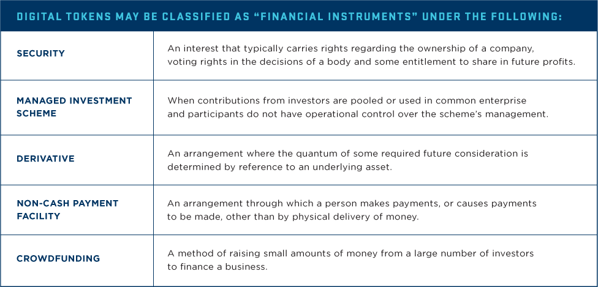

In an attempt to deal with the increasing regulatory uncertainty
surrounding digital tokens, the Australian Securities and Investments
Commission (“ASIC”), the independent government body responsible for
enforcing and regulating company and financial services laws in
Australia, has issued a series of regulatory guidelines in the last 12
months setting out the factors in determining whether a token
constitutes a security or a financial product. Importantly, if a token
constitutes a security or a financial product, then the guidelines
suggest that the token would be governed by existing securities
legislation. Further, if the event creating, or mechanism to distribute,
the tokens constituted a managed investment scheme, it would also be
governed by existing securities legislation. In the event of
uncertainty, ASIC also operates a service known as the Innovation Hub
that allows industry to discuss regulatory issues with specialised
personnel at ASIC to obtain clarity on compliance issues.

Unfortunately, apart from ASIC’s regulatory guidelines and access to the
Innovation Hub, there is no legal precedent and only limited literature
on which a Token Sponsor may rely for clarification as to the
applicability of existing law. Each token creation must be judged on its
own facts and circumstances as to whether the token will constitute a
security or financial product. However, ASIC has acknowledged that
“crypto-assets and the use of distributed ledger technology has the
potential to make an important contribution to fintech
innovation”\[132\], so it is hopeful that specific regulation will be
introduced in the near future.

# Regulation of digital tokens and crypto-assets

The capital and financial markets in Australia are governed by various
statutes that define and regulate securities, financial products,
managed investment schemes, crowdfunding, and non-cash payment
facilities. They also address events and circumstances that constitute
deceptive and misleading conduct and impose sanctions and penalties for
breach.

This report discusses the salient issues that may apply to digital
tokens, crypto-assets, and Token Sponsors. Broadly, the relevant
considerations relate to whether a digital token or crypto-asset will be
classified as a security or financial product or whether the vehicle
through which the token is generated constitutes a managed investment
scheme.

## What is a “security”?

> 'Securities' are defined in the *Corporations Act 2001* (Cth)
> (“Corporations Act”) as including shares or debentures in a company,
> interests in a managed investment scheme or units of such shares and
> further includes legal or equitable rights or interests in the
> foregoing and options.\[133\]
> 
> 'Shares' are generally regarded as an interest that carries rights
> regarding the ownership of a company, voting rights in the decisions
> of a body and some entitlement to share in future profits through
> dividends as well as a claim on the residual assets of a company if
> wound up.
> 
> ASIC’s approach to digital tokens is that if the purpose of the token
> is to fund a company, or if the bundle of rights attaching to the
> token are similar to rights commonly attaching to a share in a
> company, then it is likely that the token will fall within the
> definition of a share (security).\[134\] If so, the Token Sponsor must
> comply with the requirements of the Corporations Act in relation to
> the issue of securities, including the preparation of a prospectus,
> its registration with ASIC, and the necessary disclosures the
> prospectus must contain.

## What is a “financial product”?

> The Corporations Act provides both a general definition of “financial
> product”, as well as a list of deemed financial products.

### Deemed Financial Products

> The list of deemed financial products includes securities (see above
> analysis), as well as derivatives and managed investment
> schemes.\[135\] ASIC has identified these deemed financial products as
> potential categories under which a digital token or crypto-asset may
> be captured.\[136\]

### Derivatives

> In broad terms, a derivative involves an arrangement where the quantum
> of some required future consideration is determined by reference to
> some underlying asset, which may include a crypto-asset or digital
> token.\[137\] Recently, bitcoin futures contracts have become a
> popular investment and such a product is likely to be classified as a
> derivative under the Corporations Act.

### Managed Investment Schemes

> Certain digital tokens or crypto-assets may fall under the umbrella of
> a Managed Investment Scheme (“MIS”). This is most likely the case when
> contributions from investors are pooled or used in common enterprise,
> and participants do not have operational control over the scheme’s
> management.\[138\] Whether a digital token or crypto-asset constitutes
> a MIS will depend on the facts and circumstances, the assessment of
> which should include an assessment of what rights are attached to the
> tokens generated by the Token Sponsor. What constitutes a right should
> be interpreted broadly. These rights are likely to be set out in the
> Token Sponsor's whitepaper.
> 
> For example, payment for the purchase of a crypto-asset may be
> described as a receipt for a purchased service. However, if the value
> of the crypto-asset acquired is affected by the pooling of funds from
> investors or use of those funds under the arrangement, then the sale
> of the digital token may constitute a MIS. Use of a managed investment
> scheme triggers a range of product disclosure, licensing, and
> potential managed investment schemes registration obligations under
> the Corporations Act.\[139\]
> 
> New products may also be deemed to be financial products through
> regulations.\[140\] However, as of the date of this report, neither
> digital tokens nor crypto-assets have been designated as financial
> products. Importantly, ASIC has indicated that it does not consider
> bitcoin to be a financial product.\[141\]

### The general test for “financial products”

> “Financial product” is a term first introduced as part of financial
> services regulation reform in 2001. The term was intended to be
> sufficiently broad and flexible to allow emerging products to be
> captured under the regulation.
> 
> Importantly, the general test for what constitutes a financial product
> still applies to digital tokens and crypto-assets. Token Sponsors
> should consider all of the characteristics of the digital token or
> crypto-asset to determine whether it is a financial product at time of
> generation, or whether it may become a financial product after it is
> generated.
> 
> Section 763A(1) of the Corporations Act defines a financial product as
> a “facility through which, or through the acquisition of which, a
> person does one or more of the following:
> 
> (a) makes a financial investment;
> 
> (b) manages financial risk; or
> 
> (c) makes non-cash payments.”
> 
> The financial investment limb is likely to be the most relevant for
> digital tokens and crypto-assets. Under the Corporations Act, a person
> makes a financial investment if:
> 
> “(a) the investor gives money or money's worth (the contribution) to
> another person and any of the following apply:
> 
> (i) the other person uses the contribution to generate a financial
> return, or other benefit, for the investor;
> 
> (ii) the investor intends that the other person will use the
> contribution to generate a financial return, or other benefit, for the
> investor (even if no return or benefit is in fact generated);
> 
> (iii) the other person intends that the contribution will be used to
> generate a financial return, or other benefit, for the investor (even
> if no return or benefit is in fact generated); and
> 
> (b) the investor has no day-to-day control over the use of the
> contribution to generate the return or benefit.”\[142\]
> 
> ASIC has also made clear that simply describing a coin or token as a
> “utility” token or digital currency (in the relevant whitepaper or
> elsewhere) will not exclude it from being characterized as a financial
> product.\[143\] Instead, the Token Sponsor should assess the digital
> token or crypto-asset based on all of the rights and features
> associated with the product and obtain formal legal advice.

## Licencing requirements for financial products

> If a digital token or crypto-asset constitutes a financial product,
> the Token Sponsor may be required to obtain an Australian Financial
> Services Licence (“AFSL”).\[144\]
> 
> Under section 991A of the Corporations Act, “a person who carries on a
> financial services business…must hold an Australian financial services
> licence covering the provision of the financial services”. As the
> definition of “financial service” includes the issuing of a financial
> product,\[145\] issuers of applicable digital tokens and crypto-assets
> may fall within this requirement.
> 
> The process for applying for an AFSL includes providing substantial
> material to ASIC, employing or contracting with specialised staff to
> manage the provision of the relevant financial product and compliance
> generally, as well as the creation of compliance programs. The
> timeframe for obtaining an AFSL will vary depending on the
> circumstances of the application, but will typically require a number
> of months.
> 
> The need for an AFSL may be removed if one of the exemptions in
> section 911A(2) of the Corporations Act applies. In particular, a
> product generator may not require an AFSL if:
> 
> (a) the product is offered to potential investors through a third
> party who holds an AFSL which covers the generation of that particular
> product; and
> 
> (b) the product generator provides the product to investors based on
> the offer proposed by the third party licensee.
> 
> Prohibitions on these kinds of outsourcing arrangements exist in
> particular circumstances, so Token Sponsors should evaluate the
> applicability of these exemptions on a case by case basis.

## Crowdfunding

> Raising funds by generating tokens can sometimes be considered a form
> of crowdfunding. If so, this activity will be covered by the
> crowd-sourced funding provisions of the Corporations Act.\[146\] It
> should be noted that crowd-sourced funding is regarded as a financial
> service. Accordingly, and in addition to compliance with the
> regulatory laws, an AFSL will be required to provide this service.
> 
> ASIC has warned Token Sponsors not to use the phrase ‘crowd-sourced
> funding’ unless the offering is in fact taking place under the
> crowd-sourced funding regime.\[147\] In addition, there is a $5
> million cap on crowdfunding in Australia,\[148\] and the regime is
> currently only open to public unlisted companies.\[149\] However,
> amendments are currently being passed through the Parliament to open
> up the framework to proprietary companies, and there is a chance that
> these will be passed into law before the end of 2018.\[150\]

## Non-cash payment facilities

> Non-cash payment facilities are arrangements through which a person
> makes payments, or causes payments to be made, other than by physical
> delivery of money.\[151\] A typical example is a credit or debit card.
> If the token constitutes a non-cash payment facility, it will be
> governed by and must comply with the Corporations Act.
> 
> ASIC is presently of the view that, provided the token is more in the
> form of a gift card or utility token, it will not constitute a
> non-cash payment
facility.\[152\]

## Digital tokens that are not financial products

> Even if digital tokens and crypto-assets (including bitcoin) are not
> regarded as securities or financial products, they must still comply
> with consumer law, contract law, and general Australian law.
> 
> One of the key laws that applies to all ICOs and crypto-assets
> (including those that are not financial products) is the general
> prohibition on parties engaging in misleading and deceptive conduct in
> the course of trade or commerce. Specifically, section 18 of the
> Australian Consumer Law (“ACL”) states that a person must not “in
> trade or commerce, engage in conduct that is misleading and deceptive
> or is likely to mislead or deceive”. This prohibition has been
> extensively tested and developed through the courts and is considered
> a broad ranging prohibition.
> 
> ASIC has provided some guidance on potential conduct by a Token
> Sponsor that may be misleading or deceptive, including:
> 
> “(a) the use of social media to generate the appearance of a greater
> level of public interest in a digital token or crypto-asset;
> 
> (b) undertaking or arranging for a group to engage in trading
> strategies to generate the appearance of a greater level of buying and
> selling activity for a digital token or a crypto-asset;
> 
> (c) failing to disclose adequate information about the Token Sponsor,
> the digital token, or the crypto-asset, or
> 
> (d) suggesting that the digital token or crypto-asset is a regulated
> product or the regulator has approved of the offering if that is not
> the case.”\[153\]
> 
> A breach of this prohibition can result in serious penalties,
> including pecuniary penalties, for each instance of misleading and
> deceptive conduct.\[154\]
> 
> The power to enforce the prohibition on misleading and deceptive
> conduct in the area of digital tokens and crypto-assets has been
> specifically delegated to ASIC.\[155\] ASIC has also provided in depth
> information on this law in its latest guidance note,\[156\] so it is
> likely that this prohibition will be a key focus for the regulator
> when investigating Token Sponsors.

# Regulation of Digital Currency Exchanges

In April 2018, new laws and policy principles were introduced to
regulate the operation of Digital Currency Exchanges (“DCEs”) in
Australia. DCEs are businesses that exchange digital currency for fiat
currency (*e.g*., Dollars, Euros, RMB) and vice versa. The new laws
require an entity to be enrolled and registered with the Australian
Transaction Reports and Analysis Centre (“AUSTRAC”) before operating as
a DCE. All DCEs must also comply with obligations under the *Anti-Money
Laundering and Counter-Terrorism Financing Act 2006* (Cth) (“AML/CTF
Act”) including the establishment and continued operation of a
compliance program.

For those DCEs intending to offer exchange services for Token Sponsors
in relation to digital tokens that are financial products, the DCE may
also need a financial markets licence or receive an exemption from ASIC
in relation to their exchange services.

## Registration of Digital Currency Exchanges

> The AML/CTF Act was amended in April 2018 to require DCEs to enrol and
> register their business with AUSTRAC before engaging in digital
> currency exchange services.\[157\] The amendments also set out the
> process for enrolment and registration, the establishment of the
> Digital Currency Exchange Register, and penalties for breaches of the
> registration requirements.
> 
> A set of policy principles and exemptions also came into effect in and
> around April 2018 stating that AUSTRAC will exercise leniency in
> relation to enforcement action until 2 October 2018.\[158\] During
> this time, AUSTRAC may only take enforcement action if a DCE fails to
> take reasonable steps to comply with the AML/CTF Act. Examples of
> ‘reasonable steps’ include:
> 
> (a) complying with any breaches of the AML/CTF Act as soon as
> practicable;
> 
> (b) implementing a transition plan outlining actions and timeframes to
> achieve compliance; and
> 
> (c) allocating sufficient resources to enable compliance.\[159\]
> 
> Once the leniency period ends, it is likely that AUSTRAC will be
> diligent and prompt in pursuing enforcement action. The penalties that
> apply to breaches of the DCE obligations range from 2 to 7 years
> imprisonment and pecuniary penalties of $105,000 to $420,000.

## Process for enrolment and registration

> A DCE can enrol and register with AUSTRAC using an online process
> based on the AUSTRAC business profile form.\[160\]
> 
> The DCE will need to provide certain information to AUSTRAC,
> including:

(a) national police certificates and checks for certain personnel; and

(b) certain information in relation to the business entity.

> Foreign companies (whether or not they are registered in Australia)
> can apply for enrolment and registration. However, AUSTRAC requires
> the foreign company to provide certain information including any
> registration details, company history and details regarding any
> previous legal infringements.

## Financial Market Licence

> Section 791A of the Corporations Act states that a person must only
> operate a financial market if:
> 
> (a) the person has an Australian market licence that authorises the
> person to operate the market in this jurisdiction; or
> 
> (b) the market is exempt.
> 
> This provision will be relevant to DCEs offering exchange services for
> digital tokens and crypto-assets constituting financial products. This
> is because a financial market is defined as “a facility through which:
> 
> (a) offers to acquire or dispose of financial products are regularly
> made or accepted; or
> 
> (b) offers or invitations are regularly made to acquire or dispose of
> financial products that are intended to result or may reasonably be
> expected to result, directly or indirectly, in:
> 
> (i) the making of offers to acquire or dispose of financial products;
> or
> 
> (ii) the acceptance of such offers.”\[161\]
> 
> It is also important to note that a financial market may operate
> simultaneously in Australia and other jurisdictions. As such, DCEs
> that can be accessed in Australia but have been established outside of
> Australia may also need to obtain a financial markets licence if the
> DCE offers to acquire or dispose of financial products are regularly
> made or accepted.
> 
> ASIC has also highlighted the financial market regulations and
> licensing requirements in its latest guidance note.\[162\] Due to the
> increased awareness of the financial markets licence requirements, a
> number of DCEs operating in Australia have stopped listing new tokens
> and some DCEs have removed all tokens other than the mainstream tokens
> (bitcoin, ethereum, and ripple).
> 
> Even if a financial markets licence is required to operate a DCE, such
> activity may be exempted by Ministerial power for a particular
> financial market or a class of financial markets.\[163\] As of the
> date of this report, no exemption has been given for a financial
> market for digital tokens and crypto-assets.

# ASIC’s Innovation Hub and Regulatory Sandbox

In an effort to allow regulation to follow rather than restrain
innovation and change in the FinTech markets, ASIC has developed
programs and tools to assist industry in Australia with navigating the
regulatory environment and foster the creation of crypto-asset
businesses.

In March 2015, ASIC launched the Innovation Hub, an initiative to help
fintech businesses navigate the regulatory system in the financial
services sector. The main service provided by the Innovation Hub is
direct access to senior staff at ASIC to streamline licensing and offer
informal guidance in relation to the regulatory requirements for the
business.\[164\] Since its inception, the Innovation Hub has assisted in
the granting of over 36 licences to FinTech businesses and these
businesses received their licences much faster than those applying
through the standard process.\[165\] Recently, the Innovation Hub has
focused on digital tokens and crypto-assets and members of the
Innovation Hub are key contributors to the regulatory guidelines that
have been issued by ASIC.

As part of the Innovation Hub initiative, ASIC established a licensing
relief framework dubbed the ASIC “regulatory sandbox” allowing users to
work cooperatively with ASIC on regulatory issues to achieve a solution
that suits both the relevant firm and government.\[166\]

The sandbox comprises the following three relief options:

(a) assistance to identify existing statutory exemptions or flexibility;

(b) relief for testing certain specified products and services; or

(c) for other services, where ASIC grants individual relief.\[167\]

The sandbox may be used by new-to-market Token Sponsors to liaise with
ASIC to determine whether their token would be considered a financial
product. However, the sandbox is not available for testing the issuance
of financial products (including any digital tokens or crypto-assets
considered financial products).\[168\]

# Taxation

The tax treatment of Token Sponsors remains a pressing issue relative to
both the classification of the digital token as either belonging to the
capital or revenue account, and the uncertain applicability of the goods
and services tax (“GST”).

For digital tokens that are caught by the existing financial product or
securities regimes, the tax treatment is relatively settled, with
significant bodies of law, including statute, case law, and guidance
from the Australian Taxation Office (“ATO”), clarifying the tax
treatment of securities and financial products. However, for those
tokens that sit outside of the existing regulatory frameworks, the tax
treatment is unclear.

If a digital token is not a regulated security or financial product, its
sale will likely be treated as revenue of the Token Sponsor and taxed
accordingly at the corporate tax rate. There is currently significant
discussion in Australia around the granting of deferred taxation
liability for Token Sponsors, in recognition of the fact that the funds
raised by most Token Sponsors are often allocated to a roadmap
stretching years into the future. However, no amendments have yet been
suggested to the existing law.

The ATO has repeatedly stated that the tax treatment of Token Sponsors
will turn upon the facts and circumstances of the triggering event.
Accordingly, many Australian Token Sponsors have taken the path of
seeking a private ruling from the ATO to clarify their tax position.
While these private rulings will be released by the ATO in redacted
form, they may not be relied upon by third parties. In any event, as at
the time of writing, no private rulings have been handed down by the ATO
in relation to Token Sponsors, despite many currently being underway.

The GST treatment of tokens remains contentious. Prior to 1 July 2017,
GST was payable in relation to sales and purchases of “digital
currency”. From 1 July 2017, these activities were specifically
exempted from the GST regime. While the ATO has expressly recognised
that bitcoin, ethereum, litecoin, dash, monero, zcash, ripple, and
ybcoin fall within the definition of “digital currency”,\[169\] the
definition is relatively narrow. Guidance from the ATO released in March
2018 clarifies that Australian Token Sponsors, as well as foreign Token
Sponsors selling into the Australian market, may still be required to
pay GST on their offerings, particularly where the token provides a
right or entitlement to goods or services.\[170\]

# Conclusion

Overall, both Australian Token Sponsors and foreign Token Sponsors
maintaining a presence within the Australian market are currently
operating in an uncertain legal environment. The Australian regulators,
like almost all of the regulators in other jurisdictions discussed in
this report, have adopted an approach based on functional equivalence.
Where a digital token or crypto-asset falls within the existing
framework, the answer is clear. However, the majority of digital tokens
do not easily fit within existing frameworks. The result is less than
optimal both for regulators and Token Sponsors on the one hand and the
general public on the other.

Industry groups, including the Australian Digital Commerce
Association,\[171\] have recognised that clearer guidelines and
principles are required. Best practice guidelines are currently being
drafted in the expectation that industry will embrace and adhere to
these in the hope that they will form the basis for future regulation.

Ultimately, activity from Token Sponsors will continue to grow in
Australia as clear economic and technical drivers accelerate market
activity. It is hoped that this report encourages regulatory activity to
grow as well. 

**  
**

**Section 5:**

**Gibraltar**

1.  **Introduction**

On 1st January 2018, Her Majesty’s Government of Gibraltar
(“HMGOG”) brought into effect a new distributed ledger technology
(“DLT”) regulatory framework (“DLT Framework”) defined on a principles
basis with the ability to be applied proportionately to the business in
question, providing businesses with the regulatory certainty that has
been pursued by so many for so long. The intention is not to exclude
certain activity from the existing regulatory framework but, rather, to
build out a specific framework for businesses that use DLT to “store or
transmit value belonging to others” by way of business, and that may not
have been subject to regulation under another existing framework in
Gibraltar. Similarly, the purpose is to build a framework that can
continue to evolve and allow for the Gibraltar Financial Services
Commission (“GFSC”) to set appropriate and proportionate conditions or
restrictions.

The DLT Framework includes nine principles applied to DLT firms
operating in Gibraltar. The response to this approach has been global
and truly significant with a large number of well-known businesses
applying for licenses under the regulatory regime. Those who know
nothing about Gibraltar may be surprised, but those who know the history
of a small jurisdiction being able to adapt and evolve to attract the
right opportunities at the right level, with the speed and flexibility
needed to accomplish such goals, will not be surprised at all.

In addition to the above, the GFSC released a public statement on
22nd September 2017 noting the increasing use of digital
tokens based on DLT as a means of raising finance, especially by early
stage start-ups. The GFSC also noted that these new ventures were highly
speculative and risky, that early-stage financing is often best
undertaken by experienced investors, and set out matters that ought to
be considered by anyone thinking of investing in digital tokens. In
addition, the statement set out an intention to regulate the “promotion
and sale of \[digital\] tokens.”\[172\],\[173\] HMGOG has
publicly announced its intention to introduce regulations relating to,
amongst other things, the promotion and sale of digital tokens in and
from Gibraltar and set out its proposals in a document issued on
12th February 2018 (the “Token Framework Proposal”).

2.  **The Gibraltar Regulatory Framework**

Digital tokens vary widely in design and purpose. In some cases, they
may represent securities, such as shares in a company, and their
generation and distribution are already covered by existing securities
legislation in Gibraltar such as the Prospectuses Act 2005.\[174\] The
classification as a security triggers various consequences, in
particular regulatory consequences. The requirement to issue a
prospectus when offering securities publicly is only one example of such
a requirement. A distinction must be drawn between the concept of a
security on the one hand and a financial instrument on the other, with
the latter being the broader term. "Securities" are one of several
sub-categories of financial instruments. Regulatory requirements may
therefore also arise for non-securities that are classified as financial
instruments. This includes the requirements arising under the Markets in
Financial Instruments Directive (MiFID) II,\[175\] transposed into
Gibraltar law through the Financial Services (Markets in Financial
Instruments) Act 2018,\[176\] which, in addition to applying to
businesses providing certain investment services or engagement in
certain activities with clients in relation to financial instruments,
also defines “financial instruments” in a wide form, including forms of
commodity derivative contracts and arrangements that may apply to any
asset or right of a fungible nature (under certain conditions).

As a British Territory and current member of the European Union
(“E.U.”), the applicability of other existing frameworks would also
need to be considered in the digital token context - electronic money
issuance (“E-money”) being an example. Even within the E.U., there are
differing interpretations of the applicability of different regimes or
rules. In the context of digital tokens, the tokens must represent a
claim on the issuer in order to fall within the definition of
“electronic money.”\[177\] This might be the case for some digital
tokens; however, utility tokens, as a rule, are usually not issued for
the purpose of making payment transactions. This may not be the case for
digital tokens that serve a cryptocurrency use; but even then, these
tokens usually tend not to represent monetary value. It is
characteristic for E-Money that it represents fiat and stores its value,
backed by a claim on the token issuer for redemption against fiat.
Conversely, digital tokens issued at par value against fiat and
furnished with the promise of the token issuer to be redeemed in
exchange for fiat, and therefore being accepted as means of payment by
third parties, would qualify as E-Money.

Similarly, collective investment scheme (“CIS”)\[178\] law such as the
Financial Services (Collective Investment Schemes) Act 2011\[179\] is
another relevant legal consideration. A collective investment scheme is
described as: “any arrangement with respect to property, the purpose or
effect of which is to enable persons taking part in the
arrangement, whether by becoming owners of the property or any part of
it or otherwise, to participate in or receive profits or income arising
from the acquisition, holding, management or disposal of the property or
sums paid out of such profits or income.”\[180\] There can be many
scenarios where digital tokens may not be defined as “securities” but
may still be deemed to represent units in a collective investment
scheme. In this case, a number of points would need to be considered,
including the relevant exemptions and carve outs that may, under certain
circumstances, also be relevant.

In addition to the above, the definition of an alternative investment
fund (“AIF”) under the Financial Services (Alternative Investment Fund
Managers) Regulations 2013,\[181\] which transposes the E.U. Directive
relating to alternative investment funds, needs to be considered. An AIF
is deemed to be any collective investment undertaking that raises
capital from a number of investors with a view to investing it in
accordance with a defined investment policy for the benefit of those
investors. If the arrangement is considered to form an AIF, or a token
is deemed to represent a unit in an AIF, there are multiple
considerations that become relevant, both in terms of the sale,
promotion, and management of that scheme as well as the depositary
arrangements for those units.

In many cases, digital tokens should not normally risk being a CIS. More
often, however, digital tokens serve some cryptocurrency or functional
use that is unregulated, such as the advance sale of products that
entitle holders to access future networks or consume future services, or
virtual currency, serving principally as a medium of exchange within an
ecosystem (or marketplace) of consumers and service providers. However,
entities issuing such types of digital tokens may still have to comply
with classic consumer protection law,\[182\] depending on the design of
the digital token.

**A. Gibraltar Contract Law**

The law of contract in Gibraltar is similar to the law in England and
Wales. English common law applies in Gibraltar in accordance with the
English Law (Application) Act 1962.\[183\] Unlike certain civil law
jurisdictions, there is no general duty of disclosure in pre-contractual
negotiations relating to digital token sales. Such a duty only exists
when there are particular reasons for disclosure. These can be based on
a pre-existing relationship between the parties (*e.g*., a fiduciary or
confidential relationship)\[184\] or when the nature of the contract
carries specific duties of disclosure (this can be the case in consumer
contracts, where duties of disclosure are imposed by the relevant
legislation – see below).

Participants in digital token issuances dealing with token issuers at
arm’s length are therefore expected to conduct due diligence. Unless one
party’s mistake of fact is due to misrepresentation by the other party
(or some other vitiating factor, such as duress), the parties will
usually be held to their contractual commitments under Gibraltar law.

In short, a token issuer in Gibraltar is under no general duty of
pre-contractual disclosure, but is prevented from inducing a purchase of
digital tokens by misrepresenting (whether fraudulently or negligently)
the nature of the
arrangement.

### **B. Implementation of E-Commerce and Consumer Protection Regulations into Gibraltar Law**

All relevant E.U. legislation covering e-commerce and consumer
protection has been transposed into Gibraltar law via various Acts of
Parliament or Regulations. The E.U. e-commerce and consumer protection
rules (E-Commerce Directive,\[185\] Consumer Rights Directive,\[186\]
Directive on Distance Marketing of Consumer Financial Services\[187\])
all specify the information that should be disclosed. The relevant
provisions applicable under Gibraltar law are detailed below.

1.  Information Obligations When Generating Digital Tokens via the
    Internet

If the digital token is offered online, it falls within the scope of the
E.U.’s e-commerce Directive, which has been transposed in Gibraltar
through the Electronic Commerce Act 2001.\[188\] Regarding the type of
information that must be provided when concluding electronic contracts,
section 6(1) states:

A service provider shall ensure (unless agreed otherwise with a
prospective party to the contract who is not a consumer) that the
following information is available clearly and in full before conclusion
of the contract –

(a)  the steps to follow to conclude the contract;

(b)  whether the contract, when concluded, will be accessible and, if
so, where;

> (c)  the steps to follow to correct any errors made in input by the
> recipient of the service; further, such steps must be effective and
> accessible allowing the recipient to identify and correct any errors
> without difficulty;
> 
> (d)  any general terms and conditions imposed by the service provider,
> further, such general terms and conditions must be accessible to the
> recipient of the service for him to store and retrieve them.\[189\]

### **ii. Duty to Provide Information under Consumer Protection Law**

If the contract on which a digital token is based constitutes a consumer
contract, further consumer protection rules apply, as set out in the
Consumer Rights on Contracts Regulations 2013\[190\] (which transposes,
inter alia, the EU Consumer Rights Directive). These rules are
highlighted under Part 2 of the Consumer Rights on Contracts Regulations
2013. The Regulations further split the specific information obligations
in relation to off-premises and on-premises contracts under Schedule 1
and Schedule 2 respectively.

**C. Money Laundering **

The E.U. Anti Money Laundering Directive has been transposed into
Gibraltar law by the Proceeds of Crime Act (“POCA”).\[191\] It should be
noted that Section 9(1)(p) of the POCA now includes within the
definition of “relevant financial business” that include “undertakings
that receive, whether on their own account or on behalf of another
person, proceeds in any form from the sale of tokenised digital assets
involving the use of distributed ledger technology or a similar means of
recording a digital representation of an asset.”\[192\] POCA also
requires reporting (by businesses and by the GFSC) when there is a
suspicion (rather than actual knowledge) of money laundering.
Essentially, the addition of the new definition of relevant financial
business specifically brings sales of a tokenised digital asset clearly
within existing AML laws, which in turn have been very well received by
other service providers in the industry. Amongst other things, customer
due diligence is required before a business may receive proceeds from
the sale of tokenised digital assets. These businesses would also be
**required to appoint a money-laundering reporting officer (‘‘MLRO’’),
as well as apply certain record keeping requirements. The business must
also maintain** an AML compliance program and report suspicious
activity.

3.  **Proposed Regulatory Framework**

As set out above, most often digital tokens do not qualify as securities
under Gibraltar or E.U. legislation.\[193\] In the event that they do
constitute securities, there is currently an E.U.-wide framework\[194\]
dealing with this. Accordingly, Gibraltar is not looking to introduce a
framework that will replace securities law or prospectus directive
requirements. That is to say, the public offering of tokens that
constitute securities do not require further regulation from a Gibraltar
perspective and will continue to fall under current frameworks governing
issuances of securities.

As of the date of writing, we do not know the full extent of HMGOG’s
legislative proposals for the regulation of digital token issuances, as
the draft legislation has not yet been published. However, the Token
Framework Proposal (“Framework”)\[195\] provides a high-level outline of
what lies in store. It is proposed that new legislation will regulate
the following activities conducted in or from Gibraltar:

  - The promotion and sale of digital tokens;

  - The operation of secondary market platforms trading in digital
    tokens; and

  - The provision of investment and ancillary services relating to
    digital tokens.

It is proposed the GFSC will regulate:

  - Authorised sponsors of public digital token offerings;

  - Secondary token market operators; and

  - Digital token investment and ancillary service providers.

The Framework will not regulate:

  - Technology;

  - Digital tokens, smart contracts, or their functioning;

  - Individual public offerings; or

  - Persons involved in the promotion, sale, and distribution of digital
    tokens.

The following sections set out at a high level the scope of the new
proposed Framework.

1.  **Disclosure Rules**

The first limb of the Framework intends to deal with digital tokens that
are not regarded as securities within the meaning of Gibraltar law. As
set out above, this would typically cover circumstances where a digital
token constitutes a product or service that does not yet exist (or is
not substantially functional at the time of sale), in effect no more
than a hope or ambition to deliver that product or service in the
future. In such cases, purchasers risk that the product might never be
delivered and often waive the right to the return on the price paid.
HMGOG aims to ensure that whilst the purchaser may be prepared to take
that risk, it is appropriate that they be presented with all the
relevant information to enable them to make an informed decision. This
limb of the Framework will therefore counter the current position in
Gibraltar whereby a token issuer is under no general duty of
pre-contractual disclosure.

With respect to the promotion, sale, and distribution of digital tokens,
the Framework will require adequate, accurate, and balanced disclosure
of information to enable anyone considering purchasing digital tokens to
make an informed decision. The regulations may prescribe what, as a
minimum, constitutes adequate disclosure, and in what form disclosures
are made (*e.g*., in a key facts document not exceeding two (2) pages).
From time to time, guidance on disclosure rules may be published by
GFSC.

The digital token industry often refers to the concept of
“self-regulation”, and best practice frameworks for token offerings
have already been established. The key difference with the proposed
regulations is that the concept of self-regulation, while being
attractive in the sense that it may be said to decentralise certain
standards and requirements, it is also in many senses ‘voluntary’ and
does not necessarily raise the standards through any legally enforceable
framework such as the one being proposed in Gibraltar. As a result, the
GFSC can ensure and enforce their regulatory objectives through the
implementation of the Framework.

2.  **Financial Crime Provisions**

As discussed above, a recent amendment to POCA under section 9(1)(p)
means that token issuers now fall under its scope. It remains to be seen
whether this amendment is a temporary measure which will be replaced by
specific regulations on AML and CFT once the Framework comes into force
or whether these amendments were in fact what was contemplated in the
Framework. Nevertheless, this demonstrates the intention of the
Gibraltar Government to ensure that, even before the proposed digital
token regulations come into force, existing statutory safeguards require
all token issuers to carry out due diligence on digital token purchasers
and to mitigate AML/CFT risks.

3.  **Authorised Token Sponsors**

As outlined above, the GFSC intends to regulate:

  - Authorised sponsors of public token offerings;

  - Secondary token market operators; and

  - Digital token investment and ancillary service providers.

It therefore appears that the onus of ensuring compliance with
appropriate standards will be on the service providers and secondary
token market operators and the GFSC does not intend to regulate token
issuers, nor will it regulate the underlying technology or the digital
tokens themselves.

The Framework will establish a regime for the authorisation and
supervision of token sponsors possessing appropriate relevant knowledge
and experience who will be responsible for compliance with this limb of
the regulations. It is intended that an authorised token sponsor will
need to be appointed in respect of every public token offering promoted,
sold or distributed in or from Gibraltar.

Token sponsors will be subject to an authorisation and supervision
process by the GFSC and must possess suitable knowledge and experience
of the industry to be admitted into the sponsorship regime. A critical
component for token sponsors to be authorised is to have local presence
in Gibraltar, with “mind and management” based in the jurisdiction. The
onus will also be on token sponsors to produce their own codes of
conduct, setting out what they consider to be best practices relating to
token offerings. These codes will form part of a prospective token
sponsor’s application for authorisation. The introduction of a token
sponsor regime is comparable to what currently exists today in the U.K.
in relation to regulated public market listings, where Sponsors and
Nominated Advisors effectively act as listing agents that guide
prospective issuers through the flotation process. It appears this same
model is being adapted under the token sponsor regime to handhold
prospective token issuing entities through a compliant token sale
process.

The GFSC will establish and maintain a public register of authorised
sponsors and their respective past and present codes of practice.

4.  **Secondary Market Operations**

Apart from the DLT Framework, operating a secondary market platform for
trading tokens is not currently regulated in Gibraltar. The Framework
will regulate the conduct of secondary market platforms, operated in or
from Gibraltar and, to the extent not covered by other regulations,
their derivatives, with the aim to ensure that such markets are fair,
transparent, and efficient.

At this stage, the Framework does not elaborate on the specific
regulatory obligations that will be imposed. However, it does highlight
the introduction of further transaction reporting and disclosure
requirements, as well as extending the application of the Framework to
cover trading of derivative token products. The Framework does, however,
mention modelling the proposed regulations on market platform provisions
under MiFID II\[196\] and the Markets in Financial Instruments
Regulation (MiFIR),\[197\] so far as is appropriate, proportionate, and
relevant.

5.  **Investment and Ancillary Service Providers**

Providing investment and ancillary services relating to digital tokens
is not currently regulated in Gibraltar. HMGOG has proposed to regulate
the provision of investment and ancillary services in or from Gibraltar
and, to the extent not otherwise caught by regulations, their
derivatives. These regulations aim to ensure that such services are
provided fairly, transparently, and professionally. This limb of the
Framework will intend to cover advice on investment in digital tokens,
virtual currencies, and central bank-issued digital currencies,
including:

1.  generic advice (setting out fairly and in a neutral manner the facts
    relating to token investments and services);

2.  product-related advice (setting out in a selective and judgemental
    manner the advantages and disadvantages of a particular token
    investment and service); and

3.  personal recommendations (based on the particular needs and
    circumstances of the individual investor).

This limb of the Framework will be proportionately modelled on
provisions that currently exist under MiFID II\[198\] with the aim of
ensuring that such services are provided fairly, transparently, and
professionally. However, at this stage, little guidance has been given
on the specific types of advisors involved in a digital token
distribution process that will be caught by the proposals (*e.g*.,
introducers, marketing professionals, technical developers and smart
contract auditors, economic, legal and tax advisors, cybersecurity
firms, escrow agents, etc.).

4.  **DLT Services**

As set out above, the DLT Framework is a licensing regime for
individuals and firms that engage in activities that, for business
purposes, use DLT for the transmission or storage of customers’ assets.
It is generally accepted that the DLT Framework does not extend to the
generation and sale of digital tokens. This is in line with public
statements made by various bodies, including HMGOG, and is consistent
with the Framework which will be introduced for these purposes. However,
there may be instances where a token issuer may fall within the scope of
the DLT Framework, although this should be considered separately from
the actual digital token sale, which may remain unregulated until the
new legislation referred to above comes into effect.

**  
**

5.  **PART 2**\[199\]

**Section 1**

**PRINCIPLES AND GUIDELINES FOR TOKEN
SPONSORS**

This section provides introductory principles and guidelines for Token
Sponsors as a way to promote sound business practices. As explained in
the Introduction, within the context of this report, a “**Token
Sponsor**” or “**Sponsor**” is any clearly defined individual or group
that (a) generates or distributes, or (b) undertakes to lead or control
the development, adoption, or distribution of, a digital token that is
not intended to be a security or CFTC Regulated Instrument (as defined
above in Part 1). For these purposes, the activities of a Token Sponsor
inherently entail more than the development and publication of a
blockchain protocol that uses tokens. Hence, not all digital tokens are
generated through the efforts of a Token Sponsor — indeed, bitcoin was
generated independent of a Token Sponsor.

As explained in the U.S. Regulatory Overview provided in Part 1 and
illustrated in the examples provided in Part 3, digital tokens can take
a variety of forms and serve many purposes. This Section provides
principles and guidelines for Token Sponsors to manage the risk that the
offering and distribution of a digital token may run afoul of certain
federal securities and commodity laws by (a) discussing why a digital
token may become subject to certain securities and commodities laws and
regulations, (b) presenting steps that may reduce the risk of the token
being treated as a security or a CFTC Regulated Instrument, (c)
explaining a suggested path for Token Sponsors to follow when launching
a digital token, and (d) offering guidelines for drafting token
projects’ whitepapers and other marketing materials.

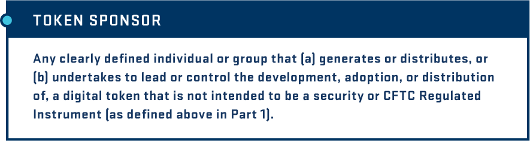

**This report, including its suggested principles and guidelines, merely
expresses the general views of the Token Alliance, and compliance with
such principles and guidelines cannot assure that the sale or trading of
tokens will fully comply with law. These views are being offered for
discussion purposes only, and they have not been sanctioned by the SEC,
the CFTC, or any other regulator. You should consult legal counsel
before offering, distributing, or trading digital tokens.**

1.  When is a Digital Token Subject to Regulation by the U.S. Securities
    and Exchange Commission or Commodity Futures Trading Commission?

**Characteristics of a Security**

As explained in the U.S. Regulatory Overview provided in Part 1, U.S.
federal securities laws define “security” broadly. A digital token that
demonstrates ownership of an instrument enumerated in these definitions,
such as a note or other evidence of indebtedness, share of stock, or
undivided fractional interest in mineral rights, would typically be
subject to regulation by the SEC under the federal securities laws and
by state authorities under their “blue sky” laws.

Although the application of U.S. federal securities laws and related
regulations to particular situations, including interpretations by
courts, emphasizes the underlying substance of a transaction, Token
Sponsors must be cognizant of confusion that might arise in the
marketplace from their use of imprecise or inapposite terminology. If a
digital token is not intended to be a security, then it is advisable to
avoid using securities-related terminology in whitepapers and other
marketing materials that may confuse readers as to the nature of the
token. Examples may include statements such as:

• Token holders will “own” or “profit” from a blockchain or network;

• Token holders will receive “interest” or “dividends” on their tokens;
or

• References to the token’s “market capitalization” or “market cap.”

Even referring to an “initial coin offering” or “ICO” may invite
comparison to an initial public offering of securities.

**The *Howey* Test**

As explained in the U.S. Regulatory Overview, digital tokens may trigger
U.S. federal securities laws if they are an “investment contract” – a
catchall for securities that are not otherwise set out in the definition
of a “security.” The test for whether any instrument is an “investment
contract” under the U.S. federal securities laws\[200\] is commonly
referred to as the “*Howey* Test.” Stemming from a 1946 Supreme Court
case of the same name,\[201\] the *Howey* Test holds an investment
contract to exist if there is:

Insert: Howey-Test copy.eps

All four elements of the *Howey* Test must be met for an instrument
(such as a token) to be considered an investment contract. Form and
nomenclature hold no weight, rather it is the substance of the
instrument in question that is important. **Thus, it is important for
Token Sponsors to have an attorney expert in U.S. federal securities
laws analyze the application of the *Howey* Test to a Token Sponsor’s
proposed digital token before the token is offered or distributed. This
includes any form of distribution, including system-based rewards,
“airdrops,” and distributions to employees, founders, contractors, and
consultants.**

**Commodity Regulation**

The U.S. Regulatory Overview explains how the CFTC may exercise general
anti-fraud and anti-manipulation authority over any digital token it
deems to represent a “commodity,” as broadly defined under the Commodity
Exchange Act. Moreover, any arrangement that involves the future
delivery of a digital token may subject the arrangement or the token to
regulation by the CFTC as a futures agreement, swap, option to buy or
sell the token, or retail commodity transaction, which were defined in
Part 1 as “**CFTC Regulated Instruments.**”

It thus should be a common practice for the Token Sponsor’s legal
counsel also to consider whether a digital token may create a CFTC
Regulated Instrument under the CEA, or the impression of such an
instrument. Even when this is not the case, working with counsel to
conduct such analyses may provide valuable guidance regarding how the
digital token should be distributed in compliance with the CFTC’s
anti-fraud and anti-manipulation regulations.

2.  How Can a Token Sponsor Manage the Risks of Having a Digital Token
    Treated as an Investment Contract or CFTC Regulated Instrument?

Ultimately, there is no better means of assisting a Token Sponsor in
complying with SEC and CFTC regulations than a candid assessment by
experienced legal counsel of the token’s intended uses and the means by
which the tokens will be generated, offered, and distributed. This
assessment should be updated as circumstances of the digital token
change and the regulatory landscape evolves.

The SEC, CFTC, and U.S. courts will consider all relevant facts and
circumstances when considering whether a Token Sponsor’s activities
entail the offering or sale of an investment contract or a CFTC
Regulated Instrument. Although the SEC’s and CFTC’s positions regarding
digital tokens are evolving, the following factors may reduce the risk
of a digital token becoming subject to such regulations.

  - **Full development of requisite system(s) and/or application(s)
    before distribution**: A digital token distributed by a Token
    Sponsor should be one component of fully-developed system(s) and/or
    application(s) designed by a Token Sponsor. Upon distribution, the
    token should provide access to any affiliated services or
    applications. Otherwise, the Token Sponsor’s continued development
    efforts may be (i) viewed by the SEC as efforts from which token
    holders reasonably expect to profit, or (ii) viewed by the CFTC as a
    promise for the delivery of a commodity at a future date.

  - **Timing of the distribution of a digital token**: A Token Sponsor
    should not deliver its digital token to purchasers until everyone
    who receives tokens can use them to access applicable system(s)
    and/or application(s), unless expert counsel confirms that the token
    can be delivered at an earlier point in compliance with applicable
    SEC or CFTC regulations.

  - **Tokenized commodities should be accessible**: If a Token Sponsor’s
    digital token is designed to represent ownership interest in a
    specified commodity (including another token), the digital token
    should be related to a system or application that is able to provide
    token holders with timely access to the specified commodity. A token
    designed to adjust in price in response to the price, or change in
    price, of a commodity without entitling the token holder to obtain
    or control a corresponding amount of the commodity may viewed by the
    CFTC as a CFTC Regulated Instrument.

  - **Token holders should not sell digital tokens on credit:** Selling
    digital tokens on credit, requiring purchasers to post collateral,
    or otherwise providing a leveraged exposure to the token or any
    underlying commodity may qualify as a CFTC Regulated Instrument. A
    delay of more than 28 days between the agreement to purchase a token
    and its delivery to the purchaser may increase this risk.

  - **Focus communications on the value of using the digital
    token:** While a Token Sponsor will want users of its digital token
    to understand and appreciate the potential value of the token’s
    project, the Token Sponsor should seek to be clear that the digital
    token is not intended to provide a passive investment opportunity
    for its holders. This may be aided by the Token Sponsor emphasizing
    the benefits of using or consuming the digital token and emphasizing
    any ways in which token holders and other network participants will
    contribute to the token’s potential value.

  - **For financial and accounting purposes, treat the digital token
    consistently with its use:** When permitted by generally accepted
    accounting principles, tax regulations, and similar rules, the
    treatment and discussion of the digital token in the Token Sponsor’s
    financial statements, reports and analyses should be consistent with
    its use in the related systems or applications. Characterizing the
    digital token as an investment, security, or CFTC Regulated
    Instrument for tax and accounting purposes could influence its
    regulatory treatment by the SEC or CFTC. This is not to suggest,
    however, that the use of a term mandated by tax or accounting rules,
    such as “forward contract” for example, would be considered
    dispositive as to the character of a digital token or contract
    relating to the token for purposes of SEC or CFTC regulations – only
    that it may give the appearance of inconsistent treatment.

  - **Tokens should be designed so that holders do not expect profits
    from the token’s project**: Projects should not entail equity rights
    and should not result in the periodic distribution of funds (whether
    fiat or crypto-currency) to digital token holders, or the
    expectation of such distributions. Likewise, a Token Sponsor should
    not design or market digital tokens with any emphasis on
    price-appreciation or profit delivery to token holders. In
    particular:
    
      - A Token Sponsor should try to avoid hallmarks of a traditional
        security, such as (1) a stake of ownership or control in a
        company or venture behind a digital token project (including a
        decentralized autonomous organization), or (2) the sharing of
        any of a Token Sponsor’s profits with other token holders
        through distributions, dividends, interest, or other payments.
    
      - A Token Sponsor should be wary of features in the digital token
        that would be reasonably expected by a prospective purchaser to
        cause the token to appreciate in price or otherwise provide
        passive returns to the token holders.
    
      - A Token Sponsor should be cautious in using the digital tokens
        as financial incentives for employees or others, so as to avoid
        the appearance that these recipients reasonably expect the token
        to appreciate in price.

Distributions of a digital token before the underlying project for the
token is complete can be at risk of creating investment contracts even
if the token would not be subject to federal securities laws once the
project is fully completed. Selling tokens at a discount to a projected
public sale price or to raise funds for the project may contribute to
this risk. In order to successfully conduct a pre-sale, a Token Sponsor
may need to ensure compliance with the registration requirements or an
exemption from registration under the Securities Act and delay delivery
of the token until the project is constructed and fully functional.

When practical, a Token Sponsor may choose to fully comply with an
applicable exemption from registration, including limiting the type of
persons (such as accredited investors or eligible contract participants)
to which its token is sold or the jurisdictions in which an offering is
conducted, rather than rely on arguments for why the token should fail
the *Howey* Test. Compliance with such an exemption should not prevent a
Token Sponsor from subsequently concluding that its digital token does
not qualify as an investment contract and permitting the digital token
to be transferred without compliance with the exemption.

3.  What are the Steps from Inception to Completion of a Digital Token
    Distribution?

A Token Sponsor should follow the steps set forth below, as applicable,
when launching a digital token that is intended to be neither a security
nor a CFTC Regulated Instrument. Following the order of the steps below
is important, as any action taken out of order may compromise the
regulatory standing of the token:

1.  **Concept and technology development**: A Token Sponsor should fully
    develop its conception of its underlying system(s) and
    application(s) employing the digital token. This primarily includes
    the development of clear frameworks related to: (i) how the system
    will enable the provision of any applications, products, and/or
    services to which the token will provide access, (ii) the design and
    construction of any related external facing applications, and (iii)
    the writing and testing of code.

2.  **Whitepaper and other materials**: A Token Sponsor should draft a
    complete and accurate whitepaper, which should be reviewed by expert
    legal counsel before publication (including posting on a website or
    social media). Please refer to Section D of these Principles and
    Guidelines for Token Sponsors for more information on what, at a
    minimum, should be included (and excluded) from a whitepaper. It is
    recommended that, when appropriate, separate materials should be
    prepared to address how the token will be offered and distributed to
    users.

3.  **Regulatory review**: The Token Sponsor, with counsel, should
    review its token project, its accompanying whitepaper, and any
    related applications, services, or marketing materials for issues
    related to state and federal money transmitter laws, import and
    export regulations, AML/OFAC compliance obligations, federal and
    state securities laws, commodity laws, and any other potential legal
    or regulatory considerations related to the sponsor’s specific
    business. In particular, they should consider:

<!-- end list -->

  - The application of the *Howey* Test and other aspects of the
    definition of a “security” to the digital token;

  - Whether a Token Sponsor’s digital token involves a CFTC Regulated
    Instrument like a swap or retail commodity transaction;

  - Tax and related reporting requirements that may arise from the
    creation and distribution of the token and the operation of the
    applications related to the token;

  - Whether to register with FinCEN as a “money services business”;

  - Whether to conduct appropriate “know your customer” activities in
    relation to the distribution of the token to comply with any
    applicable money laundering, OFAC, and/or import/export laws; and

  - Whether to consult with legal counsel in other jurisdictions.

<!-- end list -->

4.  **Corporate review** (*if appropriate for the token*): The Token
    Sponsor should establish all necessary corporate or other legal
    entities (which may include the drafting of corporate governance
    documents, board resolutions, etc.), register intellectual property,
    draft privacy policies and user terms, and prepare external
    communications strategies. The Token Sponsor should seek counsel to
    work on any transactions to raise capital for the project apart from
    a potential pre-sale.

5.  **Pre-utility sale** (if appropriate for the token): A Token Sponsor
    may need to sell (but not deliver) digital tokens in advance of
    completion of the associated system(s) or application(s). This may
    require the Token Sponsor to sell the digital tokens in compliance
    with an exemption from the Securities Act and the CEA, even though
    the Token Sponsor does not anticipate that its digital tokens will
    qualify as securities or CFTC Regulated Instruments after the
    system(s) and application(s) are completed. The Token Sponsor should
    seek expert legal counsel to assess whether the sale requires an
    exemption and, if so, what exemptions would be available. If an
    exemption is required, legal counsel should assist the Token Sponsor
    in developing and executing a legal and regulatory compliance
    program relating to the pre-utility sale.

6.  **Public distribution**: The Token Sponsor should develop and
    complete a token distribution closing checklist designed to ensure
    compliance with applicable laws and regulations. Also, if the Token
    Sponsor’s planned token distribution so requires, counsel should
    assist the Token Sponsor in drafting appropriate terms and
    conditions, including representations and warranties, as well as any
    agreement that will govern the distribution.

<!-- end list -->

4.  What Minimum Information Should Be Included in a Digital Token’s
    Materials?

Digital tokens generally have accompanying materials such as a
whitepaper and marketing materials. A Token Sponsor that intends to
generate and distribute a digital token should draft a clear and
complete whitepaper explaining the relevant facts related to the token
project, its utility and value proposition as well as any problem(s) it
seeks to solve, any related products and/or services, and how the token
is intended to operate as an integral part of the project. Additionally,
marketing materials themselves can come in many forms, both written and
spoken. Marketing materials in any form should be crafted carefully. A
clear division of labor can be helpful, with the whitepaper and certain
other information focused on how people can use the token and other
materials focused on how and why people should acquire tokens.

**Sponsors Should Market a Product Rather than an Investment**

Marketing materials should focus on the benefits of using the token for
its intended application and be addressed to those likely to use the
token in this manner. For example, if a token could only be used by
members of a network, purchasers should be required to join the network
before receiving their tokens. Marketing efforts should not be directed
at those known to be in the business of or making a practice of
recommending or purchasing tokens as investments.

**Information that Should Be Included in a Whitepaper**

A Token Sponsor’s whitepaper is a critical document. A whitepaper
provides background on a Sponsor’s token project, as well as specifics
on the project’s technological application, any related products or
services, and how the digital tokens will operate. If the tokens are
designed to monetize the value of such products or services, it may be
appropriate to explain the business model underlying the project. A
whitepaper is not a business plan, marketing materials, offering
memorandum, or prospectus – it is a factual description of how the token
will operate as part of a system or within an application. The
whitepaper will often form the objective basis for evaluating the
regulatory implications of the projects, including the distribution of
the tokens and the offer of any products, applications, and services.
Thus, Token Sponsors should carefully consider what should and should
not be included in their whitepapers.

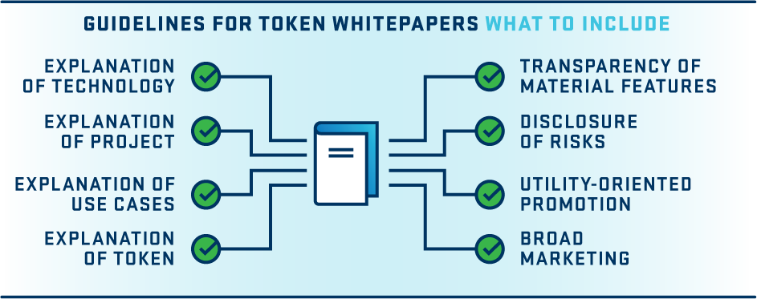

  - **Explanation of Technology**: A Token Sponsor’s whitepaper should
    explain the technology underlying the token project’s token and
    affiliated system(s) and/or application(s). It might include such
    matters as a description of the underlying code, how an application
    interacts with the platform, why a blockchain-based product or
    service is critical to solving the problem(s) that the token project
    aims to address, and the operation of the token network. Any means
    by which the token’s protocol enables control of, changes to, or
    corrections of the token’s protocol should be discussed. Depending
    on the intended token recipient, the Token Sponsor should carefully
    separate hyper-technical or dense discussions of the technology from
    plain-language discussions of the technology to enable the widest
    possible audience to understand the project and its central
    components. While technical discussions of the technology may be
    very important, a Token Sponsor should consider including them as
    appendices to, or separate documents from, the project’s whitepaper.

  - **Explanation of Project**: A Token Sponsor’s whitepaper should
    explain the utility of the token project and include a description
    of how the project seeks to achieve its intended purpose as well as
    how the token will be used for this purpose.
    
      - **Services and Products**: A whitepaper should describe
        system(s) or application(s) that may be acquired or utilized
        with the token.
    
      - **Use of Smart Contracts**: If the Token Sponsor’s project uses
        smart contracts, the whitepaper should describe how the smart
        contracts are intended to be used, what purposes they are
        intended to serve within the application, and how the smart
        contracts are intended to operate, including how they
        self-execute in the context of the application.

  - **Explanation of Use Cases**: A Token Sponsor’s whitepaper should
    consider providing current use cases for the project’s products
    and/or services and specifically the digital token. The explanation
    can include descriptive or illustrative case studies of the
    application to provide the reader an understanding of how the
    project’s application and token will work in practice within the
    blockchain application.

  - **Explanation of Token**: A Token Sponsor’s whitepaper should
    provide a comprehensive description of a token that is imbedded in
    the product and/or service. The description should include the form
    of the token (*e.g.*, ERC20, etc.), and any rights of, or benefits
    to, and obligations of, token holders.

  - **Transparency of Material Features**: A Token Sponsor, through
    published material or statements (such as a whitepaper and
    distribution terms), should transparently disclose the material
    features of its digital token and of the token’s distribution,
    including information pertaining to pricing, structure, allocation,
    and utility.

  - **Disclosure of Risks**: A whitepaper should disclose any
    foreseeable conditions that could disrupt or impair use of the
    tokens’ application(s) or system(s). If the Token Sponsor has
    devised plans to mitigate certain risks, it should disclose the
    material details of such plans.

  - **Utility-oriented Promotion**: Promotion of the system or
    application for a Token Sponsor’s digital token should not encourage
    interest in acquiring the token based solely on investment
    expectations or a fear of missing out on an investment. Depending on
    other facts, such promotion could affect the token’s
    characterization as a security. The Token Sponsor should not link to
    or reference material the content of which is not in its control.

  - **Broad Marketing**: The dissemination of a Token Sponsor’s
    whitepaper should be focused towards the population who would most
    likely use or benefit from the Token Sponsor’s product, service, or
    token. The marketing of a whitepaper should not be targeted toward
    general populations with an interest in investing, particularly
    those who speculatively invest in digital tokens, or who buy with
    the sole intention of selling for increased returns.

**Information that Should Not Be Included in a Token Sponsor’s
Whitepaper**

  - **Allocation of the pre-mine**: A Token Sponsor’s whitepaper should
    avoid discussion of any allocation of tokens for investors,
    developers, founders, or employees. Such discussions would appear to
    be more relevant to a potential investor in the project than a user
    of the application.

  - **Plans for future additional features**: A Token Sponsor’s
    whitepaper should not discuss any plans that the Token Sponsor may
    have for expanding the features or scope of the project’s products,
    services or applications, or other proposed enhancements to the
    token’s use after the launch of its token. Emphasis on plans for
    future development by the Token Sponsor may negatively affect a
    digital token’s security analysis under the *Howey* Test.

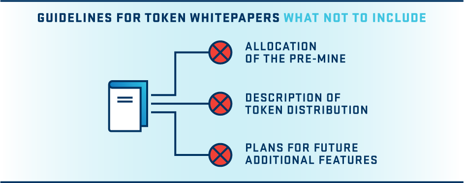

  - **Description of the distribution of tokens:** If a Token Sponsor’s
    digital token will be distributed in private sales, a limited public
    sale or auction, airdrop, or a similarly limited event, it may be
    more appropriate to describe the event in separate materials that
    can be superseded when the event is completed, rather than in the
    Token Sponsor’s whitepaper. Such materials may include details that
    would only be of interest to participants in the event. This may
    help keep readers from improperly regarding a Token Sponsor’s
    whitepaper as marketing the token rather than describing its
    operation.

> Of course, a Token Sponsor’s whitepaper generally should discuss any
> means its system(s) or application(s) employ to distribute tokens as
> part of its regular operations. Such systemic distributions might
> include rewards for work done in generating or verifying new blocks
> and rewards for other work done to operate the system(s) or
> application(s).

**Information that Should Not Be Included in a Token Sponsor’s
Promotional and Marketing Materials Generally**

  - **Intentional misrepresentations or misleading statements**: A Token
    Sponsor should not make any misrepresentations, misleading
    statements, or omit any material facts that could be deemed
    important information for someone using or acquiring its digital
    token.

  - **Promises of financial returns**: A Token Sponsor should take care
    that materials relating to its digital token not make statements
    that characterize the token as a passive investment opportunity or
    imply that the token holders will earn financial gains as a result
    of business activities of the Token Sponsor unrelated to the
    underlying utility of the tokens’ system(s) and application(s).
    Examples of such statements are those made in the *Munchee* Order
    regarding how the “ecosystem” had been designed to cause the token
    to appreciate or, as discussed in more detail in Section 2, the
    prospects for a secondary market. Token Sponsors should avoid making
    promissory statements.

  - **Discussion of matters that might primarily interest investors**: A
    Token Sponsor’s materials should not make any statements that would
    be relevant to an investor but not to a user of the application(s)
    or system(s) relating to the digital token. Quantitative statements
    regarding current or potential markets for such application(s) or
    system(s) should be carefully considered. The user of a digital
    token to obtain a service, for example, may find the number of
    customers or the number of times the service is accessed more
    relevant than the dollar amount spent on the service. Sponsors
    should especially avoid projecting the project’s takeover of market
    share or the token’s future secondary market price.

  - **Discussions of prior investments or major projects completed by
    the development team and its advisors or consultants**: In the
    *Munchee* Order, the SEC criticized statements highlighting “its
    founders had worked at prominent technology companies” and “their
    skills running businesses and creating software.” This suggests a
    Token Sponsor should be cautious about discussing the management and
    entrepreneurial skills and records of those involved with its token
    project in the context of a token’s future financial performance or
    in such a way that creates an expectation that their efforts will
    help the price of the relevant digital token appreciate.

**Conclusion**

Following these *Principles and Guidelines for Token Sponsors* provides
no guarantee that a federal or state regulator will not take issue with
the digital token issuance, sale, or other distribution. Rather, these
principles and guidelines are intended to provide an overview to assist
a Token Sponsor when thinking through critical issues related to its
digital token issuance, sale and distribution. These *Principles and
Guidelines for Token Sponsors* should be read in concert with the Token
Alliance’s *Principles and Guidelines for Token Trading Platforms*.

**Section 2**

**PRINCIPLES AND GUIDELINES FOR TOKEN TRADING
PLATFORMS **

This section provides introductory principles and guidelines for
entities that allow the trading of digital tokens on their platforms and
for Token Sponsors seeking to have their tokens traded on such
platforms. This section only addresses platforms (collectively, “Token
Trading Platforms”).\[202\] through which market participants can
convert virtual currency, fiat currency, or other digital tokens into
other virtual currency, fiat currency, or other digital tokens that are
not:

  - > Registered with the SEC pursuant to the Exchange Act as a
    > “national securities exchange” or an “alternative trading
    > system;” or

  - Registered with the CFTC pursuant to the CEA as a “registered
    entity.”

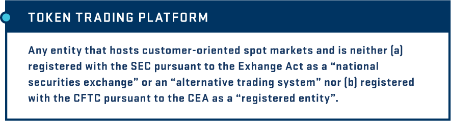

Token Trading Platforms and other secondary markets for digital tokens
play a critical role in the establishment of secure networks, enhance
token utility, and promote the general adoption of cryptocurrency and
blockchain technology. They provide an important mechanism for price
discovery, which in turn allows systems that incentivize blockchain
validation—such as proof of work—to function efficiently. They also
expand opportunities for the general public (e.g., the unbanked) to
acquire and benefit from blockchain applications, and to purchase and
sell tokens as their demands for particular token functionalities change
and evolve and as new and improved tokens are developed.

But secondary markets may also create securities law-related concerns.
In the words of SEC Chairman Jay Clayton, a secondary market is a “key
hallmark” of securities and of securities offerings.\[203\] As explained
in the U.S. Regulatory Overview provided in Part 1, facilitating the
trading of digital tokens may subject a platform to regulation by the
SEC or the CFTC if the tokens are found to be securities or CFTC
Regulated Instruments. The uncertainty surrounding the application of
“facts and circumstances” legal tests to new and evolving blockchain
technology makes compliance with those regulatory definitions
challenging.

Of course, responsible Token Trading Platforms should do more than
merely avoid regulation by the SEC or the CFTC. They should voluntarily
conduct business in a manner that protects token consumers, protects the
integrity of secondary markets, and builds public confidence in the
broader blockchain industry. These broader concerns, although important,
are beyond the scope of this chapter, as are the following
non-exhaustive list of other legal and regulatory issues that Token
Trading Platforms should address:

  - cyber security;

  - whether their activities constitute money transmission under the
    relevant federal and state statutes and regulations;

  - privacy and data transfer issues for international users;

  - AML/KYC and OFAC procedures, including transparency surrounding such
    procedures so that users understand why they must provide their
    information;

  - reserving the right to remove users from the exchange;

  - reserving the right not to conduct cross-chain recoveries when
    people deposit the wrong tokens in exchange wallets; and

  - how the exchange will treat victims of external phishing schemes or
    theft of tokens.
    
    Rather, this section will focus on how Token Trading Platforms may
    manage the risk that a regulator or a court may contend that a
    digital token trading on the platform is a security or CFTC
    Regulated Instrument notwithstanding the Token Sponsor’s claims to
    the contrary. This is an important threshold concern for any Token
    Trading Platform because allowing even one security or CFTC
    Regulated Instrument to trade on the platform would require the
    Token Trading Platform to registered with either the SEC or CFTC,
    respectively.

<!-- end list -->

1.  Important Considerations for Vetting Tokens for Acceptance onto a
    Token Trading Platform

<!-- end list -->

  - Before it establishes a market for any digital token, a Token
    Trading Platform should examine the token to determine the risk that
    it might be deemed to be a security or CFTC Regulated Instrument
    and, consequently, that the Token Trading Platform might fall within
    the requirements of the Exchange Act or CEA. No token should be
    exempt from this examination. Digital tokens for which markets were
    established before a Token Trading Platform adopted written
    procedures as described below should be reviewed retroactively.

  - The compliance officer or other senior managers of the Token Trading
    Platform should establish written procedures (“**Procedures**”),
    containing factors used to evaluate digital tokens for approval for
    trading on the platform, as well as standards for ongoing review of
    tokens to assess if they will no longer be permitted to trade. The
    Procedures should include:
    
      - a review the token’s present utility, based on the Token
        Sponsor’s whitepaper and other documents, information, or
        demonstrations provided by the Token Sponsor;
    
      - a review of promotional statements (and any subsequent
        disclaimers) made by the Token Sponsor or agents on its behalf
        on public-facing media;
    
      - a current written analysis prepared by the Token Sponsor’s
        counsel or by the Token Sponsor in consultation with its counsel
        explaining why the digital token is not a security or CFTC
        Regulated Instrument, which analysis should be reviewed by
        counsel for the Token Trading Platform; and
    
      - a requirement that digital tokens are reviewed periodically to
        ensure that they remain compliant with existing law and
        regulatory expectations relevant to Exchange Act or CEA
        requirements.

  - The same criteria should be used to close a market for a digital
    token as are used to deny a request to establish a market for a
    prospective token.

  - A Token Trading Platform should memorialize the results of a token’s
    examination and any re-examination and store them for no less than
    five years.

  - A Token Trading Platform should not permit trading of any derivative
    instruments, including but not limited to any CFTC Regulated
    Instruments.

  - A Token Trading Platform should carefully consider whether to permit
    trading of digital tokens on a leveraged, margined, or financed
    basis. If a Token Trading Platform were to permit trading of tokens
    in these ways, it should only do so where it has implemented
    appropriate measures to ensure such trading is in accordance with
    applicable CEA requirements.

  - As illustrated by the *Munchee Order*, promises by a Token Sponsor
    to establish secondary trading markets for its digital token, or
    even publicized efforts by the Token Sponsor to do so, may be a
    negative factor under the *Howey* Test. In light of this, a Token
    Trading Platform should consider its policies around
    (a) confidentiality of requests to establish a market and
    communications relating to such requests and (b) publicity regarding
    its decision to establish, to not establish, or to close a market
    for a digital token. The Token Trading Platform should take
    appropriate steps to inform applicants of and require applicants to
    abide by these policies.

  - Adopt policies and procedures to ensure that a Token Trading
    Platform’s directors, officers, employees, and affiliated third
    parties do not use nonpublic material information obtained through
    their work with the Token Trading Platform to engage in digital
    token transactions that could give the appearance of trading on
    material non-public information.\[204\]

<!-- end list -->

  - Have procedures for promptly investigating any reports of market
    manipulation.

  - Establish criteria and procedures for suspending trading of a token
    suspected of being involved in manipulative trading activity.

  - Involvement of a Token Trading Platform in the offering and
    distribution of a digital token may become a factor in determining
    whether a digital token qualifies as an investment contract under
    the *Howey* test. A Token Trading Platform may want to assess this
    risk with the Token Sponsor before becoming involved. Even after a
    market is established, a Token Trading Platform should avoid
    appearing to endorse as an investment any digital token that is
    trading on its platform and should make appropriate disclosures and
    disclaimers when necessary to counter any such appearance. This
    guidance is not meant to discourage communication between Token
    Sponsors and Token Trading Platforms for the purpose of clarifying
    or enhancing legal compliance or collaboration relating to
    technological issues associated with potential or continued
    inclusion of the digital token on the Token Trading Platform.

<!-- end list -->

5.  Considerations for Token Sponsors Dealing with Token Trading
    Platforms

<!-- end list -->

  - A Token Sponsor should keep in mind that no Token Trading Platform
    is obligated to maintain a market for its digital token and should
    be prepared to work with the Token Trading Platform to answer all
    reasonable questions that the Token Trading Platform asks of it.

  - A Token Sponsor should consider whether any financial dealings with
    a Token Trading Platform or its affiliates could create a reasonable
    impression that the Token Sponsor is “buying” the digital tokens’
    way onto the platform.

  - A Token Sponsor that deals with Token Trading Platforms should have
    policies and procedures to prevent its affiliates and employees from
    trading based on non-public information regarding the token’s status
    on the platform, such as a decision to open or close a market for
    the token.

  - While a Token Sponsor may publicize that its token can be purchased
    or sold on a Token Trading Platform, once a market for the token is
    opened, the Token Sponsor should refrain from discussing the token’s
    potential for price appreciation.

**Conclusion**

Following these *Principles and Guidelines for Token Trading Platforms*
provides no guarantee that a federal or state regulator will not take
issue with the trading of particular tokens on its Token Trading
Platform. Rather, these principles and guidelines are intended to
provide an overview to assist a Token Trading Platform when thinking
through important considerations before establishing a market for
digital tokens. These *Principles and Guidelines for Token Trading
Platforms* should be read in concert with the Token Alliance’s
*Principles and Guidelines for Token Sponsors*.

**PART 3**

**Token Economic Landscape**

**Trends in Token Project Fundraising Events: 2013-Present **

**I. Methodology**

Measuring digital token project\[205\] size is difficult. To do so,
throughout this part, the term “digital token projects” or “token
projects” includes all digital token fundraising events that (i)
entailed over $25,000 being raised from project participants; and (ii)
did not return these raised funds. Amounts raised are valued according
to average daily exchange rates on the date the fundraising event
closed. Also, for purposes of this part, fundraising events for digital
tokens are defined to take place regardless of whether tokens are
distributed immediately or are promised to be delivered to project
participants in the future (and have yet-to-be created, like Filecoin).
Thus the scope of analyses in this part includes all “presales,”
“private sales,” “pre-ICOs”, and so-called “Initial Coin Offerings” or
“ICOs,” as well as both meta-tokens on Ethereum (most of which are based
on the ERC-20 standard), meta-tokens on other blockchains, and base
tokens in fundamental protocols. Analyses set forth below also include
‘temporary tokens’ that are intended to be redeemable for future
tokens. Some data may be missing or subject to future revision, and
fundraising events occurring more than 30 days apart are treated as
separate.

**II. Introduction**

The scale of token project fundraising events over the past several
quarters has been a defining feature of the industry, and has prompted
significant attention by regulators, financial institutions, and retail
market participants alike. Yet as Figure 1 shows, token project
fundraising events vary immensely, and as subsequent analyses below
indicate, are quite diverse in how such events have been conducted, the
types of tokens that have actually been distributed, and in what
jurisdictions token projects have taken place. This part will
characterize the overall evolution and makeup of recent token projects,
but the reader should keep in mind the diversity of actual token
projects, and their fundraising and token distribution methods. No one
anecdote is indicative of all or most token project fundraising.

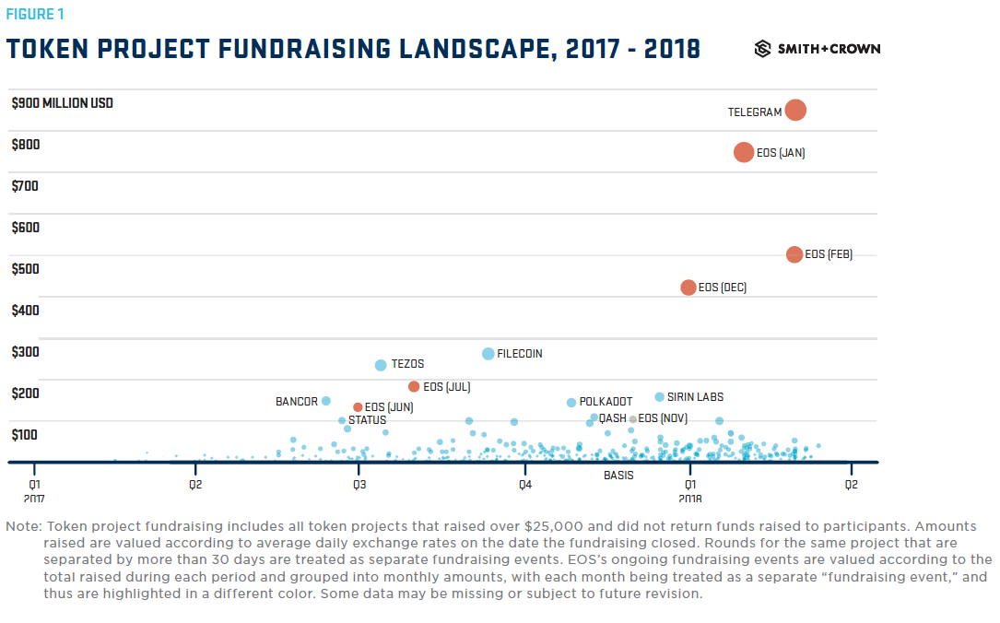

Figure 1 also illustrates that the industry's growth and evolution
during the 2017-2018 period reveals distinct periods for the digital
token ecosystem, despite its relatively young age. Subsequent analyses
set forth below further highlight this reality, as well as central
features and underappreciated aspects of the evolution of digital token
markets.

Beyond considering the fundraising event numbers, this report also
explores how evaluating different ‘tiers’ or bands of funds raised can
help clarify the full range and scale of projects coming to market.
Thinking geographically also continues to yield novel insights into the
market, and is a useful approach given the different regulatory
realities found around the world in addition to the unique regional
projects, audiences, and fundraising patterns that have emerged.

Finally, examining the different industries present within the space,
and how their component sectors typically function can yield additional
insights into how the technology is being applied.

**III. Total Amounts Raised in Token Project Fundraising Events**

As Figure 2 illustrates, in 2016, over $100 million was raised for token
projects (not including funds raised through the DAO and returned). At
the time, this number surprised many in the industry. However, few token
projects generated over $5 million from project participants during this
period, and many projects raised approximately $1 million. Amongst token
projects that raised funds from 2013 - 2016, many functional platforms
have become enduring pieces of the blockchain industry today, including,
Ethereum. Notably, as the chart below illustrates, the total
dollar-volume of this and other noteworthy token project fundraising
events was quite small relative to those that took place in 2017 and the
first quarter of 2018.

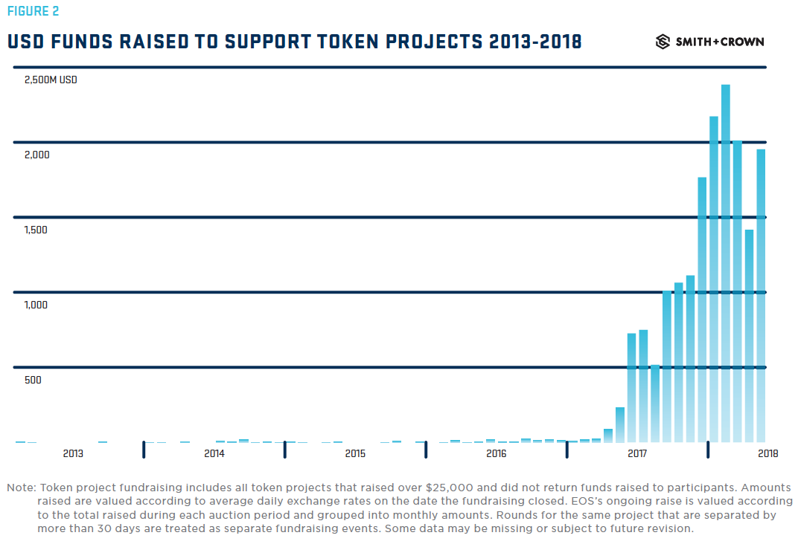

2017 represented a new chapter in the history of token project
fundraising, with $7.3 billion raised from well more than 550 completed
token project fundraising events. Underappreciated is how 2017 was
marked by a series of distinct stages that somehow also managed to fit
within a single calendar year. These periods also coincided relatively
closely with 2017’s calendar quarters, and are profiled below.

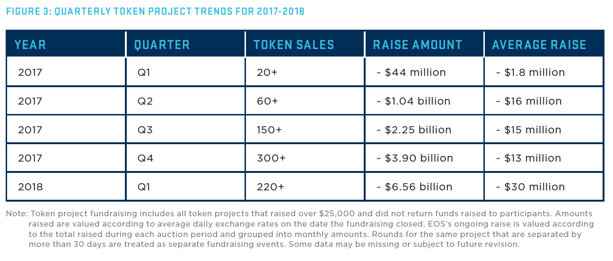

As Figure 3 shows, the scope and scale of digital token fundraising
events changed dramatically in 2017. Each distinct quarter is profiled
below:

> ●  Q1 2017 effectively extended 2016’s pattern of a limited number of
> modest raises. This was illustrated by the quarter’s average token
> fundraising amount of $1.8 million, which was virtually identical to
> averages from the four preceding quarters.
> 
> ●  Q2 2017 represented a sharp break from earlier patterns. Completed
> fundraising events tripled, and with the average digital token
> fundraising event amount increasing tenfold, total dollar-volume
> increased twenty-fold from the Q1 total. While several token projects
> began to engage in large dollar-volume fundraising events for
> ambitious undertakings, a much larger number of projects continued to
> operate at smaller-scale in line with average volumes that marked the
> 2013-2016 period.
> 
> ●  Q3 2017 brought about a doubling of Q2’s token project fundraising
> events and amounts raised. The trend of very large token projects that
> began in Q2 continued in Q3, with both Tezos and Filecoin each raising
> more than $200 million. Equally significant was the broad group of
> projects raising more than $5 million each, a different but equally
> compelling measure of the market’s strength. Average fundraise amounts
> declined slightly relative to Q2.
> 
> ●  Q4 2017 brought about another doubling of total token project
> fundraising events, with a virtual doubling of dollar-amounts even as
> average sale amounts declined modestly.

Continuing into 2018, the pattern of each quarter having a unique
characterization continued apace:

> ● Q1 2018 saw a break in the trend of increasing token sales events,
> with a decline from over 300 to around 220, yet the amount raised
> continued to increase, to over $6.5 billion for the quarter, a more
> than 50% increase from Q4 2017, yet a slowing rate of increase hinting
> at a potential slowing in the trend. As would be expected by the
> above, the average sale amount increased from around $13 million to
> close to $30 million.

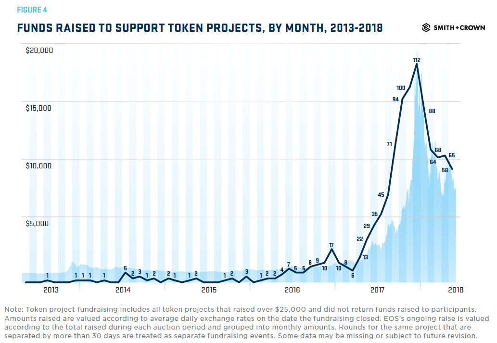

**IV. Token Project Average Fundraising Amount**

A long-running debate within the digital token ecosystem concerns the
question of how much projects should seek to raise? As noted, prior to
2017, many digital token projects sought around $500,000 to $2 million,
with plenty slightly below and above. In 2017, however, the
dollar-volume of fundraising events for many token projects began
consistently growing. Debates over the appropriate size of token
projects reflect the reality that if only a small amount of money is
sought via the fundraising event, then only a few project participants
can enjoy the project’s value upon its commencement. Some token projects
have sold all available tokens in less than 60 seconds, despite much
larger demand.

Conversely, larger-sized fundraising events allow more people to
participate in a token project. However, large fundraising events can
result in projects accumulating tens or hundreds of millions of dollars.
This is a complex topic, with tradeoffs that the digital token community
actively discusses. Figure 5 clearly illustrates, however, that 2017 and
early 2018 have been marked by a trend towards larger dollar-volume
token project fundraising events. Some attribute greed as the primary
factor driving increased project size, but as the discussion set forth
above suggests, there are multiple dynamics that drive token project
size, including pricing, a token’s underlying utility, project type,
market optimism, and market fairness.

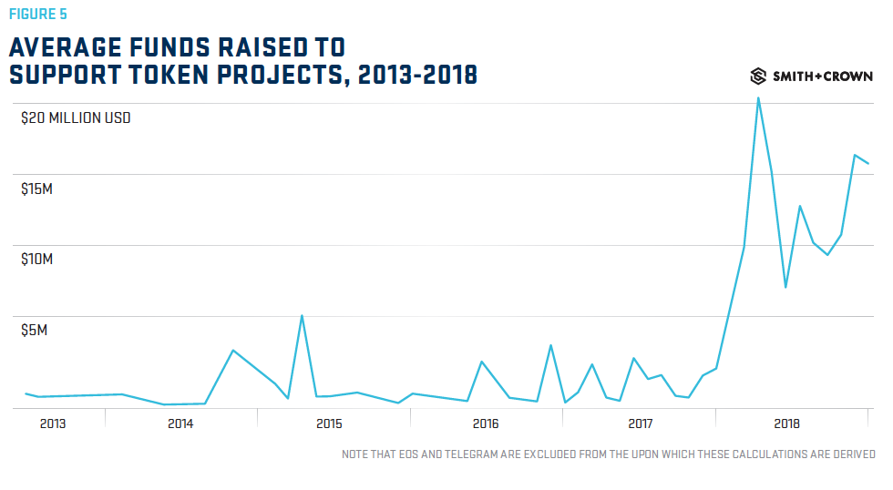

How the market evolves in the years ahead will be telling. The twin
dynamics of uncertainty over potential regulatory steps and related
issues concerning the treatment by some major regulators of certain
digital tokens as securities will likely shape the near-term trajectory
of the markets.

**V. The Relative Size of Token Project Fundraising Activity**

Impressive 2017 growth aside, token project fundraising and blockchain
investments remain small relative to IPOs or venture capital investments
(which are not mutually exclusive categories), as Figure 6 illustrates.

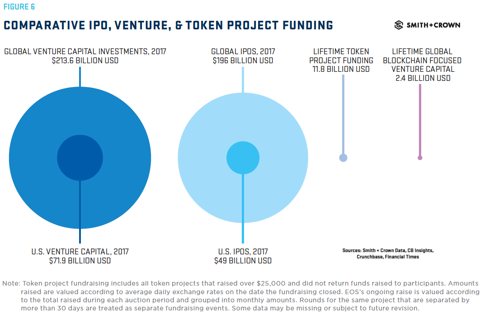

This comparison is not meant to suggest that IPOs or VC investments are
similar in mechanics or purpose to most or many digital token projects.
Indeed, that is not the case, in part because as Part 1 explains, many
digital tokens are viewed as commodities rather than securities in the
eyes of regulators.

As explained above and illustrated by Figure 7 below, larger token
project fundraising events have enabled increased market access to
innovative projects and services directly via these events, relative to
traditional, capital markets-oriented fundraising methods that are also
focused on blockchain-based projects.

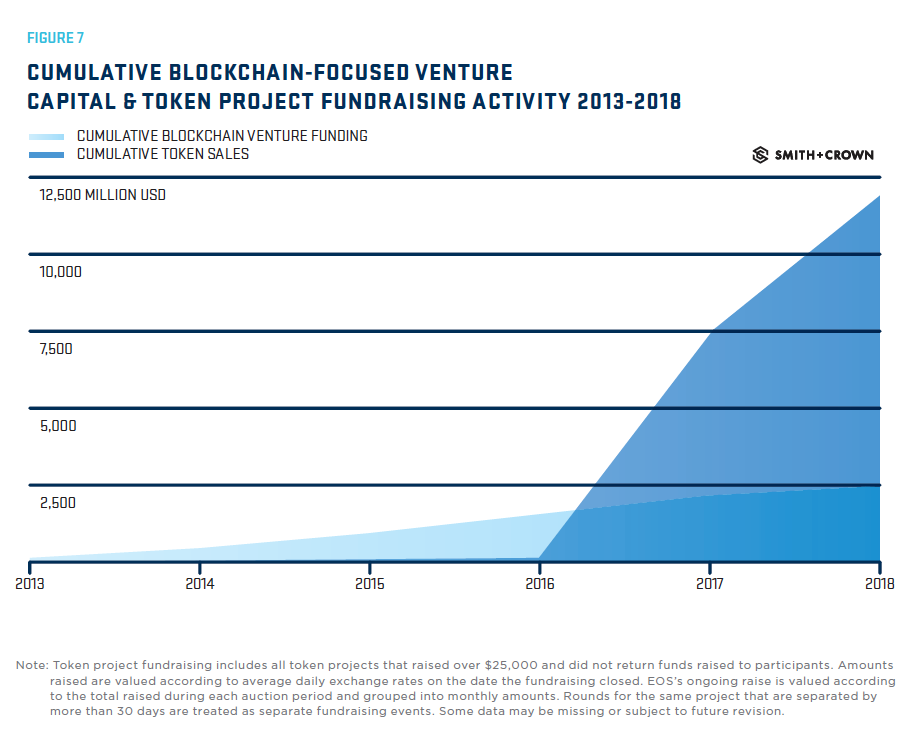

Note: Token project fundraising includes all token projects that raised
over $25,000 and did not return funds raised to participants. Amounts
raised are valued according to average daily exchange rates on the date
the fundraising closed. EOS's ongoing raise is valued according to the
total raised during each auction period and grouped into monthly
amounts. Rounds for the same project that are separated by more than 30
days are treated as separate fundraising events. Some data may be
missing or subject to future revision.

**VI. Distribution of Token Projects by Dollar-Volume Size**

As discussed above, the diversity of token project size and type is
often underappreciated. Figure 8 below divides 2017-18 token projects
into different categories based on the size of accompanying fundraising
events.\[206\] In doing so, it clearly illustrates how token project
growth was driven by the extensive, broad-based activity within tiers of
less widely publicized digital token projects. While large projects
persisted throughout 2017, a thick middle band of projects gradually
increased their contributions to the overall industry raise amounts.
Whether this trend will persist throughout 2018 bears careful
observation. Regardless, this metric will provide unique insight into
the general health of the industry.

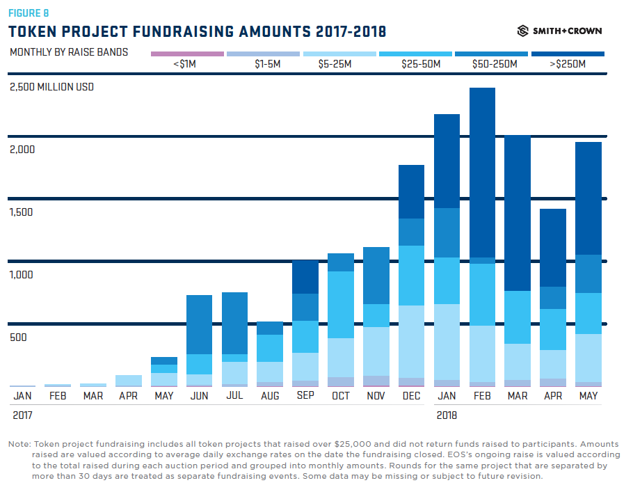

**VII. Geography of Token Sales**

Figure 9 illustrates both the relative concentrations and the geographic
diversity of amounts raised by token projects globally since 2013. The
United States, Switzerland, and Singapore are recognized blockchain hubs
and stand out as leaders, but many other jurisdictions have been hosting
token projects and token project fundraising.

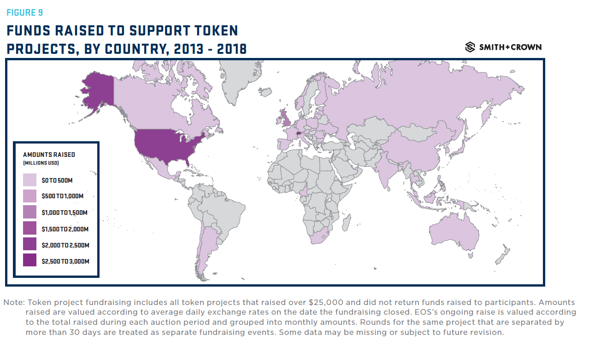

European maps in Figure 10 yield a number of additional insights,
including the extent of activity in the United Kingdom, Estonia, and
Russia.

In the broadest sense, Figures 9 and 10 illustrate the community’s
global nature, and the broad, diverse origins of many emerging projects.
Monitoring evolving trends in token fundraisings’ geographic patterns
will be revealing as the industry continues to evolve.

A rarely considered yet particularly interesting manner of examining the
geography of token project fundraising is exploring the issue of
fundraising domicile (where funds are raised) relative to the location
of a project’s headquarters – as measured by the location of a project’s
main office or the core leadership team’s primary working location.
While data can be imprecise, as the industry includes a number of
genuinely distributed teams and organizations, the domiciles of
virtually all leading projects in the space (those representing more
than 95 percent of all token fundraising events by dollar amount) can
nevertheless be identified.

Figure 11 below takes a regional look at the question of fundraising
compared to that of working domiciles on a regional basis. Switzerland
is broken out from Western Europe because its own activity is larger
than the entire surrounding region. What emerges is a clear appreciation
of the Caribbean’s role as a fundraising center. Despite nearly $4
billion in capital raises in the Caribbean, virtually none of the
projects were locally-based. While the United States and Canada appear
to be the leading center of working activity, their fundraising is often
occurring elsewhere. Yet the Caribbean is also serving as a fundraising
center for more than just the United States, since its raise amounts
exceed amounts cited as working within the United States. Switzerland
supports a community of local projects, and also acts as a major
fundraising center for global projects.

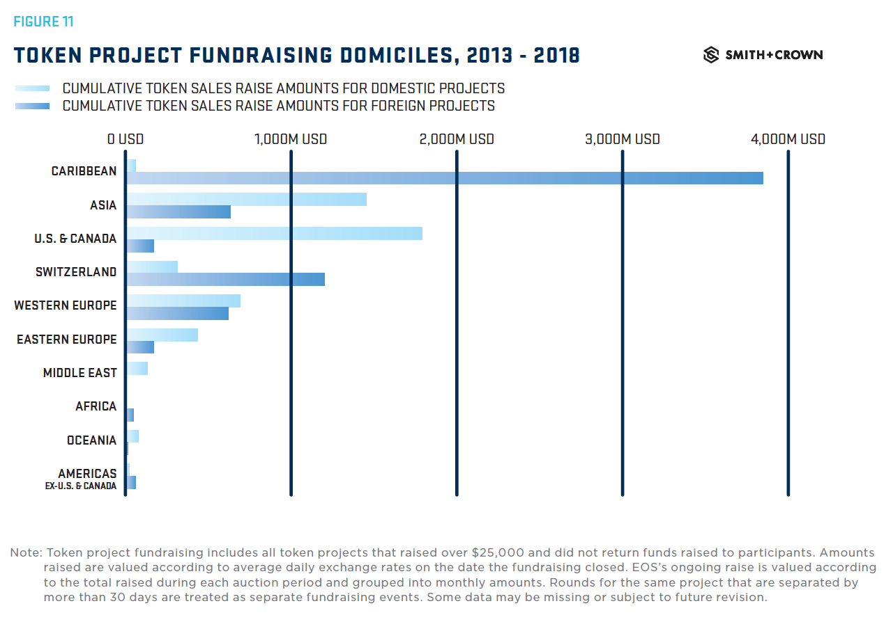

**VIII. Industry Analysis**

In an effort to keep up with the dramatic increase in breadth,
diversity, and, as a result, complexity of the token space in 2017,
Smith + Crown created a classification system for industries and
component sectors. Looking across these classifications offers
significant insight into the industry's evolution.\[207\]

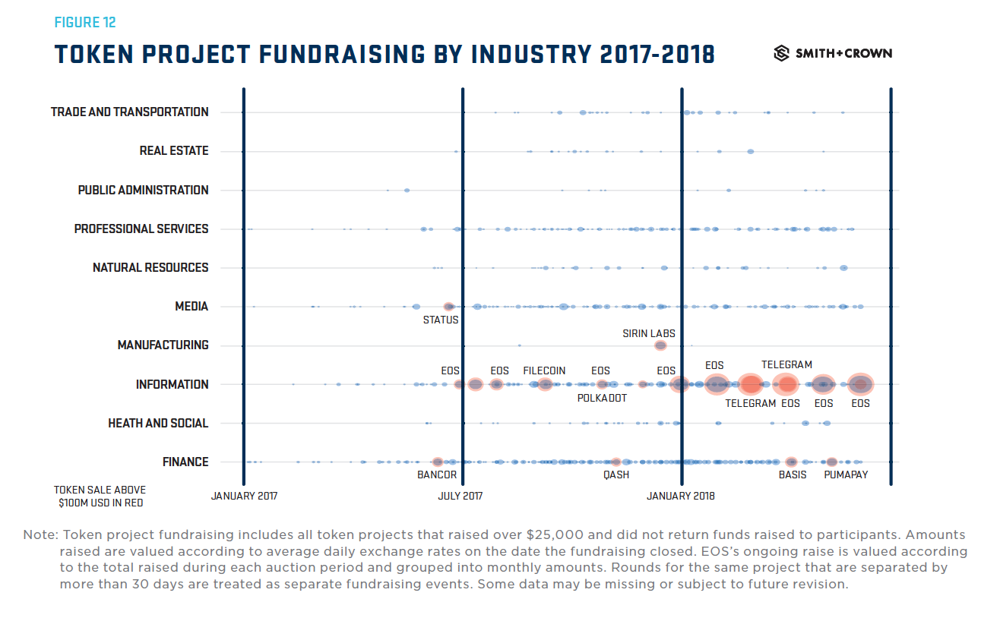

Unsurprisingly, finance and information technology dominated the
landscape until now. Blockchain technology is a unique way of storing
data and representing tradable value. The expansion of projects beyond
this core showed how entrepreneurs are imagining new ways blockchain
technology can be applied. The different industries are briefly
described below:

●  **Trade & Transportation** - Personal transportation services, supply
chain management, and transportation of goods.

●  **Real Estate** - Commercial, residential, property management, and
real estate investment funds.

●  **Public Administration** - Voting mechanisms, record keeping, and
governance platforms.

●  **Professional Services** - Advertising/marketing, accounting,
identity management, legal services, and loyalty rewards.

●  **Natural Resources** - Energy, agriculture, and precious metals.

●  **Media** - Gaming, messaging, entertainment, and social networks.

●  **Manufacturing** - Hardware devices and other manufacturing
enterprises.

●  **Information** - Smart contract platforms, distributed computing,
data storage, and data analytics.

●  **Health & Social** - Medical services, non-profits, social services,
and education.

●  **Finance** - Payments systems, distributed trading platforms, and
distributed prediction markets.

**IX. Conclusion**

Overall, token projects are both diverse and constantly evolving. Their
accompanying fundraising events are global in nature, and the patchwork
of conflicting regulations around the world has likely contributed to
many diverse projects. As this part illustrates, there is more
complexity to the digital token ecosystem than one might be led to
believe; its scope and diversity can be appreciated through the unique
and insightful analyses set forth above. Many high-quality projects have
been able to occur through well-managed fundraising events, and future
digital token projects will likely feature unexplored designs, use
cases, and accompanying network models.

**VII. Looking Ahead**

The concept of digital tokens is complex. As SEC Commissioner Hester
Peirce recently said, she used to know what a token was. Now it’s not so
clear. “A thing might seemingly have one form but in fact support many
functions, each requiring a different regulatory regime.” In many ways
we are in that universe, unpacking tokens, whether they represent money,
property, a security, or a commodity – or sometimes multiple
characteristics at the same time. As she also noted, “…we must not let
our lack of familiarity with new technology breed anxiety and therefore
bad regulation.” Digital tokens based on blockchain technology are
another innovation in technology that should be embraced; however, we
realize that much work lies before us to ensure that regulators and
policy makers understand what tokens are, what they can be, what
promises may as yet be unknown, and how to allow that to flourish while
protecting markets, purchasers, and investors.

This report represents the first installment in what is anticipated to
be multiple parts in the crusade to open the doors to creative thinking
and understanding in the token ecosystem. This report addresses digital
tokens that are not intended to be securities or Regulated Commodities
Instruments. Subsequent areas of work could include: unique
considerations for cybersecurity; AML/KYC; potential regulatory
adjustments for tokens with security characteristics; compliance
challenges for security tokens that may be unique to a digital security
that may change form (for example, no longer be considered a security –
so-called “hybrid” tokens); and how the industry might play a role in
self-regulation.

We look forward to working with the industry and key stakeholders to
promote careful stewardship of a token ecosystem.

1.  For the definition of “digital token” used throughout this report,
    *see* page 12.

2.  During 2017, total market capitalization for digital tokens grew
    from approximately $17.73 billion to $565.11 billion.
    https://coinmarketcap.com/charts/.

3.  For a definition of Token Trading Platforms, *see* page 20.

4.  *See* FIN-2013-G001, Application of FinCEN’s Regulations to Persons
    Administering, Exchanging, or Using Virtual Currencies (Mar. 18,
    2018); *see also*, FIN-2014-R001, Application of FinCEN’s
    Regulations to Virtual Currency Mining Operations (Jan. 30, 2014);
    *see e.g.*, Letter from Drew Maloney, Assistant Sec’y, U.S. Dep’t of
    the Treasury, to Senator Ron Wyden, U.S. Senate Comm. on Fin. (Feb.
    13, 2018) (clarifying that Token Sponsors may be subject to FinCEN’s
    regulations depending on the facts and circumstances).

5.  Interview by Bob Pisani with Jay Clayton, Chairman, U.S. Sec. and
    Exch. Comm’n, in New York, N.Y. (June 6, 2018).

6.  William Hinman, Digital Asset Transactions: When Howey Met Gary
    (Plastic): Remarks at the Yahoo\! Finance All Markets Summit: Crypto
    (June 14, 2018),
    https://www.sec.gov/news/speech/speech-hinman-061418.

7.  *See infra* note 10 and accompanying text.

8.  *Commodity Futures Trading Comm’n v. McDonnell*, No.
    1:18-cv-00361-JBW-RLM, slip op. (E.D.N.Y. Mar. 6, 2018),
    https://www.cftc.gov/sites/default/files/idc/groups/public/@lrenforcementactions/documents/legalpleading/enfcoindroporder030618.pdf.

9.  Hester Peirce, Beaches and Bitcoin: Remarks before the Medici
    Conference (May 2, 2018),
    <https://www.sec.gov/news/speech/speech-peirce-050218>.

10. The term “commodity” is defined in the Commodity Exchange Act
    (“CEA”) as “wheat, cotton, rice, corn, oats, barley, rye,
    flaxseed, grain sorghums, mill feeds, butter, eggs, Solanum
    tuberosum (Irish potatoes), wool, wool tops, fats and oils
    (including lard, tallow, cottonseed oil, peanut oil, soybean oil,
    and all other fats and oils), cottonseed meal, cottonseed, peanuts,
    soybeans, soybean meal, livestock, livestock products, and frozen
    concentrated orange juice, and all other goods and articles, except
    onions (as provided by section 13–1 of this title) and motion
    picture box office receipts (or any index, measure, value, or data
    related to such receipts), and all services, rights, and interests
    (except motion picture box office receipts, or any index, measure,
    value or data related to such receipts) in which contracts for
    future delivery are presently or in the future dealt in.” 7 U.S.C. §
    1a(9) (2012).

11. *See* In the Matter of: Coinflip, Inc., d/b/a Derivabit, and
    Francisco Riordan, CFTC Docket No. 15-29 (Sep. 17, 2015), 3,
    http://www.cftc.gov/idc/groups/public/@lrenforcementactions/documents/legalpleading/enfcoinfliprorder09172015.pdf.

12. *Commodity Futures Trading Comm’n v. McDonnell*, No.
    1:18-cv-00361-JBW-RLM, slip op. (E.D.N.Y. Mar. 6, 2018),
    https://www.cftc.gov/sites/default/files/idc/groups/public/@lrenforcementactions/documents/legalpleading/enfcoindroporder030618.pdf.

13. Retail Commodity Transactions Involving Virtual Currency, 82 Fed.
    Reg. 60,335 (Dec. 20, 2017) (hereinafter “Actual Delivery Proposed
    Interpretation”).

14. *SEC v. W.J. Howey Co*., 328 U.S. 293, 299 (1946).

15. *FY 2019 U.S. Securities and Exchange Commission: Hearing Before the
    Subcomm. on Fin. Services and General Government of the H. Comm. on
    Appropriations*, 115th Cong. (2018) (statement of Jay Clayton,
    Chairman, U.S. Sec. and Exch. Comm’n).

16. Kia Kokalitcheva, *SEC Commissioner Won’t Declare All Tokens Are
    “Securities,”* AXIOS (May 3, 2018),
    <https://www.axios.com/sec-crypto-securities-1525340196-82046d9e-a0ac-47c2-ae95-16ddae8a2b63.html>
    (quoting SEC Comm’r Hester Peirce’s speech delivered on May 2, 2018,
    Remarks at the Medici Conference).

17. *Oversight of the SEC’s Division of Corporate Finance: Hearing
    Before the Subcomm. on Capital Markets, Securities, and Investment
    of the H. Comm. on Fin. Services*, 115th Cong. (2018) (statement of
    William Hinman, Director of the Division of Corporation Finance,
    U.S. Sec. and Exch. Comm’n).

18. Brian Quintenz, Comm’r, Commodity Futures Trading Comm’n, Keynote
    Address before the DC Blockchain Summit (Mar. 7, 2018),
    https://www.cftc.gov/PressRoom/SpeechesTestimony/opaquintenz8.

19. *Id*.

20. Brian Quintenz, Comm’r, Commodity Futures Trading Comm’n, Remarks
    Before the Eurofi High Level Seminar 2018 (Apr. 26, 2018).

21. CFTC Letter No. 98-73, Comm. Fut. L. Rep. (CCH) P27,449 (Oct. 8,
    1998),
    https://www.cftc.gov/sites/default/files/idc/groups/public/@lrlettergeneral/documents/letter/98-73.pdf.

22. Retail Commodity Transactions Under Commodity Exch. Act, 78 Fed.
    Reg. 52,426, 52428 (Aug. 23, 2013).

23. 17 C.F.R. § 180.1(a) (2018).

24. Actual Delivery Proposed Interpretation, *supra* note 13 at fn 6.

25. *See* Complaint, CFTC v. Atlantic Bullion & Coin, Inc. and Ronnie
    Gene Wilson, S.C.D., No. 8:12-1503-JMC (June 6, 2012).

26. Complaint, CFTC v. Gelfman Blueprint, Inc. and Nicholas Gelfman,
    S.D.N.Y, No. 17-7181 (Sep. 21, 2017).

27. Brian T. Daly and Jacob Preiserowicz, *Bitcoin Derivatives and
    Expanded CFTC Jurisdiction*, Schulte Roth & Zabel (Nov. 14,
    2017), <https://www.srz.com/resources/bitcoin-derivatives-and-expanded-cftc-jurisdiction.html>.

28. Memorandum & Order, CFTC v. Patrick K. McDonnell and Cabbagetech,
    Corp. d/b/a Coin Drop Markets, 3-4, (E.D.N.Y. 2018).

29. CFTC, CFTC Backgrounder on Oversight of and Approach to Virtual
    Currency Futures Markets (Jan. 4, 2018),
    <http://www.cftc.gov/idc/groups/public/@newsroom/documents/file/backgrounder_virtualcurrency01.pdf>.

30. *See* Actual Delivery Proposed Interpretation, *supra* note 13 at
    60,337*.*

31. BFXNA INC. d/b/a Bitfinex, Order Instituting Proceedings Pursuant to
    Sections 6(c) and 6(d) of the Commodity Exchange Act, as Amended,
    Making Findings and Imposing Remedial Sanctions, CFTC Docket No.
    16-19 (June 2, 2016),
    https://www.cftc.gov/sites/default/files/idc/groups/public/@lrenforcementactions/documents/legalpleading/enfbfxnaorder060216.pdf.

32. *Id.*

33. *See* Letter, ‘‘Petition for Rulemaking Concerning the Requirements
    of ‘Actual Delivery’ and the Transfer of Ownership under the
    Commodity Exchange Act in the Context of Cryptocurrency Markets
    Utilizing Blockchain for Executing Transactions’’ from Michael Dunn
    & Micah Green, Steptoe & Johnson LLP, to Chris Kirkpatrick,
    Secretary, CFTC (July 1, 2016),
    https://poloniex.com/press-releases/2016.10.18-Our-request-
    for-no-action-relief/Steptoe-Petition-for-CFTC-
    Rulemaking-(07-01-2016).pdf.

34. *Id*.

35. Tentative Order Regarding Motion to Dismiss, Motion for Preliminary
    Injunction, and Motion to Exclude, *CFTC v. Monex Deposit Co., et
    al*., SACV 17-1868 JVS (DFM) (2018), (citing *CFTC v. Hunter Wise
    Commodities*, LLC, 749 F.3d 967, 970 (11th Cir. 2014)).

36. The CFTC has drawn a distinction between “real currency” – which it
    defined in the action as “the coin and paper money of the United
    States or another country that are designated as legal tender,
    circulate, and are customarily used and accepted as a medium of
    exchange in the country of issuance” – and “virtual currency.”
    Coinflip Order *supra* note 11 at fn 2.

37. Actual Delivery Proposed Interpretation, *supra* note 13 at
    60,335*.*

38. *Id.* at 60,341.

39. Robert H. Rosenblum, Chapter 2, Investment Company Determination
    under the 1940 Act: Exemptions and Exceptions, 2 (2003),
    <https://apps.americanbar.org/buslaw/newsletter/0014/materials/investmentch2.pdf>.

40. *W.J. Howey and Co*., 328 U.S. at 298-299.

41. *Id.* at 301.

42. SEC, *Report of Investigation Pursuant to Section 21(a) of the
    Securities Exchange Act of 1934: The DAO*, Securities Act Release
    No. 81207 (July 25, 2017),
    https://www.sec.gov/litigation/investreport/34-81207.pdf.

43. *Id.*

44. Complaint, REcoin Group Foundation, LLC et al. (Sep. 29, 2017),
    http://www.sec.gov/litigation/complaints/2017/comp-pr2017-185.pdf;
    Complaint, SEC v. PlexCorps et al. (Dec. 1, 2017),
    http://www.sec.gov/litigation/complaints/2017/comp-pr2017-219.pdf;
    Order, Munchee, Inc. (Dec. 11, 2017),
    http://www.sec.gov/litigation/admin/2017/33-10445.pdf; Complaint,
    AriseBank et al. (Jan. 25, 2018),
    https://www.sec.gov/litigation/complaints/2018/comp-pr2018-8.pdf;
    Complaint, Jon E Montroll and Bitfunder (Feb. 21, 2018),
    https://www.sec.gov/litigation/complaints/2018/comp-pr2018-23.pdf;
    Complaint, Centra Tech., Inc. (Apr. 2, 2018),
    https://www.sec.gov/litigation/complaints/2018/comp-pr2018-70.pdf;
    Complaint, Longfin Corp., et al. (Apr. 6, 2018),
    http://www.sec.gov/litigation/complaints/2018/comp-pr2018-61.pdf.

45. Munchee Inc., Securities Act Release No. 10445 (Dec. 11, 2017),
    https://www.sec.gov/litigation/admin/2017/33-10445.pdf.

46. *Id.*

47. *Virtual Currencies: The Oversight Role of the U.S. Securities and
    Exchange Commission and the U.S. Commodity Futures Trading
    Commission: Hearing Before the S. Comm. on Banking, Housing, and
    Urban Affairs*, 115th Cong. (2018) (statement of Jay Clayton,
    Chairman, U.S. Sec. and Exch. Comm’n).

48. Nikhilesh De and Mahishan Gnanaseharan, *SEC Chief Touts Benefits of
    Crypto Regulation*, coindesk (Apr. 5,
    2018), <https://www.coindesk.com/sec-chief-not-icos-bad/>.

49. *See supra* notes 15 to 17 and accompanying text.

50. SEC, *Statement Urging Caution Around Celebrity Backed ICOs*, (Nov.
    1, 2017),
    <https://www.sec.gov/news/public-statement/statement-potentially-unlawful-promotion-icos>;
    SEC, *Investor Bulletin: Initial Coin Offerings*, (July 25, 2017),
    <https://www.investor.gov/additional-resources/news-alerts/alerts-bulletins/investor-bulletin-initial-coin-offerings>.

51. SEC, *Statement on Cryptocurrencies
    and Initial Coin Offerings*, (Dec. 11, 2017),
    <https://www.sec.gov/news/public-statement/statement-clayton-2017-12-11>.

52. De and Gnanaseharan, *supra* note 48.

53. Violations of securities laws are subject to civil and criminal
    penalties.

54. 17 C.F.R. § 230.500 *et seq.* (2018).

55. Under Rule 501 of Regulation D, the term “accredited investor”
    includes, among others, certain financial institutions, such as
    broker-dealers, registered investment companies and insurance
    companies. It also includes natural persons whose net worth, or
    joint net worth with that person’s spouse, exceeds $1 million
    (excluding the value of the person’s residence). The term also
    includes natural persons whose income in each of the two most recent
    years was in excess of $200,000 or jointly with that person’s spouse
    was in excess of $300,000.

56. Exchange Act Section 3(a)(1), 15 U.S.C. § 78c(a)(1) (2012), and
    Exchange Act Rule 3b-16(a), 17 C.F.R. § 240.3b-16(a) (2018).

57. 17 C.F.R. § 242.600 *et seq.* (2018).

58. 17 C.F.R. § 242.300 *et seq*. (2018).

59. 17 C.F.R. § 240.15c2-11 (2018).

60. 17 C.F.R. § 230.144 (2018).

61. 15 U.S.C. § 78c(a)(25)(E) (2012). Other provisions of the definition
    also may be relevant to this discussion. *See, e.g*., §
    78c(a)(25)(B) and (C) (2012).

62. 15 U.S.C. § 78*l* (2012).

63. 78 U.S.C. § 78q-1(c)(1) (2012).

64. *See* Federal Trade Commission Act, 15 U.S.C. § 45(a)(1) (2012).

65. *See*, *for example*, Complaint for Permanent Injunction and Other
    Equitable Relief at 1-2, FTC v. BF Labs, Inc., No. 4:14-cv-0815
    (W.D. Mo. Sept. 15, 2014). For more information on this case, *see*
    Darren J. Sandler, “Citrus Groves in the Cloud: Is Cryptocurrency
    Cloud Mining a Security?,” 34 Santa Clara
    High Technology Law Journal 250, 267-268 (Jan. 2018).

66. CFPB, *CFPB Warns Consumers About Bitcoin*, (Aug. 11, 2014),
    <https://www.consumerfinance.gov/about-us/newsroom/cfpb-warns-consumers-about-bitcoin/>.

67. CFPB, *Prepaid Accounts under the Electronic Fund Transfer Act
    (Regulation E) and the Truth In Lending Act (Regulation Z),* 164
    (Oct. 3, 2016),
    <https://files.consumerfinance.gov/f/documents/20161005_cfpb_Final_Rule_Prepaid_Accounts.pdf>.

68. *Id.*

69. CSBS, *The State of State Money Service Businesses Regulation and
    Supervision*, (May 2016),
    https://www.csbs.org/sites/default/files/2017-11/State%20of%20State%20MSB%20Regulation%20and%20Supervision%202.pdf.

70. 18 U.S.C. § 1960 (2012).

71. 31 U.S.C. § 5311 *et seq*. (2012); 12 U.S.C. §§ 1829b, 1951-59
    (2012).

72. FIN-2013-G001, *Application of FinCEN’s Regulations to Persons
    Administering, Exchanging, or Using Virtual Currencies* (Mar. 18,
    2013). Note that money transmitters must also obtain state money
    transmitter licenses in almost every U.S. state and territory.
    Failure to do so constitutes a federal crime under 18 U.S.C. § 1960
    (2012).

73. 31 C.F.R. § Part 1023 (2018).

74. 31 C.F.R. § Part 1024 (2018).

75. 31 C.F.R. § Part 1026 (2018).

76. FINRA Rule 3310.

77. 18 U.S.C. §§ 1956, 1957 (2012).

78. Office of Foreign Assets Control, FAQ
    551 (2018). Superseded by Exec. Order No. 13,827 (Mar. 19, 2018), 83
    Fed. Reg. 12,469 (2018),
    https://www.federalregister.gov/d/2018-05916.

79. *Id.*

80. Exec. Order No. 13,827 (Mar. 19, 2018), 83 Fed, Reg. 12,469 (2018),
    https://www.federalregister.gov/d/2018-05916.

81. Office of Foreign Assets Control, FAQ
    564-66 (2018),
    https://www.treasury.gov/resource-center/faqs/Sanctions/Pages/faq\_other.aspx\#venezuela.

82. Office of Foreign Assets Control, FAQ
    559 (2018),
    https://www.treasury.gov/resource-center/faqs/Sanctions/Pages/faq\_compliance.aspx.

83. *Id.* **Virtual currency** is defined as a “digital representation
    of value that functions as (i) a medium of exchange; (ii) a unit of
    account; and/or (iii) a store of value; is neither issued nor
    guaranteed by any jurisdiction; and does not have legal tender
    status in any jurisdiction.”  
    **Digital currency** “includes sovereign cryptocurrency, virtual
    currency (non-fiat), and a digital representation of fiat currency.”
    *Id*.
    
    **Digital currency wallet** is defined as “a software application
    (or other mechanism) that provides a means for holding, storing, and
    transferring digital currency. A wallet holds the user’s digital
    currency addresses, which allow the user to receive digital
    currency, and private keys, which allow the user to transfer digital
    currency. The wallet also maintains the user’s digital currency
    balance. A wallet provider is a person (individual or entity) that
    provides the software to create and manage wallets, which users can
    download. A hosted wallet provider is a business that creates and
    stores a digital currency wallet on behalf of a customer. Most
    hosted wallets also offer exchange and payments services to
    facilitate participation in a digital currency system by users.”
    *Id*.  
    **Digital currency** **address** is defined as “an alphanumeric
    identifier that represents a potential destination for a digital
    currency transfer. A digital currency address is associated with a
    digital currency wallet.” *Id.*

84. Tax Cuts and Jobs Act, Pub. L. No. 115-97.

85. Canadian Securities Administrators, *CSA Staff Notice 46-307
    Cryptocurrency Offerings* (Toronto: Ontario Securities Commission,
    2017), online:
    <http://www.osc.gov.on.ca/en/SecuritiesLaw_csa_20170824_cryptocurrency-offerings.htm>.

86. Canadian Securities Administrators, *CSA Staff Notice [46-308
    Securities Law Implications for Offerings of
    Tokens](http://www.osc.gov.on.ca/documents/en/Securities-Category4/csa_20180611_46-308_implications-for-offerings-of-tokens.pdf)*
    (Toronto: Ontario Securities Commission, 2018), online:
    <http://www.osc.gov.on.ca/en/SecuritiesLaw_csa_20180611_46-308_securities-law-implications-for-offerings-of-tokens.htm>

87. *See* section 1.1 (“Purposes of Act”) of Ontario’s *Securities Act*
    R.S.O. 1990, c. S.5.

88. Canadian Securities Administrators, online:
    <https://www.securities-administrators.ca/>.

89. *See, e.g.,* section 1(1) of the Ontario *Securities Act* R.S.O.
    1990, c. S.5 for the definition of “security.”

90. *Pacific Coast Coin Exchange v. Ontario Securities Commission*,
    \[1978\] 2 S.C.R. 112.

91. *Canadian Securities Administrators, supra* note 85.

92. Canadian Securities Administrators, *CSA Regulatory Sandbox*
    (Montreal: Canadian Securities Administrators, 2017) online:
    <https://www.securities-administrators.ca/industry_resources.aspx?id=1588>.

93. *Re Impak Finance Inc*. (16 August 2017), online:
    <http://www.osc.gov.on.ca/en/SecuritiesLaw_ord_20170921_215_impak.htm>.

94. *Re Token Funder Inc.* (17 October 2017), online:
    <http://www.osc.gov.on.ca/en/SecuritiesLaw_ord_20171023_token.htm>.

95. Section 2.3 of National Instrument 45-106 — *Prospectus Exemptions*.

96. Ontario Securities Commission, *Summary of Key Capital Raising
    Prospectus Exemptions in Ontario* (Toronto: Ontario Securities
    Commission, 2016), online:
    <http://www.osc.gov.on.ca/en/SecuritiesLaw_ni_20160128_45-106_key-capital-prospectus-exemptions.htm>.

97. Section 2.9 of National Instrument 45-106 — *Prospectus Exemptions*.

98. *See, e.g.,* the definition of “trade” under section 1(1) of the
    Ontario *Securities Act* R.S.O. 1990, c. S.5.

99. *See, e.g.,* Form 45-106F1 *Report of Exempt Distribution* (Form
    45-106F1).

100. *Resale of Securities,* OSC NI 45-102 (30 April 2016), online:
     <https://www.osc.gov.on.ca/documents/en/Securities-Category4/rule_20170119_45-102_unofficial-consolidation.pdf>.

101. *Registration Requirements, Exemptions and Ongoing Registrant
     Obligations,* OSC NI 31-103 (11 January 2015), online:
     http://www.osc.gov.on.ca/documents/en/Securities-Category3/ni\_20150111\_31-103\_unofficial-consolidated.pdf.

102. *Ontario Securities Commission*, *supra* note 94.

103. *Ontario Securities Commission*, *supra* note 93.

104. British Columbia Securities Commission, *B.C. Securities Commission
     grants landmark bitcoin investment fund manager registration*
     (Vancouver: British Columbia Securities Commission, 2017), online:
     https://www.bcsc.bc.ca/News/News\_Releases/2017/69\_B\_C\_\_Securities\_Commission\_grants\_landmark\_bitcoin\_investment\_fund\_manager\_registration/.

105. First Block Capital Inc. (5 September 2017), online:
     https://www.securities-administrators.ca/uploadedFiles/Industry\_Resources/DE\_First%20Block.pdf.

106. *Ross Smith Asset Management ULC* (22 September 2017), online:
     <https://www.securities-administrators.ca/uploadedFiles/Industry_Resources/TC_RossSmith.pdf>.

107. *3iQ Corp.* (19 January 2018), online :
     <https://www.securities-administrators.ca/uploadedFiles/Industry_Resources/TC_3iQ%20Corp_ProposedOntariotermsandconditions.pdf>.

108. *Majestic Asset Management LLC* (26 January 2018), online:
     <https://www.securities-administrators.ca/uploadedFiles/Industry_Resources/TC_MajesticEn_2018-01-25.pdf>.

109. *3iQ Corp., supra* note 107.

110. Ontario Securities Commission, *Form 33-109F5 requirement for
     registered firms that establish, manage, advise and/or trade in
     securities of cryptocurrency investment funds* (Toronto: Ontario
     Securities Commission, 2017), online:
     <http://www.osc.gov.on.ca/en/Dealers_eb_20171205_registered-firms-33-109.htm>.

111. *Id*.

112. *Canadian Securities Administrators, supra* note 85.

113. *See* section 1(1) of the Ontario *Securities Act* R.S.O. 1990, c.
     S.5 for the definition of marketplace.

114. *See* section 2.1(3) of *Marketplace Operation,* OSC NI 21-101 (1
     January 2015).

115. Ontario Securities Commission, *Exchanges* (Toronto: Ontario
     Securities Commission, 2018), online:
     <http://www.osc.gov.on.ca/en/Marketplaces_exchanges_index.htm>.

116. Autorité des marchés financiers, *Virtual currency ATMs and trading
     platforms must be authorized* (Montreal: Autorité des marchés
     financiers, 2015), online:
     <https://lautorite.qc.ca/en/general-public/media-centre/news/fiche-dactualites/virtual-currency-atms-and-trading-platforms-must-be-authorized/>.

117. Bank of Canada, *Briefing on Digital Currencies* (Ottawa: Senate of
     Canada, 2014), online:
     <https://www.bankofcanada.ca/2014/04/briefing-on-digital-currencies/>.

118. Alexandra Posadzki, “Bank of Canada has ‘head in the sand’ on
     bitcoin: OSC”, *The Globe and Mail* (30 October 2017), online:
     <https://www.theglobeandmail.com/report-on-business/streetwise/bank-of-canada-has-head-in-the-sand-on-bitcoin-osc/article36772878/>.

119. *Canadian Securities Administrators, supra* note 85.

120. Autorité des marchés financiers, *Virtual Currency - Orders issued
     against PlexCorps, PlexCoin, DL Innov inc., Gestio inc. and Dominic
     Lacroix* (Montreal: Autorité des marchés financiers, 2017), online:
     <https://lautorite.qc.ca/en/general-public/media-centre/news/fiche-dactualites/virtual-currency-orders-issued-against-plexcorps-plexcoin-dl-innov-inc-gestio-inc-and-dominic/>.

121. U.S. Securities and Exchange Commission, *SEC Emergency Action
     Halts ICO Scam* (Washington: U.S. Securities and Exchange
     Commission, 2017), online:
     <https://www.sec.gov/news/press-release/2017-219>.

122. Section 235 of FSMA.

123. *Id*.

124. *Id.*

125. Section 238(1) of FSMA restricts the marketing by authorized
     persons of an unregulated CIS unless it falls within one of the
     exemptions to this restriction (under FSMA (Promotion of Collective
     Investment Schemes) (Exemptions) Order 2001) (as amended) (the “CIS
     Promotion Exemptions Order”) or under Chapter 4 of the Conduct of
     Business Sourcebook of the FCA Handbook.

126. Authorized persons may market unregulated CISs to certain
     categories of persons in the U.K. under the CIS Promotions Order,
     including, investment professionals (Article 14), certified high
     net worth individuals (Article 21), high net worth companies
     (Article 22), sophisticated investors (Article 23), self-certified
     sophisticated investors (Article 23a), associations of high net
     worth or sophisticated investors (Article 24).

127. Article 2(1) of the Electronic Money Regulations 2011, Article 2(1)
     of the Payment Services Regulations 2017 and Glossary of the UK FCA
     Handbook.

128. Schedule 1, Part 2, 2(k) of the Payment Services Regulations 2017.

129. FCAWebsite: Consumer Warning about the risks in investing in
     cryptocurrency CFDs (dated 14/11/2017). FCA Website: Consumer
     warning abut the risks of Initial Coin Offerings (dated
     12/09/2017).

130. https://www.fca.org.uk/news/statements/cryptocurrency-derivatives
     The FCA does not provide a definition for “so-called
     cryptocurrencies.”

131. Ibid.

132. Australian Securities & Investments Commission, ‘Initial Coin
     Offerings And Crypto-Currency*’ Information Sheet No 225* (May
     
     2018\)
     \<http://asic.gov.au/regulatory-resources/digital-transformation/initial-coin-offerings/\>.

133. *Corporations Act 2001* (Cth) s 92.

134. Australian Securities & Investments Commission, ‘Initial Coin
     Offerings And Crypto-Currency*’ Information Sheet No 225* (May
     
     2018\)
     \<http://asic.gov.au/regulatory-resources/digital-transformation/initial-coin-offerings/\>.

135. *Corporations Act 2001* (Cth) s 764A(1).

136. Australian Securities & Investments Commission, ‘Initial Coin
     Offerings And Crypto-Currency*’ Information Sheet No 225* (May
     
     2018\)
     \<http://asic.gov.au/regulatory-resources/digital-transformation/initial-coin-offerings/\>.

137. *Corporations Act 2001* (Cth) s 761D.

138. *Corporations Act 2001* (Cth) s 9.

139. See broadly Australian Securities & Investments Commission,
     ‘Offering Securities Under a Disclosure Document’ *Regulatory *
     
     *Guidance No 254* (March 2016)
     \<http://download.asic.gov.au/media/3578442/rg254-published-17-march-2016.pdf\>.

140. *Corporations Act 2001* (Cth) s 764A.

141. Australian Securities & Investments Commission, ‘Initial Coin
     Offerings And Crypto-Currency*’ Information Sheet No 225* (May
     
     2018\)
     \<http://asic.gov.au/regulatory-resources/digital-transformation/initial-coin-offerings/\>.

142. *Corporations Act 2001* (Cth) s 763B.

143. Ibid.

144. *Corporations Act 2001* (Cth) s 766C.

145. *Corporations Act 2001* (Cth) s 766A.

146. See generally Part 6D.3A of the *Corporations Act 2001* (Cth).

147. Australian Securities & Investments Commission, ‘Initial Coin
     Offerings And Crypto-Currency*’ Information Sheet No 225* (May
     
     2018\)
     \<http://asic.gov.au/regulatory-resources/digital-transformation/initial-coin-offerings/\>.

148. C*orporations Act 2001* (Cth) s 738G.

149. *Corporations Act 2001* (Cth) s 738H.

150. Corporations Amendment (Crowd-sourced Funding for Proprietary
     Companies) Bill 2017.

151. *Corporations Act 2001* (Cth) s 763D.

152. Australian Securities & Investments Commission, ‘Initial Coin
     Offerings And Crypto-Currency*’ Information Sheet No 225* (May
     
     2018\)
     \<http://asic.gov.au/regulatory-resources/digital-transformation/initial-coin-offerings/\>.

153. Ibid.

154. *Australian Consumer Law* ss 236, 237.

155. Australian Securities & Investments Commission, ‘ASIC Takes Action
     On Misleading Or Deceptive Conduct In ICOs’ (Media
     
     Release, 18-112MR, 1 May
     > 2018)
     
     > \<https://asic.gov.au/about-asic/media-centre/find-a-media-release/2018-releases/18-122mr-asic-takes-action-on-misleading-or-deceptive-conduct-in-icos/\>.

156. Australian Securities & Investments Commission, ‘Initial Coin
     Offerings And Crypto-Currency*’ Information Sheet No 225* (May
     
     2018\)
     \<http://asic.gov.au/regulatory-resources/digital-transformation/initial-coin-offerings/\>.

157. AUSTRAC, ‘Digital Currency Exchange Providers’ *austrac.gov.au*
     (June 2018)
     
     \<http://www.austrac.gov.au/digital-currency-exchange-providers/\>.

158. Anti-Money Laundering and Counter-Terrorism Financing (Digital
     Currency Exchange Register) Policy Principles 2018.

159. Ibid.

160. AUSTRAC, ‘Enrolment and Registration’ *austrac.gov.au* (April
     2018)
     
     \<http://www.austrac.gov.au/businesses/enrolment-and-registration/enrolment-and-registration\>.

161. *Corporations Act 2001* (Cth) s 767A.

162. Australian Securities & Investments Commission, ‘Initial Coin
     Offerings And Crypto-Currency*’ Information Sheet No 225* (May
     2018)
     \<http://asic.gov.au/regulatory-resources/digital-transformation/initial-coin-offerings/\>.

163. *Corporations Act 2001* (Cth) s 791C.

164. . Australian Securities & Investments Commission,
     ‘ASIC’s Innovation Hub And Our Approach To Regulatory
     Technology’ *Report 523* (May 2017)
     \<https://asic.gov.au/regulatory-resources/find-a-document/reports/rep-523-asic-s-innovation-hub-and-our-approach-to-regulatory-technology/\>.

165. Commissioner John Price, ‘The Fintech Sector Opportunity: ASIC’s
     Perspective’(Speech delivered at the 4th Annual Fintech
     Summit 2017, Sydney, Australia, 2 November 2017).

166. Australian Securities & Investments Commission, ‘ASIC Releases
     World-First Licensing Exemption For Fintech Businesses’
     
     > (Media Release, 16-440MR, 15 December 2016)
     > \<https://asic.gov.au/about-asic/media-centre/find-a-media-release/2016-releases/16-440mr-asic-releases-world-first-licensing-exemption-for-fintech-businesses/\>.

167. Australian Securities & Investments Commission, ‘Testing Fintech
     Products And Services Without Holding An AFS Or Credit
     
     > Licence*’ Regulatory Guide No 257* (August 2017)
     > \<https://asic.gov.au/regulatory-resources/find-a-document/regulatory-guides/rg-257-testing-fintech-products-and-services-without-holding-an-afs-or-credit-licence/\>.

168. Ibid.

169. Australian Taxation Office, ‘GST And Digital Currency’ *ato.gov.au*
     (March 2018)
     \<https://www.ato.gov.au/Business/GST/In-
     
     detail/Your-industry/Financial-services-and-insurance/GST-and-digital-currency/\>.

170. Ibid.

171. For more information on the Australian Digital Commerce
     Association, see https://adca.asn.au/.

172. Gibraltar Financial Services Commission, Statement on Initial Coin
     Offerings,
     <http://www.fsc.gi/news/statement-on-initial-coin-offerings-250>.

173. The terms used in this section are exclusive to the enacted and
     proposed legislation of Gibraltar.

174. Prospectuses Act 2005,
     <http://www.gibraltarlaws.gov.gi/articles/2005-46o.pdf>.

175. Directive 2014/65/EU of 15 May 2014 on markets in financial
     instruments and amending Directive 2002/92/EC and Directive
     2011/61/EU.

176. Financial Services (Markets in Financial Instruments) Act 2018,
     <http://www.gibraltarlaws.gov.gi/articles/2006-32o.pdf>.

177. Financial Services (Electronic Money) Regulations 2011,
     <http://www.gibraltarlaws.gov.gi/articles/2011s167.pdf>.

178. Financial Services (Collective Investment Schemes) Act 2011,
     <http://www.gibraltarlaws.gov.gi/articles/2005-48o.pdf>; Financial
     Services (Collective Investment Schemes) Regulations 2011,
     <http://www.gibraltarlaws.gov.gi/articles/2011s190.pdf>; Financial
     Services (Alternative Investment Fund Managers) Regulations 2013,
     <http://www.gibraltarlaws.gov.gi/articles/2013s103.pdf>.

179. Financial Services (Collective Investment Schemes) Act 2011,
     <http://www.gibraltarlaws.gov.gi/articles/2005-48o.pdf>.

180. Financial Services (Collective Investment Schemes) Act 2011,
     <http://www.gibraltarlaws.gov.gi/articles/2005-48o.pdf>.

181. Financial Services (Alternative Investment Fund Managers)
     Regulations 2013,
     <http://www.gibraltarlaws.gov.gi/articles/2013s103.pdf>.

182. Consumer Protection (Unfair Trading) Act 2008,
     <http://www.gibraltarlaws.gov.gi/articles/2008-18o.pdf>; Financial
     Services (Distance Marketing) Act 2006,
     <http://www.gibraltarlaws.gov.gi/articles/2006-23o.pdf>.

183. English Law (Application) Act 1962,
     <http://www.gibraltarlaws.gov.gi/articles/1962-17o.pdf>.

184. Tate v. Williamson LR 2 Ch App 55 (1866).

185. Directive 2000/31/EC of 8 June 2000 on certain legal aspects of
     information society services, in particular electronic commerce, in
     the Internal Market.

186. Directive 2011/83/EC of 25 October 2011 on consumer rights.

187. Directive 2002/65/EC of 23 September 2002 concerning the distance
     marketing of consumer financial services.

188. Electronic Commerce Act 2001,
     <http://www.gibraltarlaws.gov.gi/articles/2001-07o.pdf>.

189. Electronic Commerce Act 2001,
     <http://www.gibraltarlaws.gov.gi/articles/2001-07o.pdf>.

190. Consumer Rights on Contracts Regulations 2013,
     <http://www.gibraltarlaws.gov.gi/articles/2013s177.pdf>.

191. Proceeds of Crime Act 2015,
     <http://www.gibraltarlaws.gov.gi/articles/2015-22o.pdf>.

192. Proceeds of Crime Act 2015,
     <http://www.gibraltarlaws.gov.gi/articles/2015-22o.pdf>.

193. HM Government of Gibraltar, Proposals for the regulation of token
     sales, secondary token market platforms, and investment services
     relating to tokens,
     <http://gibraltarfinance.gi/20180309-token-regulation---policy-document-v2.1-final.pdf>.

194. Prospectuses Act 2005,
     <http://www.gibraltarlaws.gov.gi/articles/2005-46o.pdf>.

195. HM Government of Gibraltar, Proposals for the regulation of token
     sales, secondary token market platforms, and investment services
     relating to tokens,
     <http://gibraltarfinance.gi/20180309-token-regulation---policy-document-v2.1-final.pdf>.

196. Directive 2014/65/EU of 15 May 2014 on markets in financial
     instruments and amending Directive 2002/92/EC and Directive
     2011/61/EU.

197. Regulation (EU) No 600/2014 of 15 May 2014 on markets in financial
     instruments and amending Regulation (EU) No 648/2012.

198. Directive 2014/65/EU of 15 May 2014 on markets in financial
     instruments and amending Directive 2002/92/EC and Directive
     2011/61/EU.

199. While this report includes in Part 1 a discussion of, Canadian,
     U.K., Australian, and Gibraltar law, these principles and
     guidelines apply within U.S. securities and commodity regulatory
     regimes.

200. For the purposes of these Principles and Guidelines, “U.S. federal
     securities laws” refers to the Securities Act and the Exchange Act.

201. *SEC v. W.J. Howey Co.*, 328 U.S. 293 (1946).

202. These Principles and Guidelines assume that the Token Sponsor i
     independent of the Token Trading Platform. Although a Token Trading
     Platform may make a market in a token for which it is the Sponsor,
     this reduces the need for formal reviews and agreements.

203. SEC *supra* note 51; Clayton *supra*
     note 47.

204. Sections 6(c) and 9(a) of the CEA, CFTC Regulation 180, and
     associated guidance and case law may be relevant to such policies
     and procedures.

205. For a definition of digital token, see page 12.

206. The rationale for segmenting token project fundraising activity in
     this way is a mix of analyzing the distribution of the data and
     benchmarking it against capital raise activity in other markets. It
     is one way of understanding the diversity of projects, though it
     noting that projects themselves seek to raise different amounts and
     as noted above, what was seen as an acceptable amount to raise
     changed considerably throughout the year.

207. Smith + Crown has considered this issue carefully in developing an
     estimation of blockchain-related activity across a range of
     industries and sectors and have implemented the following approach
     to industry classification. Projects are classified according to
     their target market, that is, whichever industry in which they are
     hoping to compete or which they are trying to disrupt. If the
     project’s market is industry agnostic, classify according to the
     product. For example, if it is a general purpose payment system, it
     operates in payment processing sector. In addition, there are
     several new sectors that are specific to the blockchain industry,
     including smart contract platforms and prediction markets that
     projects can be classified by. Finally, the NAICS code industry
     system is used as a master category system for industries and newly
     emerging sectors.
